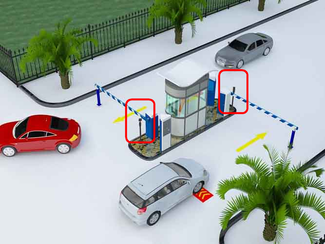
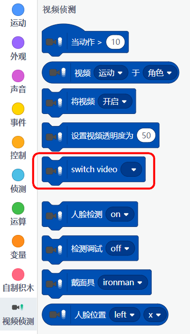
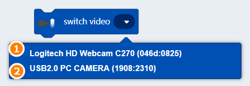
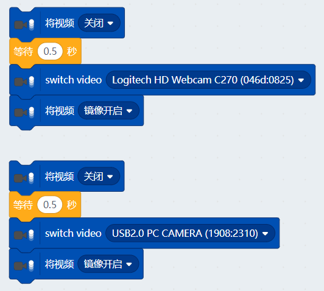

# 使用多个摄像头

本篇教程需要进阶教程

应某部分高级喵粉的要求，喵家在1.8.4W增加了多个摄像头控制。分时复用，所谓的分时复用，在某个时刻只能用一个，通过程序进行切换。

## 简介

在大部分的基础应用下，我们使用一个摄像头即可。但随着项目的不断深入，我们发现在一些特定的场合下我们需要使用多个摄像头。如停车场系统的入场摄像头与出场摄像头，这时候就至少需要2个。又如在一些门禁场合，门里与门外你需要装备两个摄像头。

## 使用操作

### 加入摄像头插件

### 选择摄像头插件

### 插件成功导入

Switch Video切换摄像头 用于多个摄像头进行切换

### 积木详解

切换摄像头积木块，如果你电脑已经插上多个摄像头，点击下拉菜单，可以有多个选择。

如果你的列表为空，右键我的电脑——管理——设备管理器，查看摄像头是否已启用

## 具体使用

切换摄像头前必须先关闭摄像头，并且需要给一点延时，再对摄像头进行选择，再启动摄像头。

分别点击这两个代码块，就可以实现摄像头切换

## 实验效果

## 注意事项

- 在启动Kittenblock软件前，您需要提前先插好你的USB摄像头，否则软件下拉列表会找不到。解决方案，重启软件即可。
- 假设你在电脑A编写了一个双摄像头的程序。你在电脑B打开，程序中的摄像头列表需要重新选择，因为每台电脑对摄像头ID都不一样，因此列表需要重新选择

## 后记

这个积木块只是起到切换摄像头的作用，程序上还需进行补充，如识别车牌等等。希望大家做出两个摄像头的停车场系统再与喵家一同分享~

