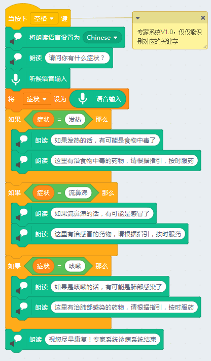
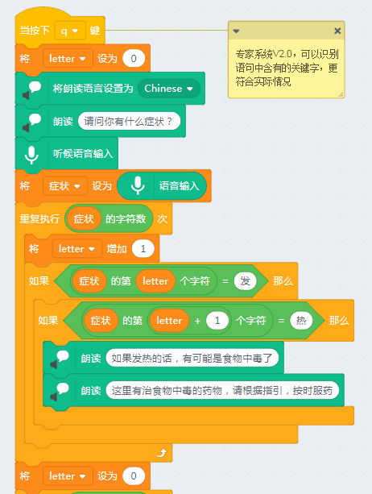
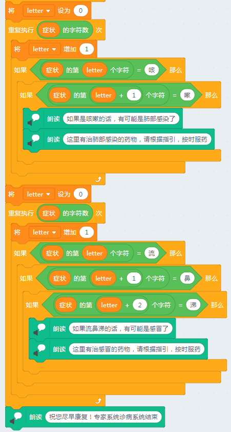

# 专家系统（复合应用）

## 简介

专家系统是AI三大模型之一，唯一一个不需要拼运算力的人工智能模型，它可以解答某一个领域的专业问题，这种专业问题一般都有标准答案，而这些标准答案是非常依赖人类在这领域内的专家知识，因为有些答案并不是计算出来的，而是根据人类难得可贵的经验得出来的。所以一个优秀的专家系统应该拥有庞大的知识库

本节实验，教大家做一个简单的专家诊病系统，实际在各大医院中已经慢慢流行这种系统，因为大部分的感冒和发烧都是通解，对应出个药方ABCD就OK了

## 实验条件

- 安装好Kittenblock

- 畅顺的网络

- 麦克风或者带麦克风的USB摄像头（型号没有限制）

(除此外，您无需购买小喵任何硬件套件，人工智能，小喵真的是做到普惠，希望各位老师多多支持！）

## 插件加载

双击打开Kittenblock，左下角加载插件

选择加载需要的插件，加载语音识别与文字朗读

## 插件成功加载

两个插件已经成功加载了

## 专家系统设计思路

当我们按下某个按键时，电脑对你进行病情诊断（人工智能——文字朗读）

当你回答后，语音识别后转为文本（人工智能——语音识别）

文本与知识题库中进行匹配对比（专家系统核心）

系统针对的的病情进行回答（人工智能——文字朗读）

好好理解以上的思路，思路明白后，写程序都是特别的简单

## 程序编写

这里我写了两个程序，V1.0版本简单粗暴的，问你病情，你对应回答，精简的几个字（说多了不识别）

V2.0版本升级了，只要你说的语句中含有对应关键词，系统就能识别

## 关于专家诊病系统的后期优化

因为本节作为普及型的教学，所以没有对这个程序进行过多的优化，怕写复杂了大家看得晕晕的。

后期优化可以从以下几点进行优化：

扩充专家知识库

扩展关键词同义词库

诊断某种病情需要做种症状符合才能得出诊断，可以设计一个得分权重系统。当权重得分大于某一个分数时才能得出病情诊断（严谨）

在病人描述没有在知识库中的，可加入新的病情知识库，然后通过人类专家进行提炼与回答，继续充实专家知识库