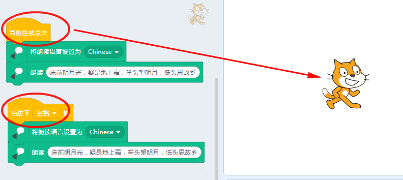
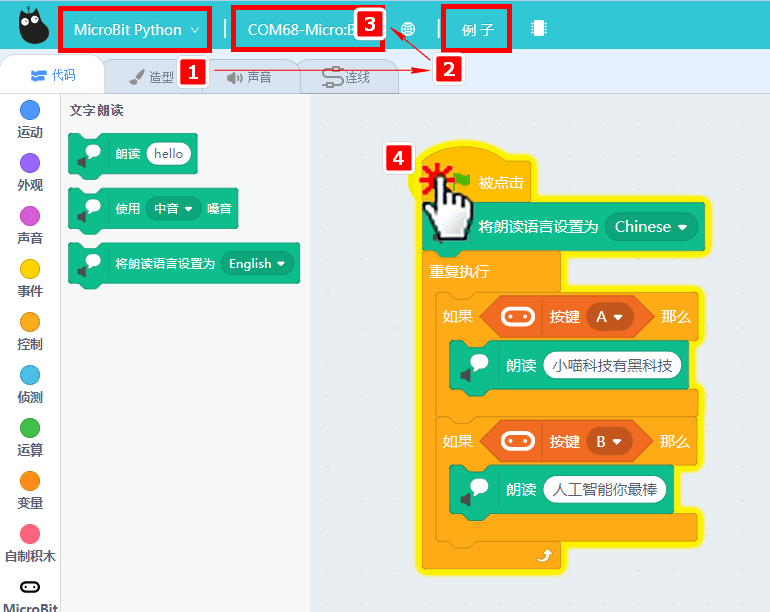
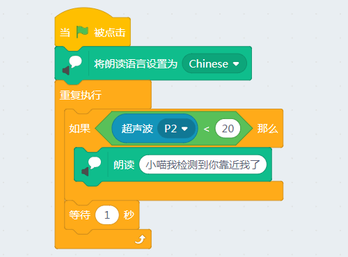

# 文字朗读

## 简介

文字朗读是最基础的人工智能插件，在我们日常生活中，例如排队叫号，车站报播，高铁报站等等，包括比较智能的机器人，与人的语音交互，都是通过文字朗读进行实现的。

文字朗读作用就是：将文字转换成语音，本文字朗读插件，除了支持中文朗读，还支持其他各国语言朗读，文字朗读发展到现在，不再是像以前的逐字进行机械的朗读，而是根据句子进行配搭语速，使朗读更加有感情和自然。

## 实验条件

- 安装好Kittenblock

- 电脑可以播放声音(记得调整好音量)

- 畅顺的网络

(除此外，您无需购买小喵任何硬件套件，人工智能，小喵真的是做到普惠，希望各位老师多多支持！）

## 插件加载

双击打开Kittenblock，左下角加载插件

选择文字朗读插件

## 插件成功加载

文字朗读插件，只有3个积木块，使用非常简单

## 积木块具体介绍

朗读前必须设置朗读的语种，并且朗读的语种与你填写的内容要对应上，假设你设置朗读语种为英文，你朗读内容框应该填入英文字符串。

设置朗读的嗓音，中英文都可以设置成多种嗓音（小猫声音是搞笑的？）

朗读内容，需要根据你的朗读语种进行对应填写

错误示范与正确示范：

例如英文，可以设置多种嗓音

如果朗读中文，那就嗓音设置无效，那就干脆不设置了

精灵角色被点击，或者用按键检测，触发朗读

## 与Microbit交互的语音朗读

案例1：按键控制语音朗读

如果我手上有一个Microbit，我现在想做一个简单的实验，按键A键 让电脑说出一句话来，按B键让电脑说出另外一句话来。

首先你要先将Microbit恢复固件，连接上串口（[如果你对Kittenblock控制Microbit在线交互不熟悉，请看这里](http://learn.kittenbot.cn/zh_CN/latest/microbit/microbit_kittenblock/03microbit%E4%BD%BF%E7%94%A8%E5%9C%A8%E7%BA%BF%E8%B0%83%E8%AF%95%E6%A8%A1%E5%BC%8F.html)）

假设上面的步骤都没问题，我们编写程序

最后按Microbit的硬件 按下A与按键B就有反应了。（如果没有反应肯定是你硬件串口没有连接）

案例2：超声波控制语音朗读

首先要接好喵家的超声波（[喵家超声波接线方法](http://learn.kittenbot.cn/zh_CN/latest/electronics/%E7%8C%AB%E5%A4%B4%E8%B6%85%E5%A3%B0%E6%B3%A2.html)）

总结：硬件与语音交互本质

硬件恢复固件后，串口与Kittenblock在线交互，例如按键触发，超声波距离触发，或者其他传感器触发。接着触发语音朗读的积木。

非常好理解，只需要你先把硬件恢复固件连接上串口即可实现在线交互。

## 疑问与解答

问1：为什么我按朗读没有反应？

答1：朗读语言与朗读的内容必须对应才有反应的。

----------
问2：中文为什么不能设置嗓音？

答2：嗓音设置只能针对英文和其他几种语言，因为我们调用的是国外的服务器。中文那边嗓音只有一种
