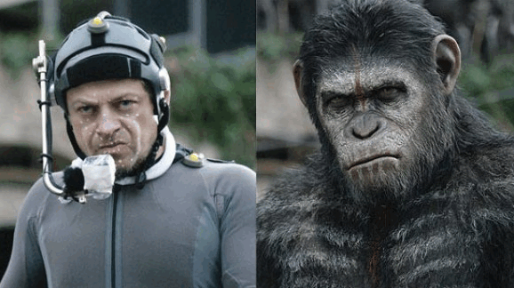
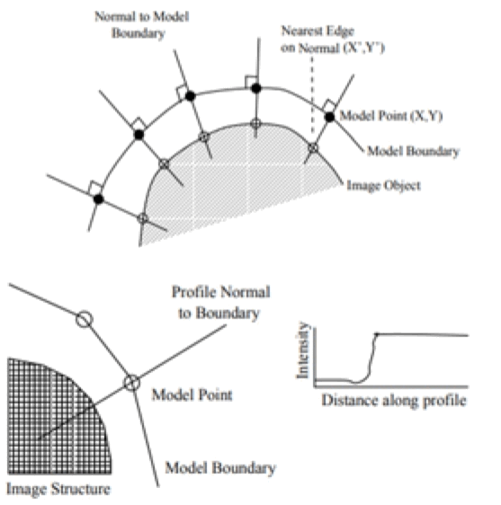
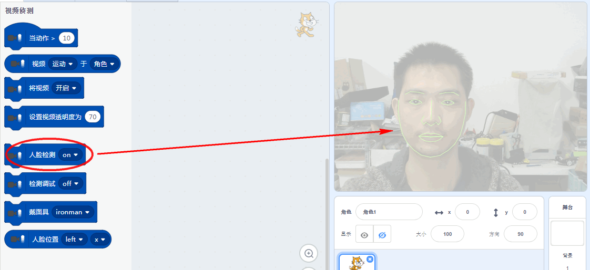

# 视觉识别02人脸追踪

## 简介

人脸追踪是属于一种特性物体的识别，根据人脸的生物属性，将识别点进行标定，对应把位置反馈回来。人脸追踪一般是科幻电影中用得比较多，例如金刚中的大猩猩表情如此生动丰富，就是将人脸的关键点映射到建模3D的大猩猩上。

本节学习体验科幻电影制作，给自己戴面具，如国外著名电影指环王，里面就用了动作捕捉与人脸捕抓，今天我们学习的是人脸追踪捕抓。

## 原理

人脸追踪本质就是人脸关键点检测，人脸关键点检测是人脸识别与分析的基础。这里不得不说经典的人脸关键点检测算法的鼻祖——Cootes，在1995年提出的ASM(Active Shape Model) ，主动形状模型即通过形状模型对目标物体进行抽象，首先进行训练，训练过程需要大量的样本，手动进行标记人脸的关键点，并把这些关键点做特征向量处理。然后进行搜索，计算眼睛(或者眼睛和嘴巴)的位置，做简单的尺度和旋转变化，对齐人脸，再匹配每个局部关键点(常采用马氏距离)，得到初步形状;修正匹配结果;迭代直到收敛。这个算法可以简单这么理解，用一张标定的人脸模型，根据鼻子或者眼睛对正到要识别的人脸样本上，然后再慢慢修正收敛到五官和人脸轮廓上。发展至今已经用到深度学习算法来进行关键点检测，由于涉及到比较复杂的数学，这里就不展开讲了，大家了解简单的原理即可。

## 实验条件

- 安装好Kittenblock

- 畅顺的网络

- USB摄像头（型号没有限制）

(除此外，您无需购买小喵任何硬件套件，人工智能，小喵真的是做到普惠，希望各位老师多多支持！）

PS：Kittenblock软件安装过程很简单，这里不再作介绍，具体参照：

http://learn.kittenbot.cn/ 的Kittenblock教程分栏

## 插件加载

双击打开Kittenblock，左下角加载插件

选择视觉识别插件

## 插件成功加载

切记在打开Kittenblock已经插上USB摄像头，并且保证USB摄像头是可用的。

一旦插件成功加载后，舞台背景即成为摄像头的取景框（与实际镜像），如果舞台没有变化那么说明你的摄像头没有成功驱动或者被其它软件占用了

## 人脸检测积木块介绍

点击人脸检测积木块，开启识别，可以看到连上已经有一些线条点对脸部进行拟合了，这个是戴面具的技术基础

点击戴面具，面具有多种类型，这里我选择了钢铁侠，人脸离开摄像头远一点，这样戴面具的效果才会比较好

## 人脸五官位置

可以通过这个积木块对五官的坐标进行获取，如果所示获取鼻子的横坐标

## 关于人脸追踪的例子

可以直接打开我们提供的例子

图中标记的例子就是与人脸追踪有关联的，另外的例子是跟视频侦测有关联的。

