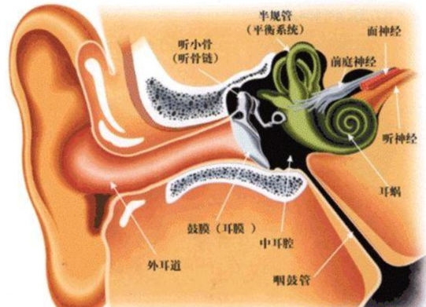
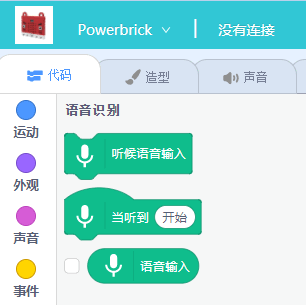
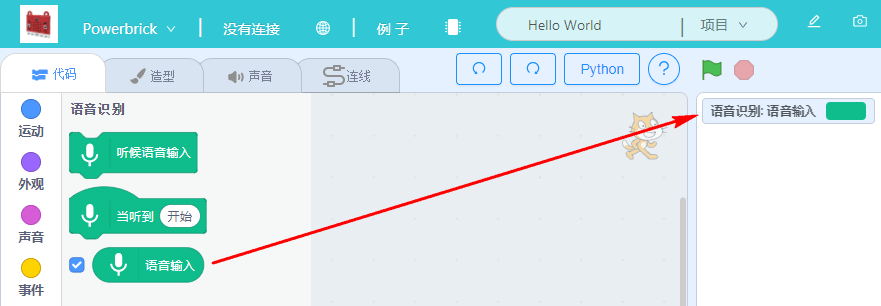
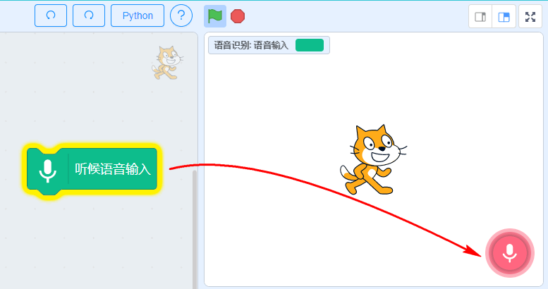
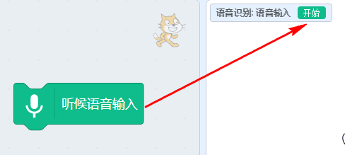
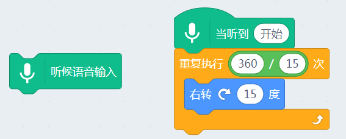
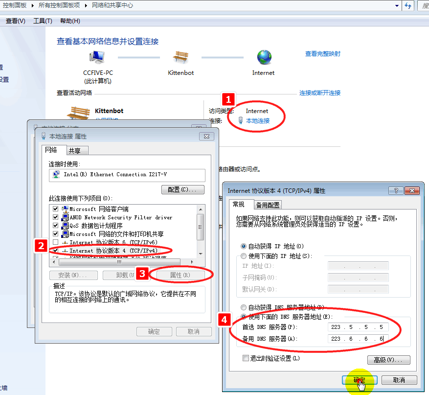
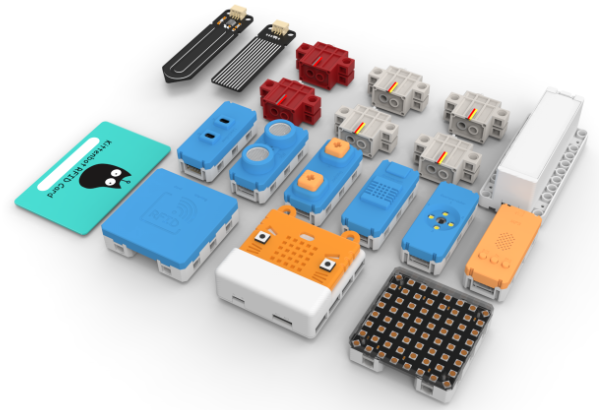
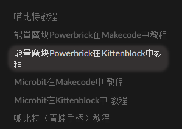
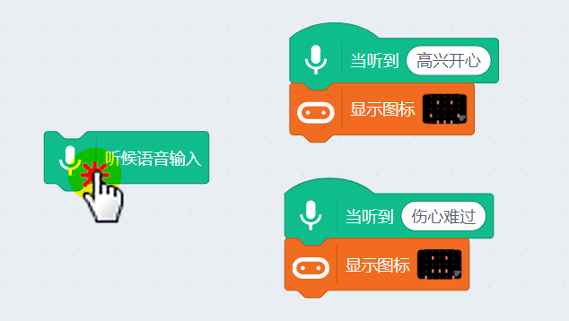

# 语音识别

## 简介

语音识别，是CC喵最喜欢的一个人工智能功能。近年来智能音响大热，大家喜欢的功能无非就是，多了个语言控制，感觉机器是有生命的，能听懂人话，感觉很神奇很智能，那么本节，就由我带领你学会语音识别控制。

## 原理

在说语音识别技术的原理前，我们先来学习下，人是如何听到别人说的话，并且理解句子的意思。

声波由物体震动产生，它经过耳朵的一系列结构，最后声音触发了听神经，最后通过我们大脑将听到的话处理成可以理解的意思。

同理，对于机器的语音识别一样。

麦克风将声波转换为电信号，电脑将电信号储存为音频文件，将其数字化。机器在对语音信号进行处理，进行特征提取，根据语言模型进行匹配，最后“听懂”这句话的意思。

## 实验条件

- 安装好Kittenblock

- 麦克风或者带麦克风的USB摄像头（型号没有限制，但是麦克风质量最好是好一点的，不然识别率不是很高）

- 电脑可以播放声音(记得调整好音量)

- 畅顺的网络（文字朗读是通过云端服务器实现，用的是MIT的服务器）

(除此外，您无需购买小喵任何硬件套件，人工智能，小喵真的是做到普惠，希望各位老师多多支持！）

PS：Kittenblock软件安装过程很简单，这里不再作介绍，具体参照：

http://learn.kittenbot.cn/ 的Kittenblock教程分栏

## 插件加载

双击打开Kittenblock，左下角加载插件

选择语音识别插件

## 插件成功加载

语音识别插件，使用非常简单，如果你用过手机的语音助手，那就很简单了。一般我们使用手机语音助手，需要按住一个虚拟按键，然后等待出现麦克风图标后，再进行语音对讲。

## 积木块具体介绍

一般使用语音识别插件，习惯性会把语音输入勾上，如图所示，因为语音识别的识别会被环境噪音或者朗读者的口音影响。所以为了知道服务器那边把我们的话识别成什么样,我们最好把勾勾上，这样最直观。

语音录入按钮，点击一下。舞台的右下方就会出现一个红色的麦克风图标，这时候你就可以对着麦克风说话了。（等红色麦克风图标出现后，再说话）

例如我说了“开始”，稍等片刻后，可以看出识别的结果为开始，识别率还是挺高的，虽然我的普通话真的好普通

已经测试语音识别内容是OK的，我们写一个完整的识别程序，让舞台小猫进行反馈，当识别到我说话“开始”，小猫顺时针转一圈

## 识别不成功？

很多用户反馈识别不成功，有几方面的原因：

这个语音识别是利用国外MIT的服务器进行识别，所以如果你网络特别差，这个语音识别可能会不成功。

另外一个有可能是你的DNS问题，可以设置下你的网络设置，如图操作：

[如果你觉得这里不够详细，可以百度DNS的设置方法](https://jingyan.baidu.com/article/046a7b3e934bf5f9c27fa9f0.html)

## 加入硬件更好玩

案例1：控制喵家能量魔块

控制虚拟的东西总是有点无聊，我们能不能利用语音识别来控制喵家的产品套件呢？当然，本质就是软件与硬件之间的交互。

本示例所用的套件————能量魔块（Microbit、主控盒、电池盒、灰色乐高Geekservo），它是一款结合Microbit与乐高结构件的电子套件。

如果你对能量魔块不熟悉，可以访问http://learn.kittenbot.cn/ 的能量魔块分栏

 
选择Powerbrick硬件，恢复固件后，连接串口（[如果这里遇到问题，请在learn的相关页面进行学习](http://learn.kittenbot.cn/zh_CN/latest/powerbrick_KB/index.html)）

访问 http://learn.kittenbot.cn/ 的能量魔块分栏的快速开始

编写对应的语音识别控制硬件的程序，这里是控制S2的角度，当识别到“举起手”，S2舵机转到90度，当识别到“放下手”，S2舵机转到180度（能量魔块记得插上电池盒）

现象：当点击语音输入时，等待舞台右下方的麦克风出现后，说出“举起手”或者“放下手”。Microbit就会控制舵机做出不同的反应。

案例2：控制Microbit点阵

硬件选择Microbt-python——serial，然后恢复固件，最后连接上串口，[如果你对此操作不熟悉可以跳转这里的教程](http://learn.kittenbot.cn/zh_CN/latest/microbit/microbit_kittenblock/03microbit%E4%BD%BF%E7%94%A8%E5%9C%A8%E7%BA%BF%E8%B0%83%E8%AF%95%E6%A8%A1%E5%BC%8F.html)

访问 http://learn.kittenbot.cn/ 的Microbit分栏的快速开始

现象：当点击语音输入时，等待舞台右下方的麦克风出现后，说出“高兴开心”或者“伤心难过”，Microbit点阵屏上就会显示不同的表情。