# 青蛙手柄分栏积木块

## 成功加载青蛙手柄分栏，并连接上

如下图，出现绿色的勾勾图标，就证明串口已经正确连接上了

## 手柄按键与金手指检测积木块

### 使用示例1——xy按键按下播放蜂鸣器音乐

确保青蛙手柄的串口已经连接上，否则板上的蜂鸣器不会响

### 使用示例2——摇杆左右控制小猫移动

手柄摇杆左右可以控制舞台小猫左右移动

问：摇杆能否读到模拟值？

答：因为本身如果摇杆涉及读到不同模拟值，对应Scratch角色

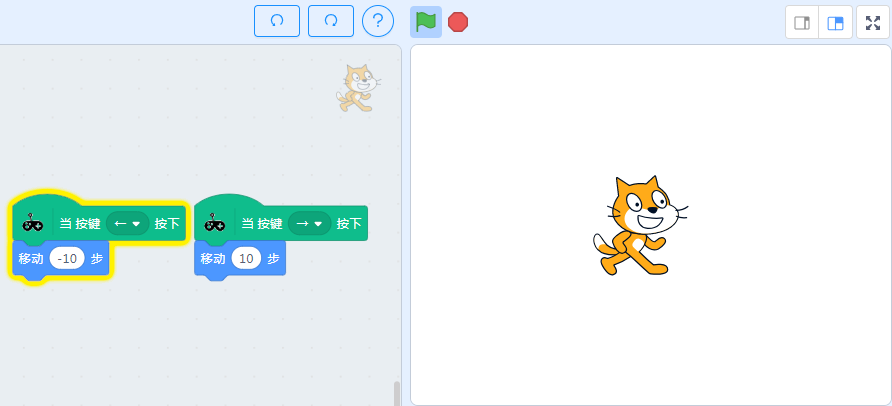

### 使用示例3——摇杆按下

摇杆除了可以上下左右摇动，还有一个确认按钮(就是直接按下摇杆)。所以这里特意做了一个示例用来说明摇杆按键。

示例的现象：当你按下摇杆杆件，舞台小喵会说出“摇杆按键按下”

### 使用示例4——金手指触摸

青蛙手柄其中一个很好玩的功能就是——金手指触摸。金手指触摸还可以通过鳄鱼夹连接到各种水果上或者金属的物体上。

示例的现象：当金手指1、2分别按下时，舞台显现角色A和角色B(当然你也可以连接8个鳄鱼夹，刚好做出一个水果琴)

## 金手指独立检测积木块

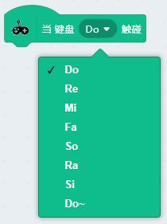

此积木块的功能实际等同这个，只是为了方便大家对金手指进行音调编程，所以特意做了一个独立的积木块。

这样大家对这Do、Re、Mi这些字符来编程比较容易对应上。

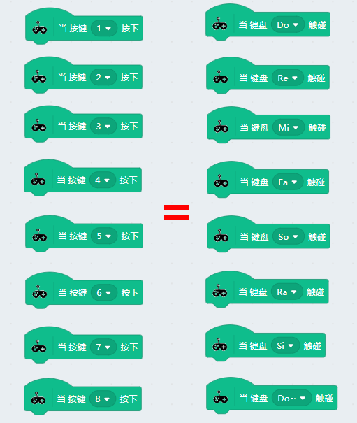

## 蜂鸣器音调设置积木块

你可以自由设置蜂鸣器的音调和时间

### 使用示例1——xy按键按下播放蜂鸣器音调

确保青蛙手柄的串口已经连接上，否则板上的蜂鸣器不会响（串口驱动之前已经提前安装好了）

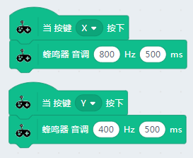

## 蜂鸣器音乐设置积木块

音乐播放内置了Microbit的常规音乐

### 使用示例1——xy按键按下播放蜂鸣器音乐

确保青蛙手柄的串口已经连接上，否则板上的蜂鸣器不会响

## 红外特定编码发射积木块

红外编码使用这个需要注意下，这个红外编码是指常规的NEC编码（采用16进制编码）

举个例子：电视遥控器某个按键红外发出去的编码有可能是"01ABCDEF",可以看到这个编码一定是8个字符组成的，字符的范围（0~9，A~F，16进制）。**所以如果编码的字符串在这些字符范围以外的，程序必然是错的！**
 

### 使用示例1——xy按键按下发送红外编码

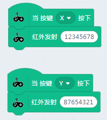

## 红外接收触发积木块

只要青蛙手柄上的红外接收器接收到红外编码（无论是怎样的红外编码），这个帽子积木都会进行触发

## 红外解码内容积木块

光接收数据是不行的，我们需要接接收的数据的进行判断。例如家里的遥控器都是很多个按键，每个按键对应不同的红外编码，对应触发不同的事件（例如电视喇叭声音变大，或者换台等等）

一般我们会将红外解码数据前面的勾勾勾上，这样就可以在舞台左上角可以看到，即时接收回来的红外数据

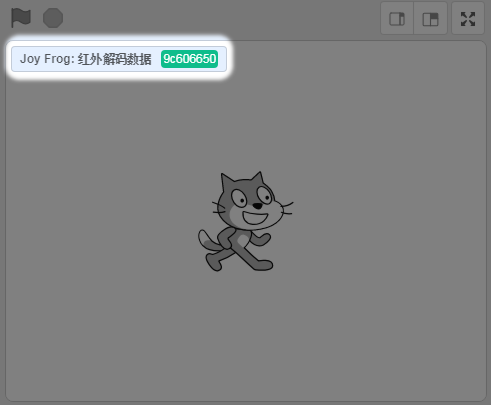

## 3PIN模块

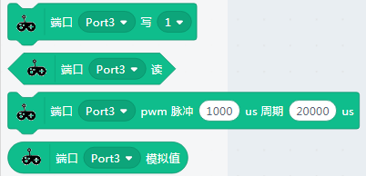

### 数字写（以LED模块为例）

端口写，适用于逻辑电平的输入模块，如LED模块

Port3口 接好LED模块

程序：

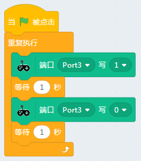

### 数字读（以按键模块为例）

使用的按键模块，按下是低电平，平时是高电平

程序：

### PWM写（以舵机为例）

舵机是典型的被PWM写的器件，我们可以控制舵机的角度

程序：

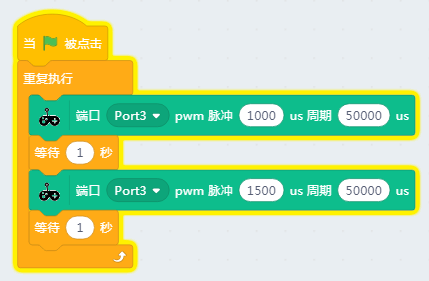

### PWM写（以LED模块控制亮度为例）

程序，通过变换PWM值，可以控制LED的亮度

### 模拟读写（以电位器模块为例）

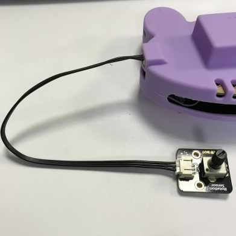

程序：

旋动电位器，观察舞台小猫说出来的值，通过模拟值的大小变化，我们可以结合Scratch舞台做些好玩的项目

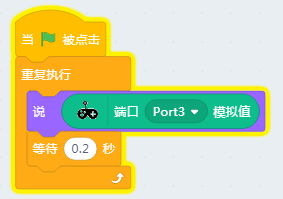