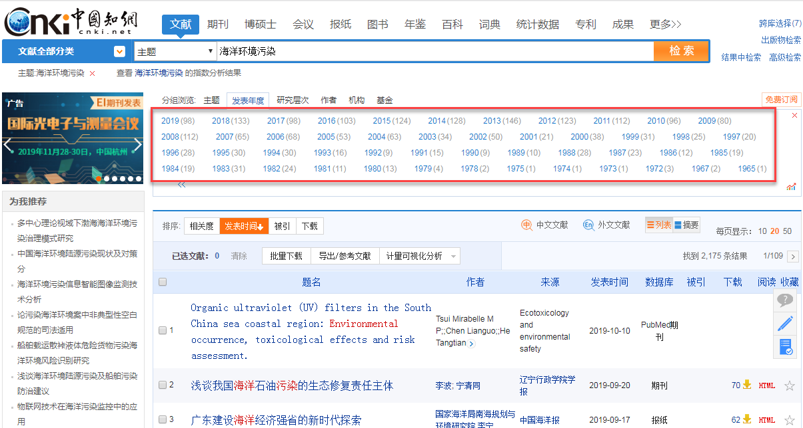
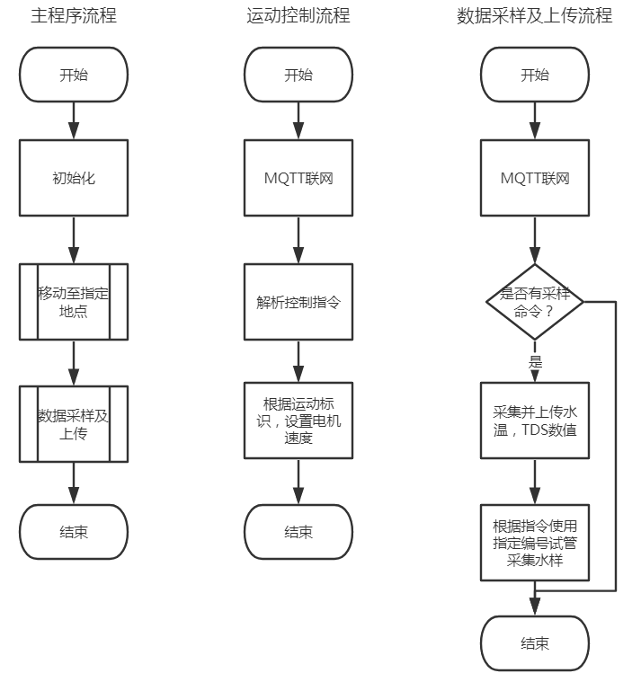

# 海洋监测采样船

在陆地环境污染渐渐消失的时候，海洋环境问题却日益严重。海洋是地球上最大的生态系统，一旦海洋生态系统因为环境污染而崩溃，人类也就离毁灭不远了。

古往今来，出现过很多海洋保护措施，但是海洋保护问题却没有像陆地环境问题一样日益完善。我们小组对此进行深入分析，并使用喵家软硬件，提出了一种新时代背景下的海洋环境保护方案。

****

## 1.项目简介

### 1.1 海洋污染现状

我国海岸线长达18000千米，海域总面积470万平方公里，在陆地资源渐渐衰竭，人口总数却在不断增长的情况下，海洋资源已悄然成为经济发展、社会发展的重要组成部分。

我国早在上世纪七八十年代就对海洋进行了治理，基本上构建了具有中国特色的海洋环境保护法律体系。步入二十一世纪以来，寻求海洋可持续发展道路成为了全球共识。国内外无数专家学者投身于海洋环境保护，以中国知网为例，下图为中国知网收录的近五十余年海洋环境污染相关文献数量。从图中我们可以很明显地发现，相关研究越来越多，但是治理效果却迟迟看不到，究竟是哪个环境出了问题呢？

### 1.2解决方案的提出

基于上文提到的疑问，我们进行深入调查和研究，最后终于找到了海洋环境治理最核心的问题。

海洋环境保护较难起到效果是因为执行力不够，虽然有完善的法律法规，但是却没有人督促执行。陆地环境在所有人眼皮底下，与每个人日常生活息息相关，所以执行力较高。

就像我们很多人都知道海洋保护很重要，但是却没有人清晰明了地知道海洋保护的急迫性，因为没有“亲眼所见”。基于这个核心问题，我们开发了这一套“众筹式海洋水质检测系统”。

它由网络端和数据采集端两部分组成，数据采集端采集海水浊度，酸碱度数据后可将采集的数据以及采集点GPS坐标通过MQTT协议，依托喵家物联网系统共享至全网络。

### 1.3方案优势

我们将会首先号召沿海地区的居民，制作自己的数据采集端，将自己所在地点的GPS数据上传至喵家服务器，共同构建全球海洋水质地图。

另一方面通过构建全球海洋水质地图活动，让越来越多的人关注海洋环境污染问题，一方面让大家自觉减少环境污染，另一方面让所有人督促海洋环境相关政策的执行。

## 2.项目适合人群

初高中学生，要有求有Microbit编程基础

## 3.项目难度

机械搭建：五颗星（需要会三维设计，切割加工等等）

电子接线：三颗星（有多种传感器连接等）

软件编程：四颗星（需要编写IOT端程序）

## 4.材料准备

- Microbit 						 1块
- Robotbit拓展板              1块
- TDS水质传感器               1个
- 电机                                  2个
- 舵机                                  1个
- 水泵                                  1个
- GPS模块                           1个
- 液体温度传感器               1个
- 浊度传感器                       1个
- NbIOT模块                       1个
- 20*30cm木板                  6块
- 试管                                  3根
- 乐高积木                          若干

## 5.工具准备

- 3D打印机一台
- 电钻
- 锯子
- 螺丝刀
- 胶枪

## 6.软件准备

- Makecode
- 微信开发者工具

## 7.项目原理

1. 运动控制：通过物联网服务器给搭载了NBIOT物联网模块的采样船发送控制信号，控制船上电机转动，进而让船运动到采样地点。
2. 数据采集：到达采样地点后，在网页端通过物联网服务器给采样船发送采样指令，采样船通过TDS水质传感器检测海水浊度，通过液体温度传感器测量海水温度，GPS测量该点经纬度值，并根据指令使用指定编号试管存储水样。
3. 数据共享：数据采集完毕后，通过NBIOT模块上传至物联网服务器，网页端解析出经纬度数据后调用地图插件，在地图上标出该点海水浊度，温度。

简单来讲，就是通过物联网控制采样船运动，通过多种传感器采集数据，最后通过物联网标注共享数据。

## 8.制作过程——机械搭建

1. 木板切割

 

2. 拼装船体

 

2. 船内支架及电机安装

 

3. 试管支架搭建

 

4. 试管切换器安装

 

## 9.制作过程——电子接线

液体温度传感器接P1引脚，TDS水质传感器接P2引脚，GPS模块的Tx引脚连接Robotbit的P13引脚，NB-IOT模块的Tx，Rx引脚分别连接Robotbit的P14，P15引脚。

 

## 10.制作过程——软件编写与调试

 

## 11.项目展示视频

https://www.bilibili.com/video/av73724770/?p=1

## 12.总结

### 12.1项目难点

- GPS驱动库编写
- 物联网服务器搭建与APP小程序编写
- NB-IOT通讯系统搭建

### 12.2 项目的不足与改进

- 不足：NB-IOT模块联网时信号不稳定，故有时候存在较长延时。

- 改进：后续改为指定GPS坐标，小船自动行驶到采样点进行采样，运动过程不通过人工控制，从而避免因延时带来的问题。