# MNIST 手写数字识别

机器学习中另外一个相当经典的例子就是MNIST的手写数字学习。通过海量标定过的手写数字训练，可以让计算机认得0~9的手写数字。相关的实现方法和论文也很多，我们这一篇教程就直接教大家目前大紫大红的卷积神经网络方法（convolution network）。先看看最后的效果

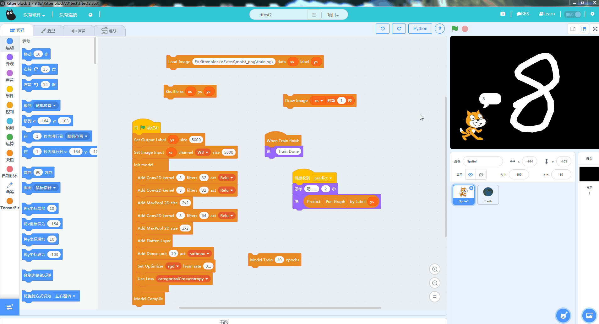

只要大家耐心地照着这篇教程实践，并思考其中的原理也能实现这个效果

## 获取手写数据

所有机器学习的第一步就是获取数据，MNIST数据集本身相当庞大。它对0~9的数组，每个数字都提供了5000张以上28x28像素的图片数据。大家可能在其他书或者网上教程看到的资料所用的数据集都是压缩整合过的图片或者直接是二进制格式的，我们这里为了大家好理解直接使用现成的原始图片。

请点击下面的链接下载数据集，并解压到电脑上(图片超多，解压过程比较缓长)。

[https://github.com/myleott/mnist_png/raw/master/mnist_png.tar.gz](https://github.com/myleott/mnist_png/raw/master/mnist_png.tar.gz)

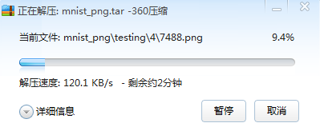

解压完后大家可以看到数据实际上分了train和test两个文件夹，每个文件夹下又有10个独立数字的图片文件夹：

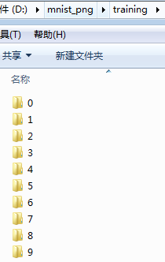

## 数据的导入

我们新建一个scratch3项目，导入TensorFlow插件，并保存为mnist.sb3。

还是跟之前一样，我们需要新建两个列表list，分别命名为xs和ys。

由于这里我们用的是标定过的图片数据，需要用到另外一个方块导入图片。这里注意将xs和ys的显示关掉，不然可能会导致软件卡死，毕竟xs里面是6万张图片的原始数据。

注意将两个变量**前面的勾去掉**

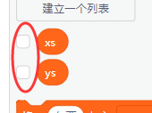

之后拖入图片导入方块，第一个参数填写mnist的train数据根目录，具体对应你自己电脑存放训练图片的位置（小提示，可以直接将路径复制进去）

点击方块开始导入，导入完成后大家可以选上ys的数据显示，可以看到这是6万个图片的标签。如果大家电脑配置很好也可以把xs选上，看看里面的数据到底长什么样的。

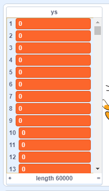

如果我电脑配置不够，那个有没有其它办法看到xs里面的数据呢？ 有的，我们做了一个调试用的积木，可以在舞台上看到xs的原始图像。

拖入如下的方块，并点击。

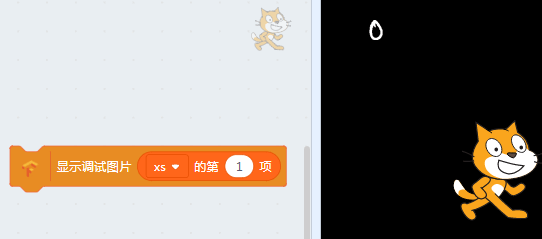

可以看到我们的训练图片都是一张张背景为黑色，字迹为白色的图片。

由于完整的数据集相当大，我们并不需要全部6万组数据，只需要其中5千组就够了。但是前面5千组全部是数字0的图片，那么怎么办呢？

我们这里用另外一个方块，数据的洗牌（shuffle），就类似我们玩扑克的洗牌，随机将图片的排列顺序打乱。

点击一下洗牌（shuffle）方块，后重新将ys列表加载（**将ys的勾勾去掉再打上**）

然后就看到ys列表已经是乱序排列的（你的不一定和我图中的一样，随机是没有规律的）

这样数据就变成随机的排序了。

对数据进行洗牌的另外一个好处就是能让你的**模型和权重更加健壮**。
因为机器学习本质是在无序中挖掘有序的过程，也就是寻找数据中的有效熵。而没必要的有序序列或者熵只会造成干扰，让你的模型以为自己找到了规律。

洗牌之后我们可以做个小程序看看里面的手写数据：

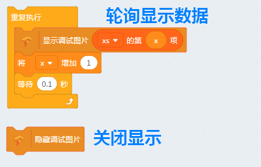

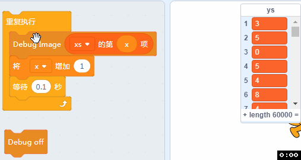

## 模型的建立

我们照着下面的图片拖入对应的模型：

注意我们输入图片是28x28像素的黑白图片，因此输入维度是28x28x1。

前两层是卷积层，卷积核的大小都是3x3像素，对应的卷积特征算子数目是32个，并且使用relu激活函数去掉负值。具体卷积的原理网络或书本中有一大堆的资料，这里就不细说了。卷积层主要是图片中各种特征进行识别，多个卷积层组合起来可以分辨出高维度的抽象特征，类似我们眼球视网膜后的神经元作用。

之后是池化层，池化层的作用是主动丢弃一些像素，这样可以大大降低运算过程中的参数数量，也可以去除一些噪声干扰。

之后我们又做了一次卷积和池化，但是这次有64个特征算子，可以进一步区让机器分析图片中的细节。

由于卷积是一个高维度的矩阵，我们让它跟神经网络连接必须要将它摊平，这里我们引入了一个flatten layer。

最后我们由于我们希望的输出是0~9数字中的其中一个，加入了一个10个神经元的softmax激活的全连接层。

模型就到这里结束了，其他书籍和资料的模型可能和教程中的模型不一样，更有直接使用n层神经网络训练的也取得不错的效果。具体模型的构造和调整需要大家去学习相关的专业理论，我们这里以实践为主。

## 数据导入

开始训练前我们还需要将xs和ys的数据赋给模型。

这里我们只用了全部数据集中的前5000组数据进行训练。

其中第一个方块是从图片中构造输入数据。channel是图片的像素，有黑白（W/B）和RGB两种。最后一个shape不指定会自动从输入图片的尺寸中指定，对于一些特殊的情况需要我们手动指定输入图片的大小。

将xs图片转换为可以训练的tensor过程比较久，大家耐心等待。其实际过程就是将5000张打开并加载到你的显卡内存中。

## 开始训练

全部准备工作做完后我们就可以开始训练我们的模型了~

强烈建议按F12打开后台调试窗口，因为这个计算量很巨大，不会马上返回训练完成信息，我们往往会误认为电脑死机或者积木块没有执行。

只要你看到调试窗口类似有这样的数据（如下图）在滚动，就说明模型已经在训练中，耐心等待完成。

由于有卷积神经网络的存在，其训练时间远远大于我们上一节的鸢尾花分类器。我们可以在Kittenblock的终端中看到模型收敛过程：

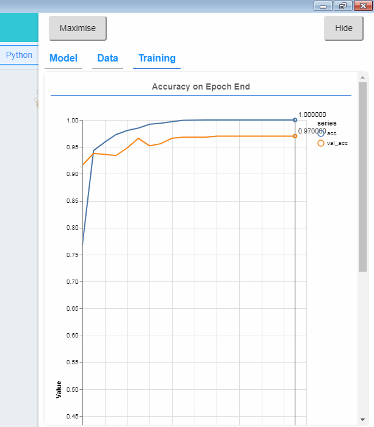

当这个数字变为49，这个模型就算训练完了。

## 检验结果

其实Kittenblock内部默认将输入数据的10%作为测试集（500张图，作为标准答案去验证这个模型），大家看到log输出的val_acc就是使用该测试集进行测试的精确度结果。

那么有没有更直观的方法测试我们的模型是否准确？到此本节的Tensorflow的知识点已经讲完，下面讲的是怎么再舞台写数字。

## 把舞台变成能写数字的黑板

### 将舞台设置成黑板色

有的，就是直接在舞台上写字了~然后模型对其进行验证。（当然我们也可以调用摄像头，这个后面我们再说到摄像头）

我们前面看到我们的输入数据都是黑底白字的图片，那么我们测试的时候也要把舞台背景调成黑色。去到舞台的背景编辑框，将其转换成位图并填充黑色。

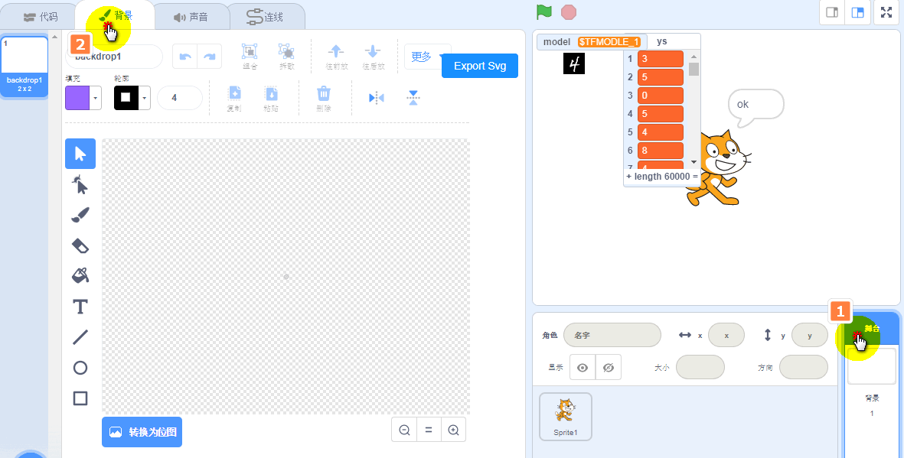

具体方法如下：

### 导入画笔插件

左下方扩展——画笔

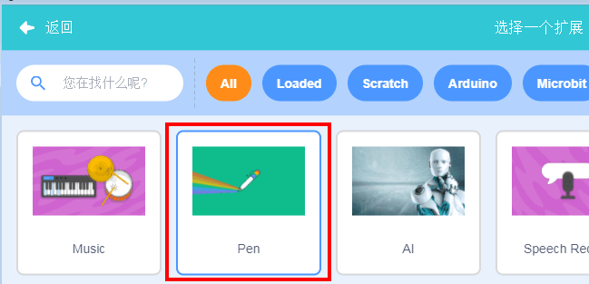

成功加载画笔插件

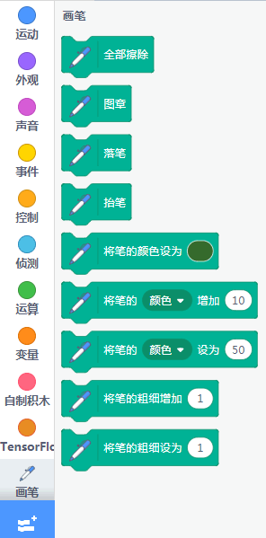

### 增加精灵作为画笔，拖入代码

精灵任意，这里以圆球为例，记得把球隐藏起来，隐藏按键如下

圆球积木块代码：

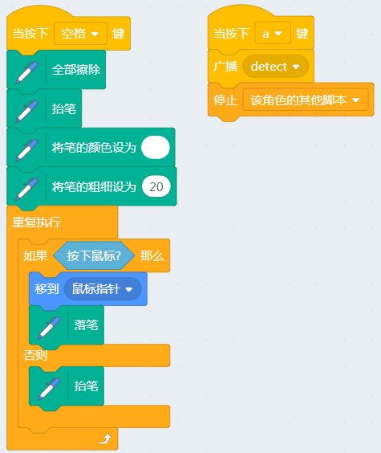

当我们按下空格开始画画，之后按键按键A就结束并开始识别。

之后回到猫咪精灵，并且加入收到画笔消息后的代码

其中Pen Graph是舞台上画笔的数据，Kittenblock目前支持的其他数据还有整个舞台所有的图片数据和摄像头的输入。

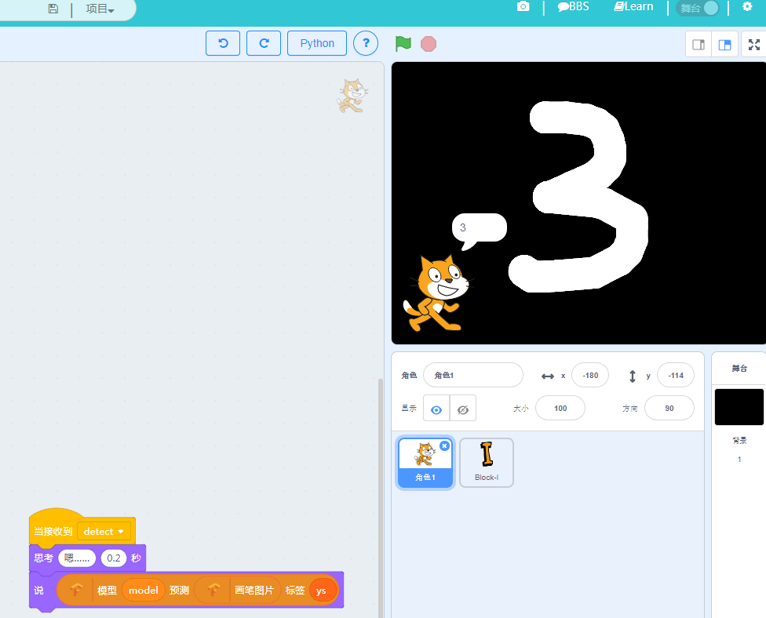

## 保存项目

最后大家记得保存项目，我们在下一节还要用到。我们看看保存完后的sb3文件相当大，因为其中保存了完整的mnist数据集，也就是xs和ys。

本系列教程所有的sb3项目都可以在我们github仓库下载：

[https://github.com/KittenBot/kittenbot-docs/tree/master/Tensorflow/data](https://github.com/KittenBot/kittenbot-docs/tree/master/Tensorflow/data)

也欢迎大家在github上给我们提issue和pr帮助我们改进和做的更好~

