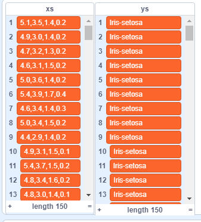
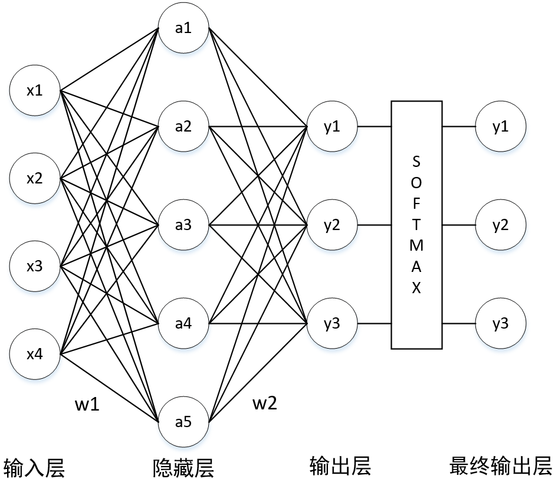
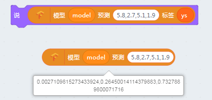

# 鸢尾花(Iris)分类

鸢尾花分类相当于机器学习中的Helloworld问题，如果这个问题你能解开了那么说明你机器学习已经入门了。

大家平时应该也留意过这种花吧，但是真的能分出来三种花的区别吗？

这篇教程所使用的的数据全称是：安德森鸢尾花卉数据集，完整的数据如下表：

五列数据分别对应花萼长度、花萼宽度、花瓣长度、花瓣宽度和种类，其中种类分别为山鸢尾、变色鸢尾和维吉尼亚鸢尾三个类别。

	5.1,3.5,1.4,0.2,Iris-setosa
	4.9,3.0,1.4,0.2,Iris-setosa
	4.7,3.2,1.3,0.2,Iris-setosa
	4.6,3.1,1.5,0.2,Iris-setosa
	5.0,3.6,1.4,0.2,Iris-setosa
	5.4,3.9,1.7,0.4,Iris-setosa
	4.6,3.4,1.4,0.3,Iris-setosa
	5.0,3.4,1.5,0.2,Iris-setosa
	4.4,2.9,1.4,0.2,Iris-setosa
	4.9,3.1,1.5,0.1,Iris-setosa
	5.4,3.7,1.5,0.2,Iris-setosa
	4.8,3.4,1.6,0.2,Iris-setosa
	4.8,3.0,1.4,0.1,Iris-setosa
	4.3,3.0,1.1,0.1,Iris-setosa
	5.8,4.0,1.2,0.2,Iris-setosa
	5.7,4.4,1.5,0.4,Iris-setosa
	5.4,3.9,1.3,0.4,Iris-setosa
	5.1,3.5,1.4,0.3,Iris-setosa
	5.7,3.8,1.7,0.3,Iris-setosa
	5.1,3.8,1.5,0.3,Iris-setosa
	5.4,3.4,1.7,0.2,Iris-setosa
	5.1,3.7,1.5,0.4,Iris-setosa
	4.6,3.6,1.0,0.2,Iris-setosa
	5.1,3.3,1.7,0.5,Iris-setosa
	4.8,3.4,1.9,0.2,Iris-setosa
	5.0,3.0,1.6,0.2,Iris-setosa
	5.0,3.4,1.6,0.4,Iris-setosa
	5.2,3.5,1.5,0.2,Iris-setosa
	5.2,3.4,1.4,0.2,Iris-setosa
	4.7,3.2,1.6,0.2,Iris-setosa
	4.8,3.1,1.6,0.2,Iris-setosa
	5.4,3.4,1.5,0.4,Iris-setosa
	5.2,4.1,1.5,0.1,Iris-setosa
	5.5,4.2,1.4,0.2,Iris-setosa
	4.9,3.1,1.5,0.1,Iris-setosa
	5.0,3.2,1.2,0.2,Iris-setosa
	5.5,3.5,1.3,0.2,Iris-setosa
	4.9,3.1,1.5,0.1,Iris-setosa
	4.4,3.0,1.3,0.2,Iris-setosa
	5.1,3.4,1.5,0.2,Iris-setosa
	5.0,3.5,1.3,0.3,Iris-setosa
	4.5,2.3,1.3,0.3,Iris-setosa
	4.4,3.2,1.3,0.2,Iris-setosa
	5.0,3.5,1.6,0.6,Iris-setosa
	5.1,3.8,1.9,0.4,Iris-setosa
	4.8,3.0,1.4,0.3,Iris-setosa
	5.1,3.8,1.6,0.2,Iris-setosa
	4.6,3.2,1.4,0.2,Iris-setosa
	5.3,3.7,1.5,0.2,Iris-setosa
	5.0,3.3,1.4,0.2,Iris-setosa
	7.0,3.2,4.7,1.4,Iris-versicolor
	6.4,3.2,4.5,1.5,Iris-versicolor
	6.9,3.1,4.9,1.5,Iris-versicolor
	5.5,2.3,4.0,1.3,Iris-versicolor
	6.5,2.8,4.6,1.5,Iris-versicolor
	5.7,2.8,4.5,1.3,Iris-versicolor
	6.3,3.3,4.7,1.6,Iris-versicolor
	4.9,2.4,3.3,1.0,Iris-versicolor
	6.6,2.9,4.6,1.3,Iris-versicolor
	5.2,2.7,3.9,1.4,Iris-versicolor
	5.0,2.0,3.5,1.0,Iris-versicolor
	5.9,3.0,4.2,1.5,Iris-versicolor
	6.0,2.2,4.0,1.0,Iris-versicolor
	6.1,2.9,4.7,1.4,Iris-versicolor
	5.6,2.9,3.6,1.3,Iris-versicolor
	6.7,3.1,4.4,1.4,Iris-versicolor
	5.6,3.0,4.5,1.5,Iris-versicolor
	5.8,2.7,4.1,1.0,Iris-versicolor
	6.2,2.2,4.5,1.5,Iris-versicolor
	5.6,2.5,3.9,1.1,Iris-versicolor
	5.9,3.2,4.8,1.8,Iris-versicolor
	6.1,2.8,4.0,1.3,Iris-versicolor
	6.3,2.5,4.9,1.5,Iris-versicolor
	6.1,2.8,4.7,1.2,Iris-versicolor
	6.4,2.9,4.3,1.3,Iris-versicolor
	6.6,3.0,4.4,1.4,Iris-versicolor
	6.8,2.8,4.8,1.4,Iris-versicolor
	6.7,3.0,5.0,1.7,Iris-versicolor
	6.0,2.9,4.5,1.5,Iris-versicolor
	5.7,2.6,3.5,1.0,Iris-versicolor
	5.5,2.4,3.8,1.1,Iris-versicolor
	5.5,2.4,3.7,1.0,Iris-versicolor
	5.8,2.7,3.9,1.2,Iris-versicolor
	6.0,2.7,5.1,1.6,Iris-versicolor
	5.4,3.0,4.5,1.5,Iris-versicolor
	6.0,3.4,4.5,1.6,Iris-versicolor
	6.7,3.1,4.7,1.5,Iris-versicolor
	6.3,2.3,4.4,1.3,Iris-versicolor
	5.6,3.0,4.1,1.3,Iris-versicolor
	5.5,2.5,4.0,1.3,Iris-versicolor
	5.5,2.6,4.4,1.2,Iris-versicolor
	6.1,3.0,4.6,1.4,Iris-versicolor
	5.8,2.6,4.0,1.2,Iris-versicolor
	5.0,2.3,3.3,1.0,Iris-versicolor
	5.6,2.7,4.2,1.3,Iris-versicolor
	5.7,3.0,4.2,1.2,Iris-versicolor
	5.7,2.9,4.2,1.3,Iris-versicolor
	6.2,2.9,4.3,1.3,Iris-versicolor
	5.1,2.5,3.0,1.1,Iris-versicolor
	5.7,2.8,4.1,1.3,Iris-versicolor
	6.3,3.3,6.0,2.5,Iris-virginica
	5.8,2.7,5.1,1.9,Iris-virginica
	7.1,3.0,5.9,2.1,Iris-virginica
	6.3,2.9,5.6,1.8,Iris-virginica
	6.5,3.0,5.8,2.2,Iris-virginica
	7.6,3.0,6.6,2.1,Iris-virginica
	4.9,2.5,4.5,1.7,Iris-virginica
	7.3,2.9,6.3,1.8,Iris-virginica
	6.7,2.5,5.8,1.8,Iris-virginica
	7.2,3.6,6.1,2.5,Iris-virginica
	6.5,3.2,5.1,2.0,Iris-virginica
	6.4,2.7,5.3,1.9,Iris-virginica
	6.8,3.0,5.5,2.1,Iris-virginica
	5.7,2.5,5.0,2.0,Iris-virginica
	5.8,2.8,5.1,2.4,Iris-virginica
	6.4,3.2,5.3,2.3,Iris-virginica
	6.5,3.0,5.5,1.8,Iris-virginica
	7.7,3.8,6.7,2.2,Iris-virginica
	7.7,2.6,6.9,2.3,Iris-virginica
	6.0,2.2,5.0,1.5,Iris-virginica
	6.9,3.2,5.7,2.3,Iris-virginica
	5.6,2.8,4.9,2.0,Iris-virginica
	7.7,2.8,6.7,2.0,Iris-virginica
	6.3,2.7,4.9,1.8,Iris-virginica
	6.7,3.3,5.7,2.1,Iris-virginica
	7.2,3.2,6.0,1.8,Iris-virginica
	6.2,2.8,4.8,1.8,Iris-virginica
	6.1,3.0,4.9,1.8,Iris-virginica
	6.4,2.8,5.6,2.1,Iris-virginica
	7.2,3.0,5.8,1.6,Iris-virginica
	7.4,2.8,6.1,1.9,Iris-virginica
	7.9,3.8,6.4,2.0,Iris-virginica
	6.4,2.8,5.6,2.2,Iris-virginica
	6.3,2.8,5.1,1.5,Iris-virginica
	6.1,2.6,5.6,1.4,Iris-virginica
	7.7,3.0,6.1,2.3,Iris-virginica
	6.3,3.4,5.6,2.4,Iris-virginica
	6.4,3.1,5.5,1.8,Iris-virginica
	6.0,3.0,4.8,1.8,Iris-virginica
	6.9,3.1,5.4,2.1,Iris-virginica
	6.7,3.1,5.6,2.4,Iris-virginica
	6.9,3.1,5.1,2.3,Iris-virginica
	5.8,2.7,5.1,1.9,Iris-virginica
	6.8,3.2,5.9,2.3,Iris-virginica
	6.7,3.3,5.7,2.5,Iris-virginica
	6.7,3.0,5.2,2.3,Iris-virginica
	6.3,2.5,5.0,1.9,Iris-virginica
	6.5,3.0,5.2,2.0,Iris-virginica
	6.2,3.4,5.4,2.3,Iris-virginica
	5.9,3.0,5.1,1.8,Iris-virginica

那么这个问题就是我们有花萼长度、花萼宽度、花瓣长度、花瓣宽度四个参数,怎样判断它属于哪个种类呢？

## 导入数据

我们将上面的数据保存到硬盘上，名字叫iris.csv。之后在Kittenblock内新建一个项目，导入TensorFlow插件。

第一步首先我们要建立两个列表（list）变量，分别叫xs和ys，对应我们的前四列输入数据和最后一列输出名字。

之后拖入数据导入方块并执行：

数据导入后我们可以看到xs和ys的内容如下：

这里不建议大家在学习TensorFlow的过程中一直将数据显示打开，特别是xs列，因为后面我们接触到图像识别中xs中保存了成千上万的图像数据，在舞台中显示会活生生将软件拖死。

## 模型建立

建立模型前我们还是要记得新建一个变量保存模型的名字，这里就叫**model**。

* 第一个方块初始化一个输入参数为4的模型，因为我们有花萼长度、花萼宽度、花瓣长度、花瓣宽度四个参数。
* 第二个方块我们添加了一层有10个神经元的全连接网络
* 第三个方块我们添加了一层有3个神经元的全连接网络，注意这是我们最后一层也就是输出层一定要跟我们的数据的矩阵大小一样才行，这里我们有三个分类。之后我们这里使用了softmax激活函数，因为我们的输出结果只能是3个其中一种，只要取概率最高的就行了。
* 最后编译模型，这里我们使用adam优化器和熵减损失计算。注意要将学习速率调低到0.01，防止训练步长过大导致震荡无法收敛结果。

整个模型如下图：

其中隐藏层有10个神经元，图中只画出了5个，实际上每个神经元还是跟前一级所有输入进行连接。

## 数据导入

同理我们需要将数据导入给TensorFlow引擎

需要注意的是这里我们ys是一系列的标签，也就是输出为所有可能标签的某一个，大家看机器学习的书中说到onehot就是指的这个。

例如：`5.1,3.5,1.4,0.3,Iris-setosa`这一组数据的输出是**Iris-setosa**，但是机器并不认识这个单词。它跟喜欢的是形如**[1,0,0]**这样的矩阵，这样它就知道这一组数据输出是第一个类别。

同理：`6.2,2.9,4.3,1.3,Iris-versicolor`这一组的数据输出就应该是**[0,0,1]**

因此我们这里需要使用Output Label方块，这个方块将ys数据直接转换成onehot矩阵，并且保存了对应的标签映射。

## 模型训练与检查

之后我们加入模型训练方块，完整的图形化代码如下

大家可以打开Kittenblock的调试窗口查看模型的收敛过程：

训练完成后我们加入模型预测方块

注意我们将ys标签化了，所以我们需要用Predict By Label让它输出正确的方块。 电机方块猫咪就会告诉你正确的类别喽~

当然大家也可以不用标签输出，那么模型预测将给出三组概率，其中最高那个就是我们需要的类别了。

