# 永远猜不赢 剪刀石头布猜拳机器人

Power by 小喵科技

更多教程请访问：learn.kittenbot.cn

更多技术支持：QQ技术交流群568084773

## 简介

TensorFlow对于我们普通人来说一直是高冷的存在，都是大神们的狂欢。喵家最近将TensorFlow移植到喵家编程软件Kittenblock中，希望能让人工智能，机器学习尽快落地。能让普通用户也能用上这个好用的机器学习框架，解决生活中的一些实际问题。TensorFlow的详细教程可以自行查阅喵家相关Learn。这篇文章为了不吓倒大家，基本不会展开TensorFlow的晦涩知识点，CC喵只会教你从零开始手把手教你做出一个智能的实时识别的猜拳机器人，先让大家体会到TensorFlow的简单易用，大家自然会主动进行学习了。

## 知识点

TensorFlow机器学习框架
Kittenblock基本操作（scratch3.0）

## DIY思路

猜拳机器人TensorFlow工作过程：

1. 建立一个机械学习模型（模型建立需要一定的机器学习理论基础，新手按照本文设置即可）

1. 提供标定的学习样本进行训练（剪刀石头布与空白情况各拍50张图片）

1. 将训练好的模型对镜头采集回来的手势进行预测

1. 反馈预测结果，对结果进行条件判断，对应控制舵机进行运动。

## 材料准备

- 可以跑Kittenblock的电脑一台
- USB摄像头（笔记本电脑的摄像头也是可以的）
- 电路板（Rosbot或者Robotbit）与三个舵机（可选）
- 乐高机械结构件（可选）
- CC喵提供的程[序包](http://kittenbot.cn/bbs/forum.php?mod=attachment&aid=MjUyN3w5OGE1YWYwMnwxNTM5ODUxMDkyfDN8NDA2)
- 你的耐心与细心

## DIY步骤：

### 解压压缩包

得到以下三个文件

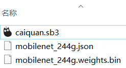

### 双击打开sb3程序

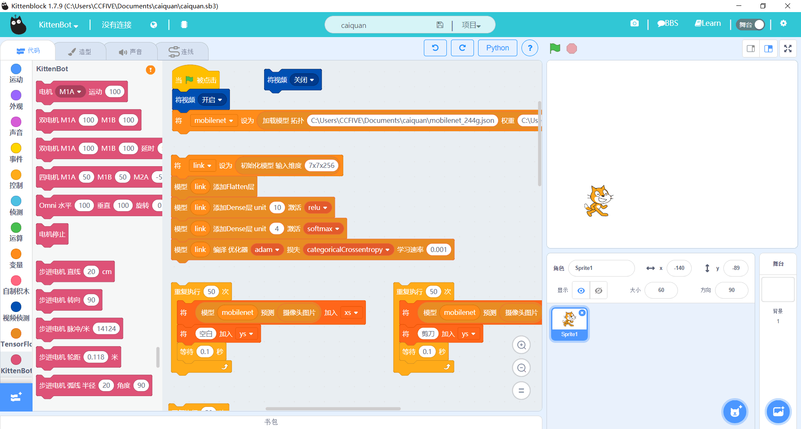

### 修改拓扑路径与权重路径

根据你下载的程序包解压的路径，对应修改程序。

如下图的两处修改：

小技巧：

直接去到对应的文件的目录，点击下，把目录复制粘贴，这样就不会输入错误了。
不过要记得，\mobilenet_244g.json  与  \mobilenet_244g.weights.bin 不能缺少。**这里新手很容易犯错~**

**CC喵笔记：拓扑与权重这两个就是机器学习里面的概念，第一次使用不必深究，知道就好。**

### 点击积木块开启摄像头

点击积木块，scratch舞台会出现摄像头画面，如果没有出现画面，请检查你的摄像头是否成功驱动（如果你电脑连接连着两个摄像头，例如笔记本本身自带摄像头，你再接了一个USB摄像头，kittenblock默认会连上第一个摄像头，一般就是驱动起笔记本摄像头，如果你要用USB摄像头，你需要去设备管理器将本机摄像头禁用掉。）

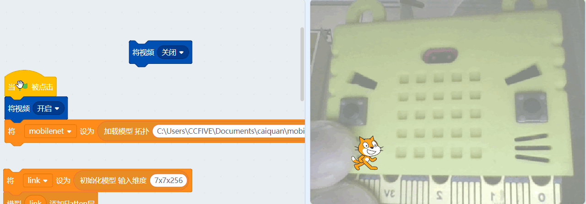

### 点击积木块建立模型

积木块群点击的一瞬间，有个黄色边框，然后又恢复原状，说明这段积木块已经被执行了。

**CC喵笔记：模型建立是机器学习的核心，也就是学习TensorFlow的精髓所在，第一次使用不必深究，知道有模型建立这个概念就好。**

### 点击积木块进行手势采样

首先我们先采集空白图，就让镜头采集空白的图片

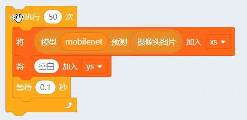

再依次采样剪刀图，采样过程中（积木块边框亮），变换下剪刀手的方向角度，让样本具有差异性，这样训练出来的模型适应性比较强。

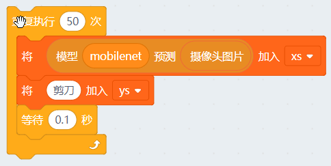

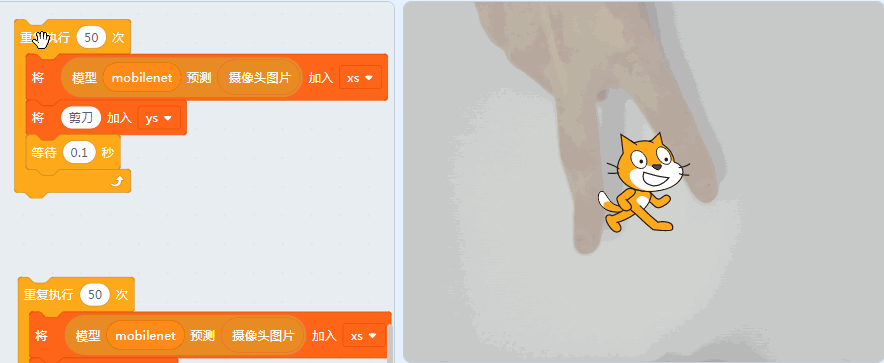

采样石头图

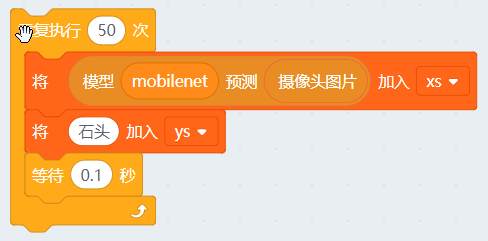

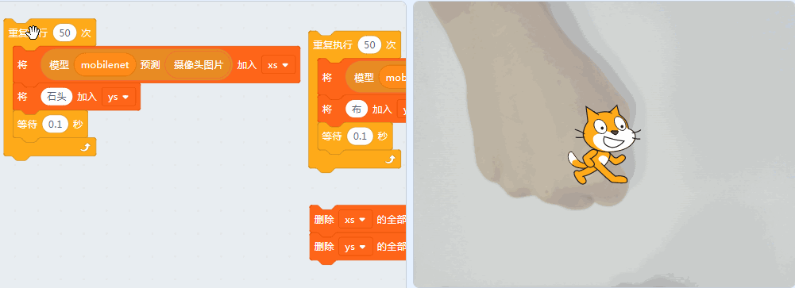

采样布图

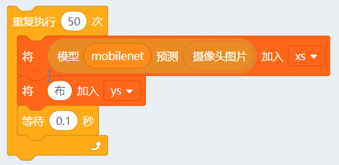

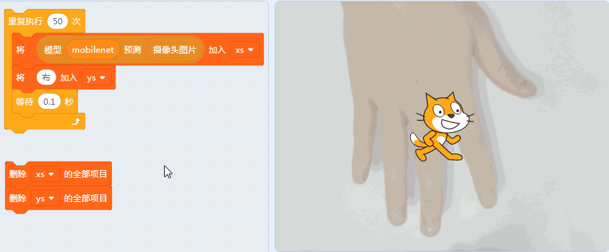

**CC喵笔记：因为我们打算让机器分辨出这四种情况：空白图，剪刀图，石头图，布图。所以我们首先要像教一个婴儿那样，要重复告诉它（这里每种情况拍了50张照片），这是什么手势。这里要注意下，我们只是采集了图片，并且把图片打上了标签，我们并没有告诉机器，这四种情况是如何区分，机器学习引擎的魅力所在就是你无需告诉它规律，只要告诉它，这个是50张剪刀图，那个是50张石头图，你自己找出它们自己的规律，并建立好模型。XS可以理解为就是一个要学习的图片集，ys是对应这个图片集的标签（这里的标签就是空白、剪刀、石头、布）**

### 如果采样有误

如果在以上的采样过程中，采集有误（采样手势有误），就要需要点击以下的积木块，把之前采集过的图片数据以及对应的标签全部删除掉。（包括你后面模型训练出来后，如果你觉得识别的准确率不高，这很可能是你这个采样过程中，手势不典型没有代表性，导致机器识别出错）

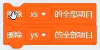

然后重复手势采样步骤（空白、剪刀、石头、布）

### 将样本导入模型并进行训练

点击积木块群

训练20次数，训练需要一点时间，所以我们按键盘F12（window系统），调出后台，可以看到训练数据在跑动。

从0跑到19，这样20次就训练完成，也可以看到函数在收敛。

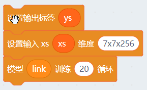

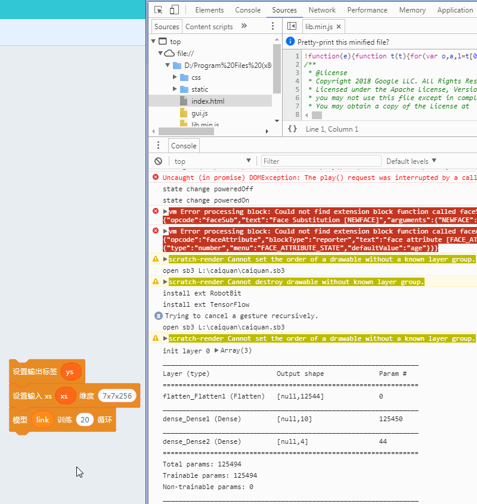

**CC喵笔记：这个步骤就是将我们采集回来的样本（图片集合与一一对应的标签），塞到我们开头建立的模型里面进行训练，这个训练过程是全自动的，也是很神奇！机器学习按照你的设置建立了一个模型后，然后通过学你的给的样本，自己在训练的过程中摸清楚规律，并且它每次训练好模型后，它会将10%样本放到模型中进行验证（因为样本我们已经标定了正确的答案），如果验证不通过，它自己则会再进行调整参数，如此重复循环，直到训练次数结束。我们可以理解它这个训练过程就是自己在跟自己博弈的过程，不断的学习进化，最后它被训练出来了，就能很好适应类似样本的图片了**

### 训练完成后进行应用

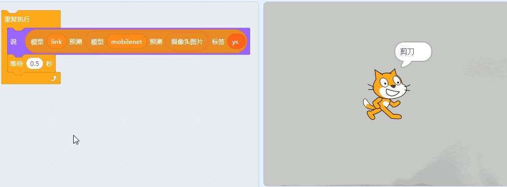

这个就是我们想要的最终答案：

这个积木块返回的的就是，实时采集摄像头的数据，塞到我们的预测模型中，然后返回我们的标签类型（空白、剪刀、石头、布）的其中一个类型。
这时候我们只需要对这个积木块进行条件判断，对应做出不同的反应就完成了实验。

### 利用预测结果控制舵机

做一个重复执行函数，对机器学习结果进行条件判断。对应调用石头、剪刀、布函数

视频运动于舞台>100,这个积木块可以理解为，当让摄像头影像有变化时，才进行判断，否则摄像头一直频繁判断，比较消耗电脑的内存，电脑消耗内存过大会导致软件蓝屏。

石头剪刀布函数实际就是控制三个舵机不同的运动角度，把对应的手势举起来。（这里主控板用了Rosbot，你也可以用Robotbit）

例如石头函数：

控制A2舵机举起来！

硬件如下：

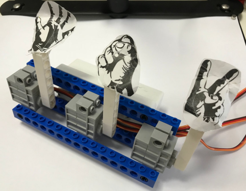

## 如何提高识别度

### 样本的数量

样本数量越多肯定越好，不过考虑到工作量的问题，一般取到恰当的样本数量能达到预期效果就可以了。数量一般没有什么规律可以，简单特征至少50以上比较好，如果非常复杂特征的物体，那几百上千比较合适。这个具体设计到调参和应用环境，如果觉得识别正确率不够，可以适当加大样本量。

### 样本的质量

所谓样本质量，例如我们是摄像头采集回来的图片，第一个就是清晰度。拍照的时候和具体使用的环境是否一致，尽量一致的时候识别率是比较好。
如果环境比较杂乱，那就需要更高级的机器学习模型来适应。本文的程序只适合背景比较简单的情况。还有一个就是一些光照度的原因都会影响到识别。样本质量其实很好理解，就从一个普通人的角度去想，这样图片你怎样看才是最容易认出来，这样感兴趣认知下。

### 训练的次数

普遍认知上，训练次数越多，识别度越准确。但是训练次数过多，又会造成过拟合。类似一个人经常专做一些偏题难题，钻牛角尖，做多后，一看到类似的题目，就马上反应答案，不假思索，实际这个答案是错误的。这就是做得太多的坏处。过拟合和欠拟合在机器学习中也是一个很重要的专题。具体详情可以自行查阅机械学习相关书籍。

所以自己可以稍微改动下训练次数，看看结果如何

## 后记

如果你操作得不到本文的结果，建议将程序重新打开。重新操作一遍。因为这个程序要求操作比较严格。错了就要重来。第一次使用建议直接用我们提供的程序，防止你自己拖拽积木拖错了，得不效果，多么令人沮丧。

摄像头采样的背景尽量保持纯色干净，这样可以提升识别率

到应用阶段，摄像头采集的环境尽量保持与样本采集一样的环境。

Mac版本调出后台按 Fn+F12

摄像头一般的USB摄像头即可，当然质量越好的摄像头采集图片越清晰，效果当然越好，十来块，几十块钱的都够用了，不用追求极致

看完本文，有些用户说只是感性认知了机器学习，实际还没真正了解到。确实这样的，要知道TensorFlow这个机器学习框架是倾尽谷歌多少工程师才做出来，如果你仅仅是看这一篇就能把谷歌大牛们的精髓全部理解透彻，这只能说明TensorFlow的技术含量有点低。所以不要气馁，活到老学到老。还是那句话，我们不要求每个人都成为程序架构师，我们只需要能掌握应用到这项技术到我们实际生活中，这就已经足够了。

本实验的TensorFlow运算实际就是跑在电脑中，所谓的在线，必须连着电脑。很多用户问，喵家有没有硬件可以离线跑TensorFlow？可以这么说现在市面上的能跑TensorFlow的硬件还没有多少个，并且不是一般人能玩得转的。如果你想要可以离线跑TensorFlow的硬件，不妨到喵家群找大群主@C说，“我就是想要可以跑TensorFlow的离线硬件，Take my money!”,群众呼声高了，喵家的产品自然就会有了^^

## 技术延伸

CC喵，剪刀石头布，这个实验我已经完成了。能不能改动下程序，改成我自己想要的。例如我想识别其它物体，或者是不同人的头像。这个可以实现吗？

当然可以！小喵科技的黑科技每一个都是易用性与灵活性之间取平衡。

剪刀石头布这个案例中。主要是针对摄像头识别物体，主要是识别了4个样本类型。

换句话来说，你可以更改程序，可以让摄像头识别其他物体（例如人头像），而且样本类型不限。TensorFlow这个机械学习框架的魅力在于，只需要稍微修改下参数即可以套用原来的机械学习模型，通用性十分强。

### 举栗子识别五个样本类型

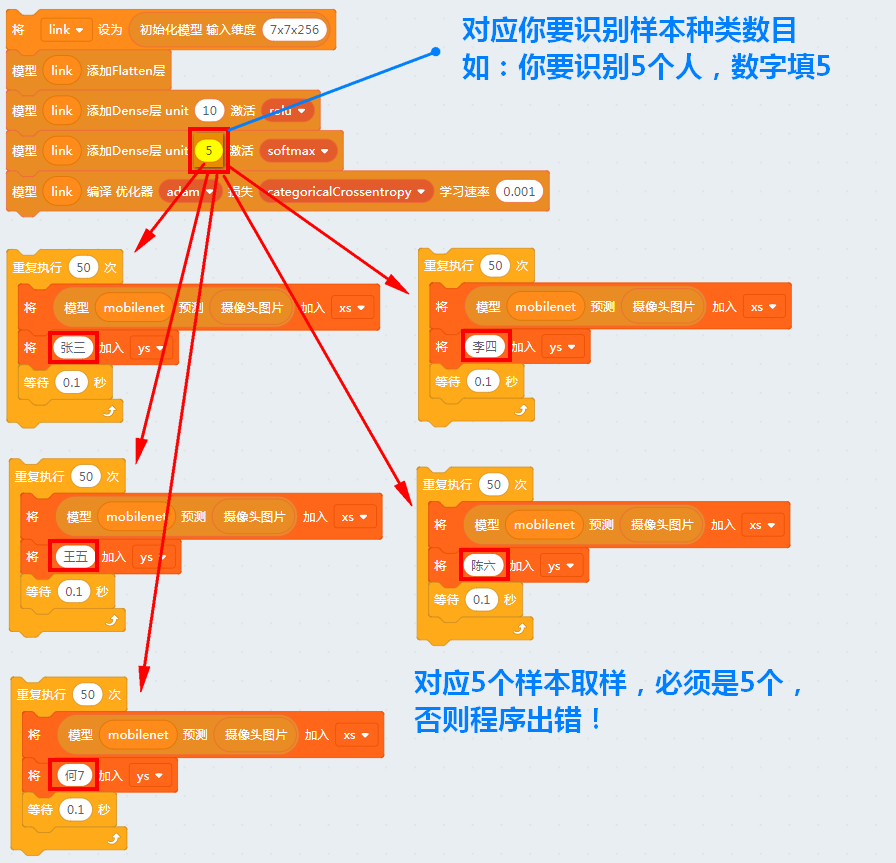

更改参数后，对应操作和剪刀石头布的步骤一样。唯一不一样就是取样拍照，你需要找5个物体来拍照取样。

## 你需求你有好想法？

TensorFlow是一个新生的事物，包括技术落地与应用都需要大家共同去讨论和使用，如果你对喵家的TensorFlow有任何使用上的疑问或者建议，请联系CC喵~我们共同鞭策程序猿，哇哈哈哈~