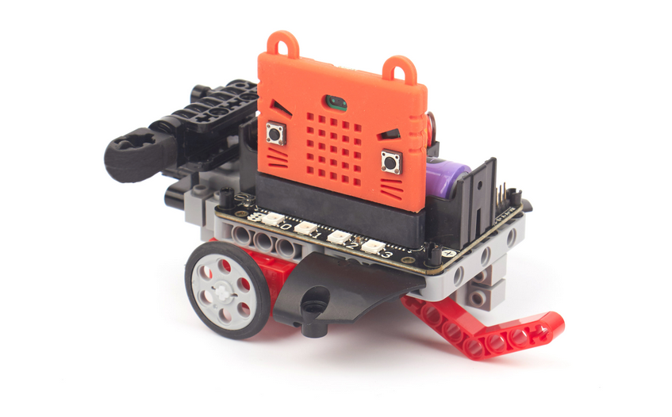
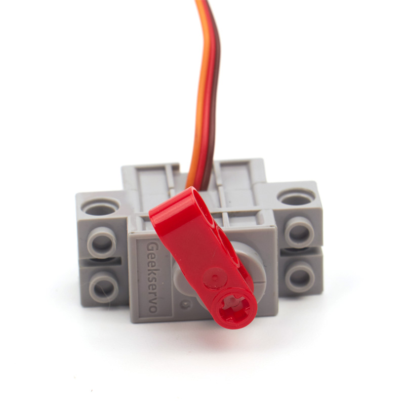
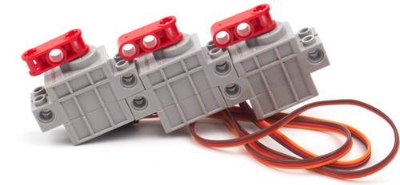
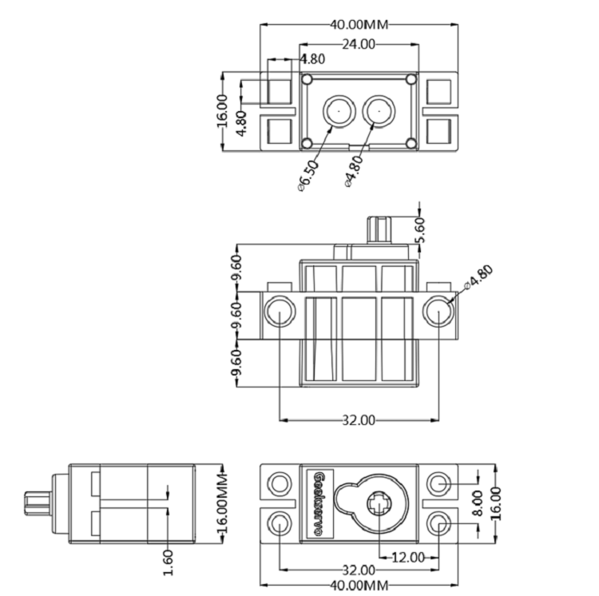
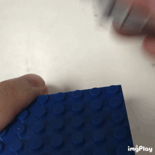
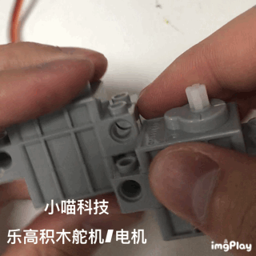
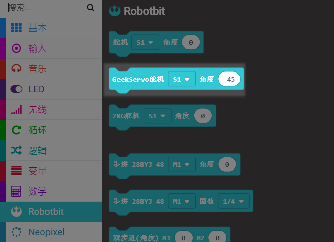
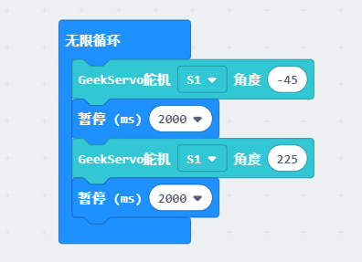

# 乐高伺服舵机/乐高减速电机   

## 产品名称：   
Geekservo 乐高伺服舵机/乐高减速电机   

## 配送清单：   
舵机版：4个Geekservo   

电机版：4个Geekmotor   

混批版：2个Geekservo+2个Geekmotor   

## 产品简介   
   
小喵科技作为研发型的科技公司，一向以开放的心态听取用户意见，综合用户意见后，研发两款性价比高，适配乐高的伺服舵机与减速电机
大家从此可以摒弃，用普通蓝色9g舵机+转接块的方式安装与乐高结合。接口采取常用的2.54接口，可以适配是市面上常用的主控板。舵机控制方式并没有加入小喵家的特殊协议，而是兼容市面上的舵机控制方式协议。小喵是希望以最大的兼容方式，让普通用户也能把这个乐高舵机/电机用到各种DIY中，而不仅仅停留于小喵家的软件。   
同时这款乐高舵机是270°（所采用的电位器是300°），市面上的普通蓝色9小舵机（大家DIY用这种最多）一般角度之后0~180°，并且很多时候不能真正达到180°。所以小喵听取了用户的建议，采取了300°的电位器保证了，270°的转动角度（-45~225°）。由于转动的角度比蓝色9g小舵机的大，所以控制脉冲稍微有所变化。不过在Arduino中本身就可以初始化设置脉宽范围。各种软件中的控制方式会在本文中给出例程。
为了应对不同应用场景，小喵做了两种类型，应对大家的不同需求。   

## 产品特色   

- 乐高灰（伺服舵机类型）：   
主要用于动作关节类控制   
   

- 乐高红（减速牙箱类型）：   
主要用作360转动或小车类制作   

----------

以下介绍下乐高伺服舵机/减速电机的特色：   
### 极力齿过载保护   
   
一般是市面上常规的9g小舵机坏的原因都在电机上。   
电机坏的原因无非三个：   
1. 电机本质寿命问题   
2. 长时间堵转，电机烧毁    
3. 小熊孩用力扭，把齿轮箱扭坏了。
小喵首先采用了优质的电机，采用优质的电刷材料。另外一方面为了应对后两种情况。在输出轴的最后一级做了极力齿，所谓的极力齿，就是在设定的扭矩范围内，输出轴正常输出。超出最大扭矩后，极力齿就开始工作。用力乱拧输出轴在极力齿的保护下，只会哒哒哒进行跳齿保护。可以防止小熊孩的破坏，所以特别适合青少年编程培训搭建。虽然价格上比蓝色9g小舵机贵，但是实用性，耐用性和寿命上，乐高舵机/电机远超9g小舵机。   
### 兼容性强   
无论是程序还是机械结构乐高搭建上，尽可能做了兼容处理。   

### 控制简单   
乐高舵机采用了常规的脉宽方式控制，并没有加入协议控制。与常规9g小舵机控制方式类似，90°脉宽是1500（与常规小舵机控制方式一样）   

### 体积小巧   
在乐高Technical体系中，似乎不在往体积小巧中发展。另外都是以可测转速的减速直流电机为主。体系中缺少体积小绝对值角度控制的动力电机。（乐高体系中没有舵机）   

### 安装方式灵活   
Technical安装方式与普通乐高砖块安装方式。

### 自带十字输出轴   
输出抽直接采取十字轴安装方式   

## 产品参数   
   
### 伺服舵机参数规格   
- 工作电压：3.3V~6V
- 额定电压：4.8V   
- 额定电流：200ma   
- 堵转电流：700ma   
- 打滑电流：450ma   
- 最大扭矩：500g.cm   
- 角度转速：60°/0.12s   
- 净重：12.8g（单个）

### 减速电机规格   
- 工作电压：3.3V~6V
- 额定电压：4.8V   
- 额定电流：200ma   
- 堵转电流：700ma   
- 打滑电流：450ma   
- 最大扭矩：500g.cm   
- 最高转速：70rpm（3V供电情况下）   
- 净重：12.4g（单个）   
- 
点评：减速电机速度较慢，小体积但扭矩一点都不小，适合简单入门的小制作，小喵后期会推出速度更快的直流牙箱   

## 尺寸规格   
- 长度：五个乐高孔电源8x5=40mm   
- 宽度：两个乐高宽度单元8x2=16mm   
- 高度：三个乐高高度单元3.2x3=9.6mm   
- 基础孔位：直径4.8   
- 输出轴：带极力齿乐高十字轴   

## 伺服舵机线序   
常规舵机线序
- 红接正极
- 棕接负极
- 黄接数据引脚（控制引脚）

## 减速电机线序   
红接正极
黑接负极（实际并没有正负）   

## 安装方式
### 与普通乐高安装   
底部安装   
   
侧边法兰下安装   
   
侧边法兰上安装   
   
### 与Technical乐高安装
侧孔安装   
   
底孔安装   
   
输出轴安装   

## 使用环境   

### Microbit中控制方式

RobotBit最新插件加入了对GeekServo的支持，用在线版本Makecode的同学需要重新添加一下插件。离线版本已经集成了最新版本Robotbit插件。

如下图,如果找不到舵机下面那个Geek servo模块的同学，请重新加载一下插件。离线版本可能需要清除一下数据库。

**注意：这个模块只针对灰色舵机版本，如果是使用红色直流电机版本可以直接使用robotbit直流电机插件.**

下面我们来写一个让舵机摆动的程序

跟一般的9g舵机不同，geekservo摆动角度可以达到270度，我们在软件中标定范围为(-45°~225°)。90度的时候对应十字轴中心位置，每颗GeekServo出厂都做了校准。

### Kittenblock中控制方式   
待续~   

### Arduino中控制方式   

GeekServo 本质上还是用传统脉宽信号控制舵机角度，因此Arduino自带的舵机库完全可以胜任，不过需要做一些角度的转换。

### 9g舵机的 角度-脉宽

- 0度：600us
- 90度：1500us 
- 180度：2400us

### GeekServo的 角度-脉宽

- -45度：600us
- 90度：1500us 
- 225度：2400us

转换的函数如下：

    int angleMap(int degree){
      return (degree-90) * 20 / 3 + 1500;
    }

另外初始化的时候需要向Arduino声明舵机控制周期为600~2400us，以便重新计算定时器周期。

	servo.attach(4, 600, 2400);

大家可以将下面的代码直接复制到Arduino中并烧录到主板上，注意例子中我们舵机接在4号引脚。

    #include <Servo.h>

    Servo servo;
    
    int angleMap(int degree){
      return (degree-90) * 20 / 3 + 1500;
    }
    
    void setup() 
    { 
     servo.attach(4, 600, 2400);
    } 
    
    void loop() {
     servo.writeMicroseconds(angleMap(0));
     delay(2000);
     servo.writeMicroseconds(angleMap(90));
     delay(2000);
     servo.writeMicroseconds(angleMap(180));  
     delay(2000); 
    }

## 注意事项：   

geekservo的转动范围：-45~-225°，一共是270°   

geekservo舵机有严格的线序之分，插接电路板请根据说明指引进行插接   

geekservo使用过程中禁止长时间堵转，长时间堵转有可能导致电机损坏   
