# wifi模块固件更新 

由于软件在不断优化更新，wifi的适配也需要，于是就存在固件更新的必要性。 
更新固件的同时我们需要区别一下当前固件版本。
用户手里的喵家wifi模块版本号可能有2种。 

PS: wifi firmware 后续更新在[github release](https://github.com/KittenBot/kittenbot-docs/releases/)

- v2.80及以上
- v2.80以下  

由于喵家对wifi固件的不断优化，v2.80以上属于一个分水岭，则固件的更新方式也需要有所区分。  

## 查看当前的wifi版本

```important:: 要查看当前wifi版本，第一件事就是需要先连接wifi，而后才位于kittenblock的wifi管理面板中查看信息。
``` 

首先给wifi供电(即接上5V和GND)，同时确保拨码开关拨向右侧(如图)

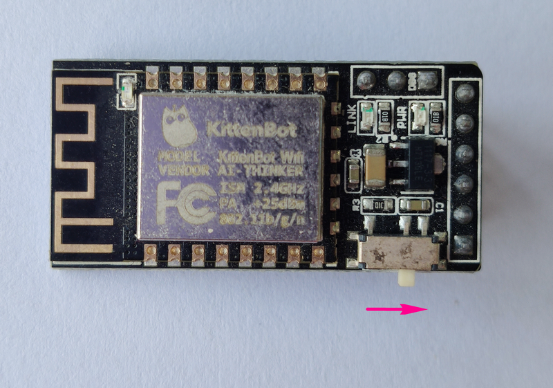 

```important:: 接着是确认连接wifi存在2种情况，分别就是你使用的电脑是否含有无线网卡
```

- 含无线网卡(如笔记本)  

这种情况，在WLAN的列表里应该可以找到ESP开头的wifi可选，点击连接即可，一般第一次是不存在密码的。 

- 网线(如大部分台式机) 

这就需要先将手头的wifi连上路由器确保和电脑在同个局域网。 

**接着就教大家如何将wifi连上自家路由器,无线网卡用户可以直接跳过这一部分**

## 将wifi连上路由器 

连上路由器的方式也有多种 

- 通过kittenblock烧录连接程序 
- 通过手机app帮助wifi连接 

### 连接路由方法1——kittenblock烧录程序 

一. microbit + robotbit为例  

硬件选中powerbrick，拖出最底下的初始化wifi积木块并默认PORT2即可 
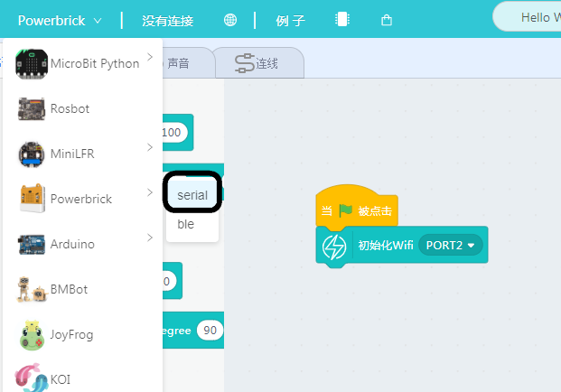  

加载IoT插件，拖出连接路由器积木块，输入你路由器的名称以及密码 
  

打开代码区，可见tx=pin1，rx=pin12，并按照如下接线(记得打开robotbit电源，否则5V一列没电)


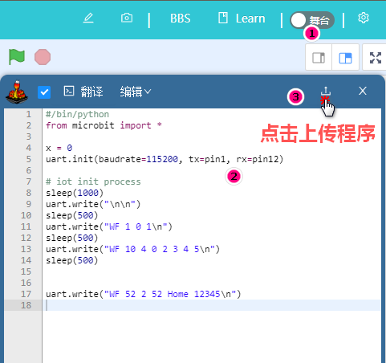   

下载成功后差不多，按一下板子背后的reset键，等待一下，可以看到图示出蓝灯闪烁，过一会儿就能搜到wifi了
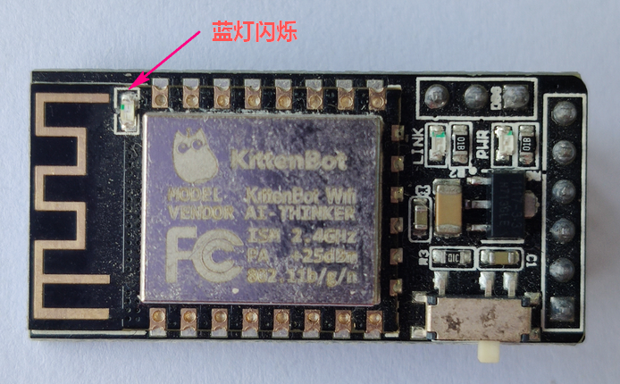
 

二. rosbot为例 

硬件选择rosbot，并连接串口
  

加载IoT插件并搭建如下程序(填好你的路由器名字和密码)
   

调出代码框，点击上传
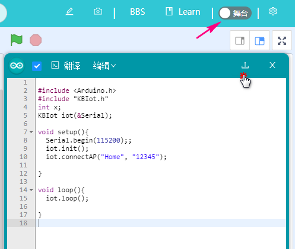  

```attention:: 上传代码的时候需要提前将wifi模块拔掉
``` 

代码上传成功我们重新接上wifi模块到固定接口，并稍等1s后按下rosbot复位按键，让程序重新跑一下 

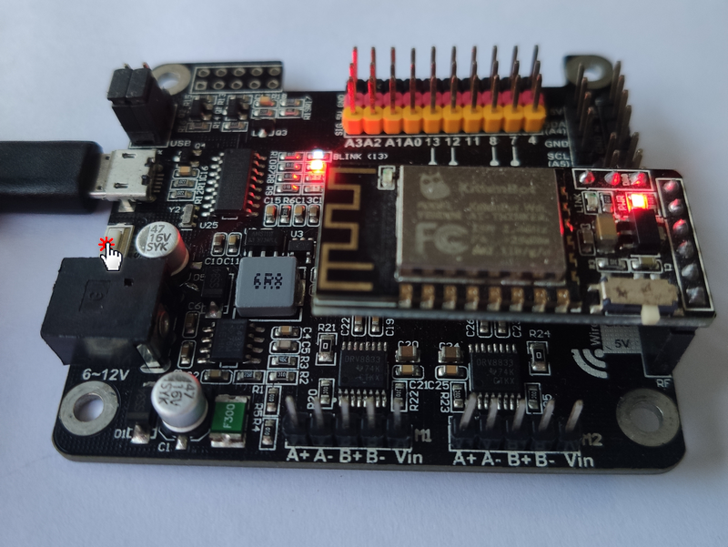   

### 连接路由方法2——使用手机app连接 

- 首先确保下载最新版kblock app 

下载地址: [https://www.kittenbot.cn/kblock](https://www.kittenbot.cn/kblock) 

- 给wifi模块上电(接上5V和GND即可)，并确保上电时拨码在右边(参照方向为天线在左侧)

- 上电后将拨码拨向左便，等待一下，可以看到红灯旁的蓝灯快速闪烁，此时表明进入了配置模式 

- 打开app并点击smart Config
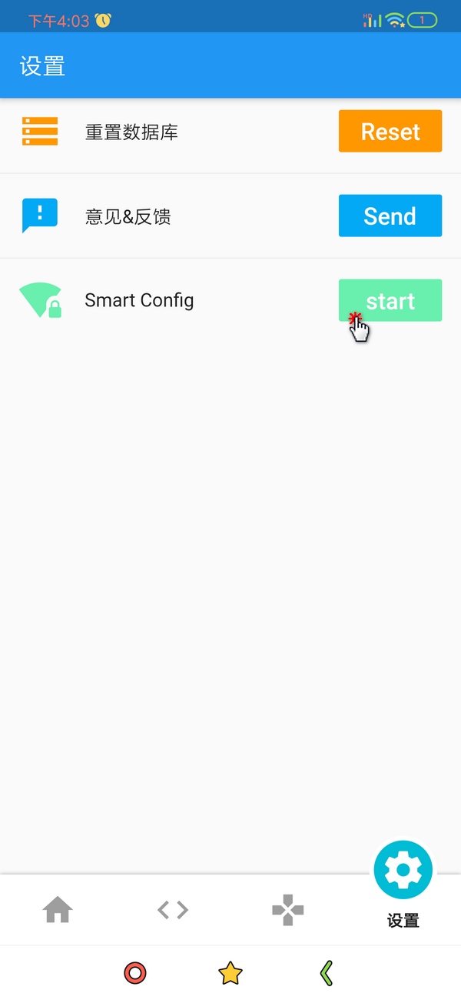 
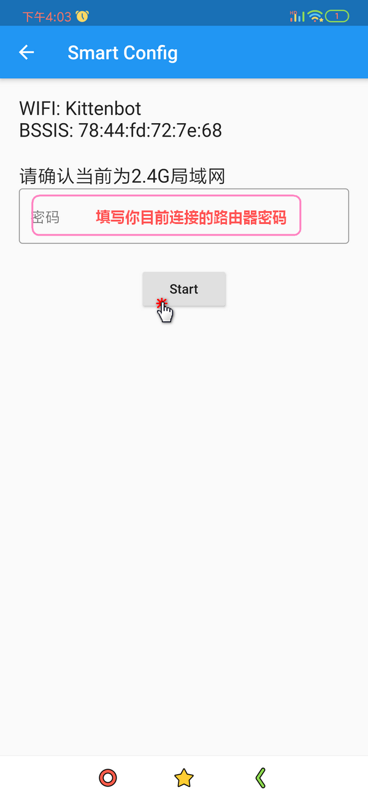  

- 等待一会儿，出现如下字符串既是连接成功了，此时看到wifi的蓝灯也不像之前那样快速闪烁了 
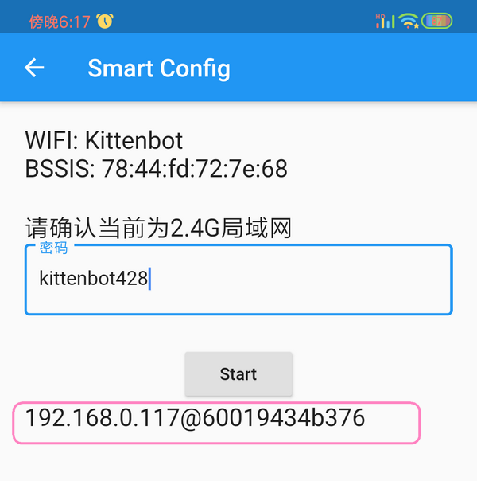  

- 我们将wifi模块拔掉下，将拨码拨向右侧后再接到板子上，此时我们的wifi已经添加到路由器并且可以被搜索到了 

```attention:: 拔下来是为了断电，这一步是必须的
```

## 正式查看版本号 

随意选个硬件并连上wifi 
  

连上后，打开网络管理，点开wifi控制页面，查看wifi版本号（框框处就是目前的wifi版本号，可能跟home页面的不同，但已这里为准）
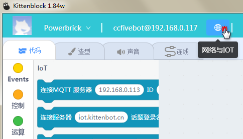

  

```important:: 如此一来我们既了解了如何连上wifi并查看版本号，而后根据版本号选择以下的更新方式
``` 

## v2.8以下固件更新(不包括v2.8) 

```attention::如果是v2.8及以上用户，这一步可以跳过。更新固件要么使用rosbot，要么只能使用[USB转TTL模块]（淘宝可以搜到）
```

1、拨动wifi的设置开关，进入wifi固件更新模式，结果如下图


2、拔掉Rosbot主控板跳帽，RX就对应TX,TX对应RX进行接线 
（上电钱请再三确实接线是否正确，非常容易接错）

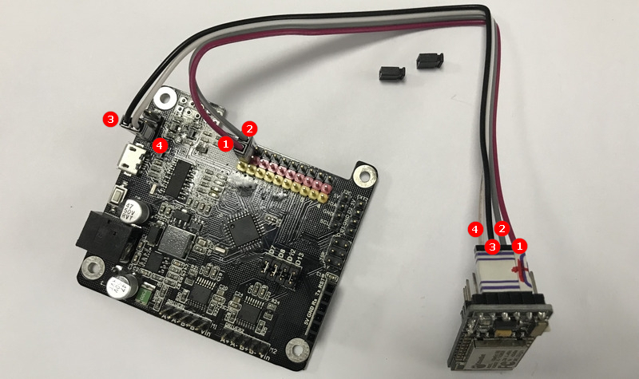


3、下载ESP8266的固件更新软件，[http://cdn.kittenbot.cn/flash-tool.zip](http://cdn.kittenbot.cn/flash-tool.zip)

4、双击打开“ESPFlashDownloadTool.exe”

5、按照如图所示操作


在文件第一栏中加载压缩包内的固件bin文件（**kbwifiV2.8.bin**）

其他设置如下图，必须设置一模一样，否则下载失败或者导致wifi模块无法通讯。下载前请再三确认。

```attention:: 左上角一定要勾上，不够相当于没选固件，烧了个寂寞
```

COM选择，是你插上Rosbot主控板后出现的COM口，对应选择你的COM口，波特率优先选择1152000，如果下载失败后，尝试吧波特率降低一点点，波特率实际上就是下载的速度，太快有些电脑有时候会失败。

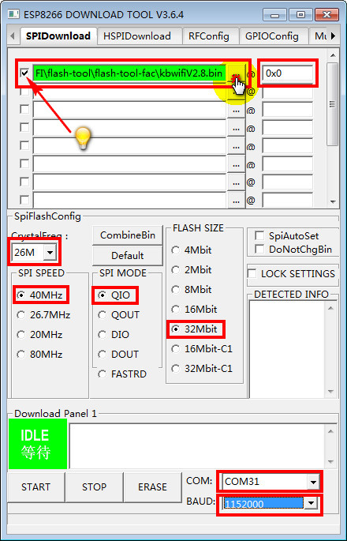

6、进行下载
点击“START”

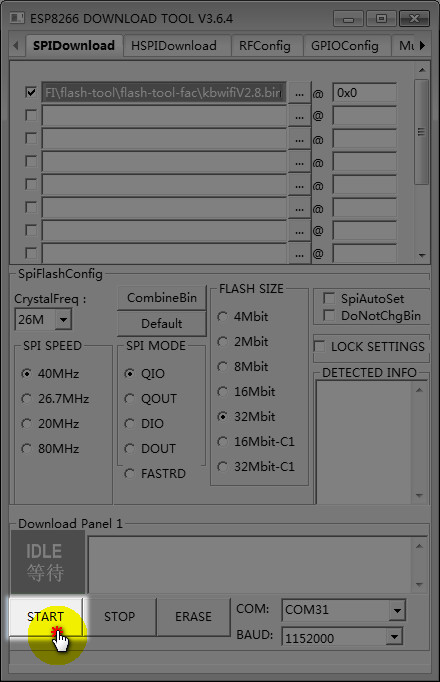

7、出现红框提示后，再稍作等待，即可看到，红框的"等待上电同步"变成“下载中"

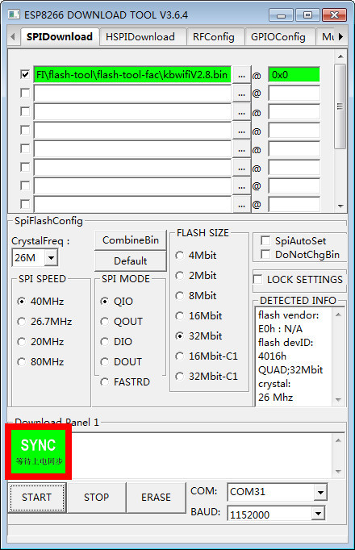

PS：有一部分电脑，如果红框一直显示“等待上电同步”，一直都不动，这时候你需要把wifi模块拔下来，如下图：

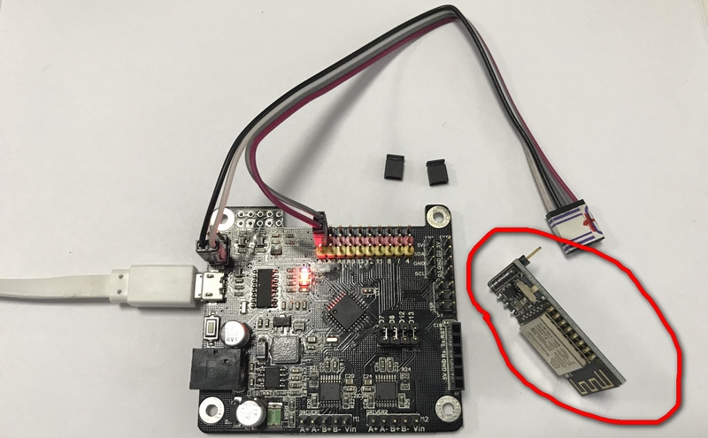

再插上，这时候红框就会变成“下载中"
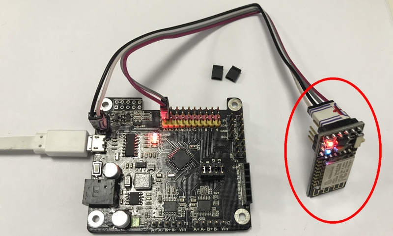

8、等待成功提示，这样就成功更新完。


  
9、把wifi拔下来，开关拨动回去正常模式。**（90%的用户都会忘记）**

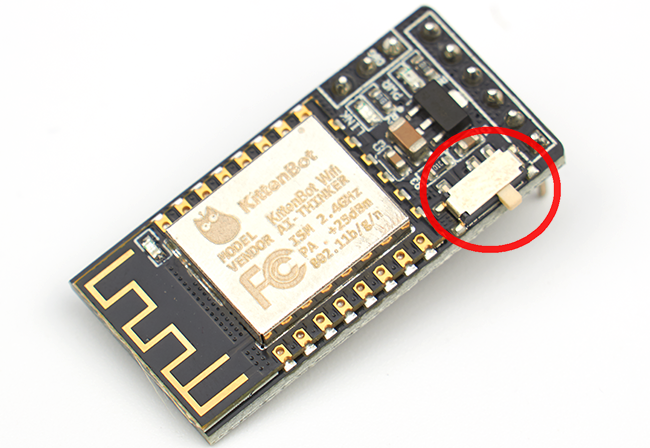

10、Rosbot板子的跳帽插回去否则Rosbot不能正常使用**（90%的用户都会忘记）**
  
 

wifi烧录完成功，断电，开关拨回正常模式，重新上电，红灯常亮，蓝色亮着，每隔1秒闪烁一下  

```attention:: 如果更新失败了，请重新再尝试一下，检查下步骤是否错误或者是否遗漏。更新完请继续下面章节的更新
```


 
## v2.8及以上固件更新
 
先下载最新固件文件 
[wifi最新固件2.6](https://github.com/KittenBot/kittenbot-docs/releases/tag/wifi_2.86) 

```important:: v2.8的以上wifi的革新就是利用网页给wifi刷固件
``` 

### 原理
喵大神将wifi模块里面的程序分成两个区假设是1区和2区，平时运行启用一个区（例如1区），刷固件的时候，就给另外一个区（2区）刷固件，刷好后，就运行2区，这时候就是最新的固件。下次刷就是2区给1区刷。 

### 操作过程 

由于是需要通过wifi配置页面进行更新，所以前提是你必须连上wifi，不明白的看上一篇 **如何连上wifi** 

在配置页面中根据提示我们选择对应的.bin文件进行刷入 

 

 

### 下载成功

到此，你已经成功更新下一个版本的固件了。

 


