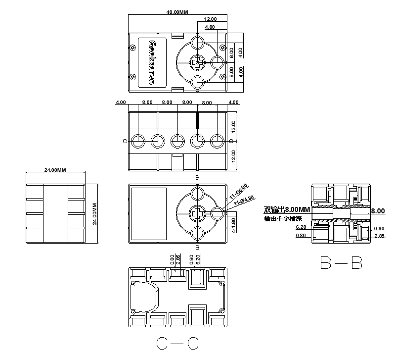
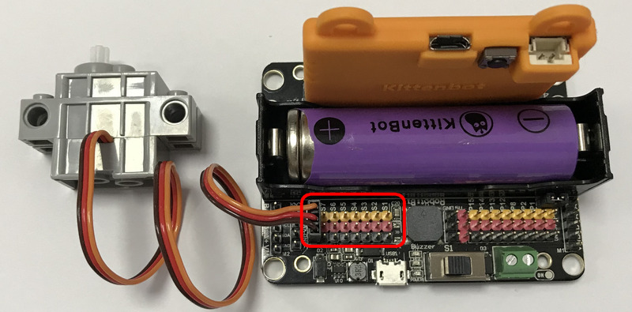
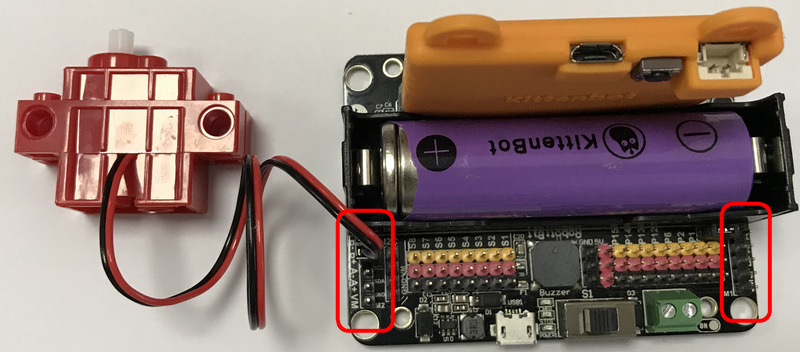
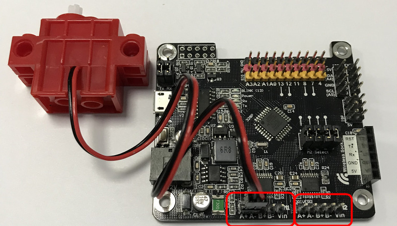
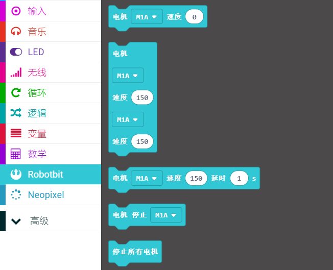
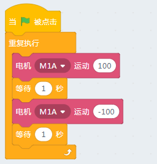
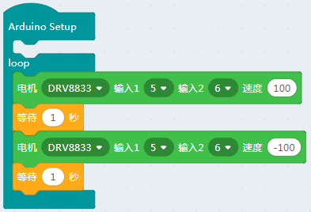

# 乐高2KG伺服舵机/乐高减速电机   

## 购买链接

## 产品名称：

Geekservo 2KG 乐高伺服舵机/乐高减速电机   

## 配送清单：
以淘宝套件清单为准

套餐一：Geekservo 2KG 乐高灰伺服舵机 x 2

套餐二：Geekservo 2KG 乐高红减速电机 x 2

## 产品简介   

自2018年推出推出的Geekservo系列，第一款 Geekservo 9G，引领大家从以前那种常规的蓝色9g小舵机走向了乐高体系的舵机，解决了传统舵机与乐高结构件的连接问题。将Geekservo 9G是有传统蓝色9G小舵机演变过来，定位是简单的连接用法。后面发现用户的各种创新用法，已经远超我们的设计预期。进阶过程中，搭建比较紧凑和齿轮配合的机构总会遇到半孔的位置尺寸问题。

因此Geekservo 2KG舵机/电机就应运而生。小喵科技与工厂联合开发，具有独家专利。

外形结构上采用中规中矩的长方体形式。不再考虑兼容乐高砖块形式，只兼容乐高的科技件系列。结构紧凑，两侧和上下两个面有半孔和全孔的插销孔。

颜色体系上与第一款 Geekservo 9G一致。乐高灰对应伺服舵机类型，乐高红对应减速电机类型，乐高橙色对应360连续舵机类型（橙色暂未上架）。

程序控制上与常规舵机控制类似。脉冲宽度500-2500us（9g舵机脉冲宽度600-2400us）

软件程序上Kittenblock与Makecode都有图形化积木块进行支持，Arduino IDE有示例代码

## 产品特色   

- 乐高灰（伺服舵机类型）： 
主要用于动作关节类控制，适用角度范围0~360度（注意是不是连续转动的）

- 乐高红（减速牙箱类型）：   

  主要用作360转动或小车类制作，可控速

  

### 输出轴采用十字沉孔处理

可以根据用户需求，自由插入不同长度的十字轴，拼装更灵活更方便

### 转动角度范围大

舵机控制范围0~360度

### 扭力更大

扭力是之前Geekservo第一款的扭力3倍左右

### 极力齿过载保护  

依旧采用极力齿设计 

### 兼容性强   
输出轴孔位尺寸、外形尺寸、插销孔孔位尺寸完全符合乐高标准

   

### 控制简单   
乐高舵机采用了常规的脉宽方式控制，并没有加入协议控制。与常规9g小舵机控制方式类似，90°脉宽是1500（与常规小舵机控制方式一样）  ，脉宽范围500-2500us，对应0-360度

### 体积小巧   

外形方正小巧，适合于乐高结构进行自由搭建

## 产品参数   
### 灰色伺服舵机参数规格   
- 工作电压：3.3V~6V
- 额定电压：4.8V   
- 额定电流：70mA
- 堵转电流：900mA
- 打滑电流：700mA
- 最大扭矩：1.6±0.2 kg-cm （4.8V）
- 角度转速：60°/0.14s   
- 净重：20g（单个）

### 红色减速电机规格   
- 工作电压：3.3V~6V
- 额定电压：4.8V   
- 额定电流：200ma   
- 堵转电流：700ma   
- 打滑电流：450ma   
- 最大扭矩：1.6±0.2 kg-cm （4.8V）
- 最高转速：45rpm（3V供电情况下）   
- 净重：20g（单个）   
- 点评：减速电机速度较慢，体积小但扭矩一点都不小，适合简单入门的小制作，可以与齿轮配合进行搭建

## 尺寸规格   
- 长度：五个乐高孔电源8x5=40mm   
- 宽度：三个乐高宽度单元8x3=24mm   
- 高度：三个乐高高度单元8x3=24mm   
- 基础孔位：直径4.8   
- 输出轴：带极力齿乐高十字轴沉孔（双边） 

## 伺服舵机线序   
常规舵机线序
- 红接正极
- 棕接负极
- 黄接数据引脚（控制引脚）

## 减速电机线序   
红接正极
黑接负极（实际并没有正负）   

## 机械安装方式  

## 与主控板连接方式（需要更换图片）

**geekservo——灰色舵机**    

针对Robotbit，有S1-S8的舵机接口可以接，

针对Rosbot，所有IO均可接

**geekservo——红色电机**  

针对Robotbit，有M1、M2的A+A-、B+B-接口可以接

针对Rosbot，有M1、M2的A+A-、B+B-接口可以接

## 使用环境   

**Makecode中控制方式**  

Robotbit最新插件加入了对GeekServo 2KG的支持

1. geekservo灰舵机

舵机相关积木：

摆动的程序:

跟一般的蓝色9g舵机不同，geekservo摆动角度可以达到270度，我们在软件中标定范围为(-45°~225°)。90度的时候对应十字轴中心位置，每颗GeekServo出厂都做了校准。

----------

2. geekservo红电机  （这个没有变动）

电机相关积木：

转动的程序：

**Kittenblock中控制方式**     

1. geekservo灰色舵机

2. geekservo红色电机（与控制普通TT电机方式一样）

3. geekservo灰色舵机

4. geekservo红色电机（与控制普通TT电机方式一样，根据arduino所接的电机驱动模块对应进行更改）

**Arduino中IDE控制方式**   

新手建议用Kittenblock图形化编程软件。

GeekServo 本质上还是用传统脉宽信号控制舵机角度，因此Arduino自带的舵机库完全可以胜任，不过需要做一些角度的转换。

**9g舵机的 角度-脉宽**

- 0度：600us
- 90度：1500us 
- 180度：2400us

**GeekServo 2KG的 角度-脉宽**

- -45度：500us
- 90度：1500us 
- 225度：2500us

转换的函数如下：

    int angleMap(int degree){
      return (degree-90) * 20 / 3 + 1500;
    }

另外初始化的时候需要向Arduino声明舵机控制周期为500~2500，以便重新计算定时器周期。

	servo.attach(4, 500, 2500);

大家可以将下面的代码直接复制到Arduino中并烧录到主板上，注意例子中我们舵机接在4号引脚。

    #include <Servo.h>
    
    Servo servo;
    
    int angleMap(int degree){
      return (degree-90) * 20 / 3 + 1500;
    }
    
    void setup() 
    { 
     servo.attach(4, 600, 2400);
    } 
    
    void loop() {
     servo.writeMicroseconds(angleMap(0));
     delay(2000);
     servo.writeMicroseconds(angleMap(90));
     delay(2000);
     servo.writeMicroseconds(angleMap(180));  
     delay(2000); 
    }

## 注意事项：   

geekservo的转动范围：0~-360°，一共是360°，但不是连续转动，举例栗子，从0转动到360°，再从360°转到0是逆着回去的。

geekservo舵机有严格的线序之分，插接电路板请根据说明指引进行插接   

geekservo使用过程中禁止长时间堵转，长时间堵转有可能导致电机损坏   
