# 流光溢彩屏

## 购买链接

__转到淘宝购买__----------→[柔性屏](https://item.taobao.com/item.htm?spm=a1z10.3-c-s.w4002-17001215033.39.70df762efMRztd&id=567667633394)

## 产品名称

8x32、16x16流光溢彩屏

## 适用人群

适用于编程比赛，气氛点缀。主要适合diy爱好者和比赛主办方

## 配送清单

- 16x16/8x32 流光溢彩屏x1

## 流光溢彩示意图 

在交互设计，氛围点缀中用的十分广泛，用得好可漂亮得一塌糊涂

8x38:

  

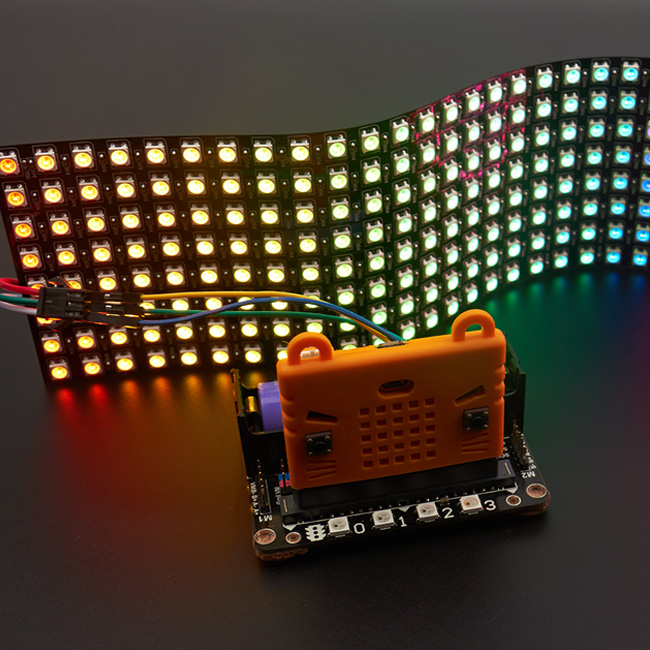 
 
16x16:

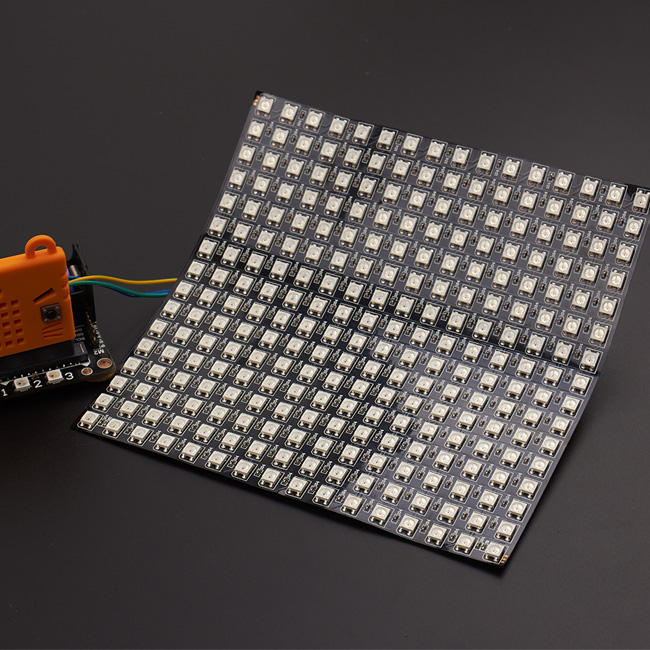 

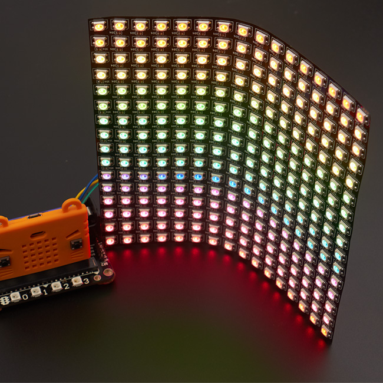 

## 产品简介

这是一款全彩柔性显示屏，相对于市面一般的全彩显示屏所突出的特点在于它的携带方便，显示全面及编程简易。它的使用方法是结合小喵的硬件拓展板及软件平台轻松编程显示自己想要的效果，除此以外，小喵家还专门推出了一款柔性屏编辑器，可以手动添加需要的文字图案效果，甚至免去了自己编写的过程，对于一般没什么基础的人群同样适用性极佳，在无论是节日祝福，还是小聚会气氛都具有更好的点缀效果。

## 产品特色

- 图形化编程使用随心
- 支持单总线控制
- 支持多模块级联控制
- 气氛渲染程度强
- 轻松掌握灯控原理
- 长期使用支持外部供电
- 轻便小巧可方便携带
- 用于展示和教育效果极佳

## 产品参数
 
__8x32柔性屏__

- 长x宽x高：320mm x 80mm x2mm
- 净重：55g
- 毛重：根据包裹最终大小决定
- 板材：软质铜板
- 支持PH2.0接口

__16x16柔性屏__

- 长x宽x高：160mm x160mm x2mm
- 净重：55g
- 毛重：根据包裹最终大小决定
- 板材：软质铜板易弯曲
- 支持PH2.0接口

## 技术参数 

- 工作电压：5V
- 材料：软铜板易弯曲
- 灰度等级：256级
- 发光角度：120度
- 电流：1A、长时间使用建议10A电源适配器
- 功率: 0.3W
- 配合Robotbit拓展板实现创意图形文字创作

## 使用环境

- Makecode可连接硬件：Microbit

## 接线  
	    

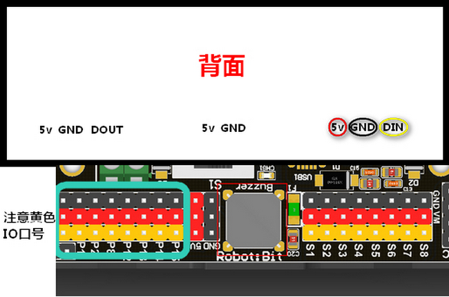   

## neopixel插件的使用方法(建议下述内容请全部看完再具体选择使用)

使用小喵科技离线版makecode的如下添加robotbit软件包   

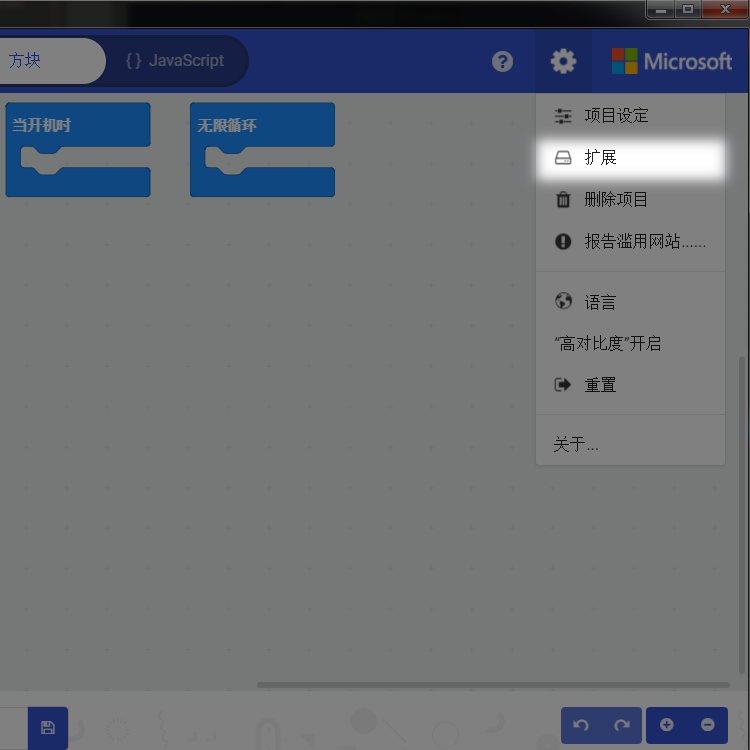  
  
   

开始种初始化柔性屏  

    
   
单色点亮  

   
    
彩虹色点亮  

    
  
推荐调节亮度到30，否则太亮对眼睛不好    

   
  
非全局点亮需要使用刷新显示即show
 
    
  
流水效果积木块，可选偏移或循环，区别在于循环会一直重复，而偏移则闪出尽头就消失，注意都需要要使用show  

    
  
调整你需要的颜色，通过RGB值  

  

调整你需要的颜色，通过HSL值  
  
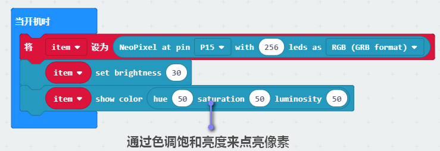  
  
清屏，记得要带show哦  

    
  
  
使用像素单独点亮的话可以参考下面的像素序号表  
(先找到0的位置)  

  

## 喵家官方neomatrix插件使用方法（相信我，这个插件你会爱上）

**如果想编辑复杂文字和图形，要手动拖积木或填数组真的太麻烦了！所以小喵为大家带来了一手的便利，柔性屏编辑器，支持16x16和8x32柔性屏(注意：该插件仅限于在离线版中使用)**  
  
**一.插件加载方法** 

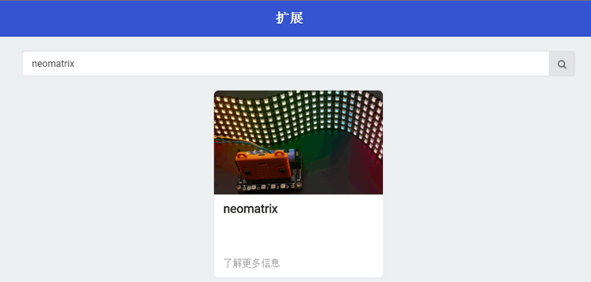

**二.积木块功能介绍**   

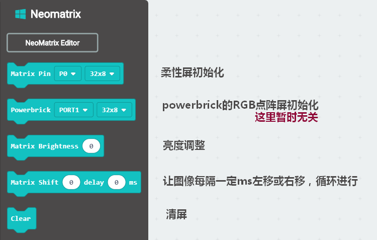

**三.进入柔性屏编辑器**

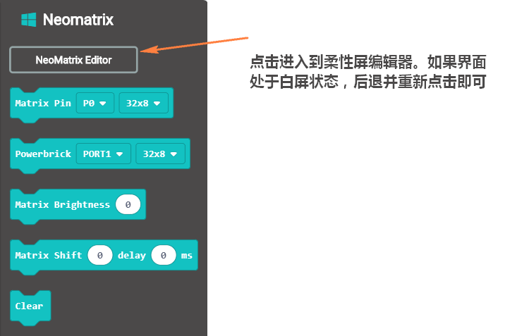

**四.编辑器使用基本流程**  

- 选择柔性屏尺寸（32x8  or  16x16)
- 点击黑色区域的像素格画你想要的图案，或者直接在下方输入文字点击渲染，注意8x32的可能高度不够不足以渲出中文 
- 最后点击界面左下角的流光溢彩屏幕（出现生成成功提示即可）  

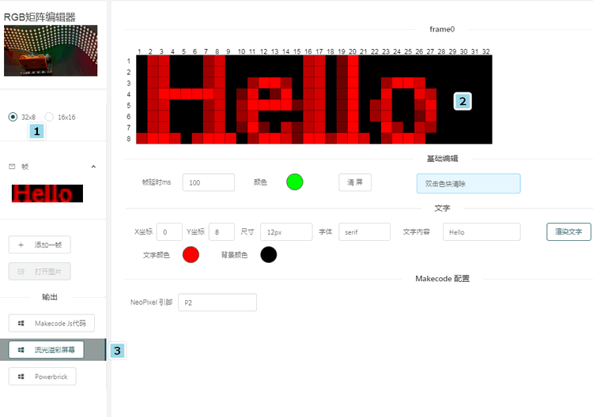  

**五.你可能觉得手动描点太麻烦，那么编辑器提供直接拖入像素图片生成像素点的功能**  
  
- 首先在PS等软件中根据柔性屏尺寸新建画布，而后在画布上绘制你要的图案并导出png或jpg等   
 

- 将生成的图片直接拉入到编辑器的框内,并点击上述提过的生成流光溢彩屏幕

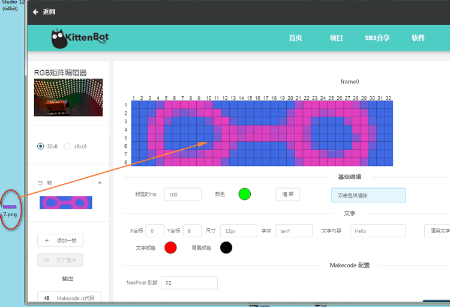 

**六.添加多个图片帧**   

- 只需点击添加一针，并选择新增加的那一帧，在其中绘制你的图案并按流程生成(这里的每一帧图片对应着插件积木块里的每一个图片，注意：如果生成了一张图片后还再原来的帧上修改再次生成的话，原来生成的图片会被覆盖)

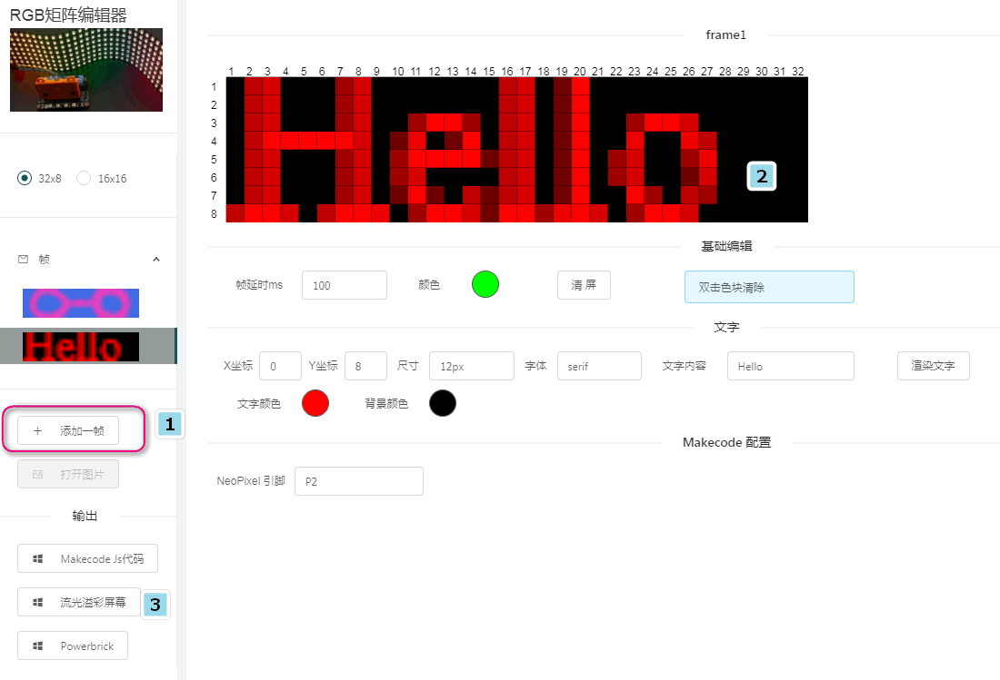   

- 退出编辑器界面我可以看到左下角多了一个Show Frame的积木，下拉框内存着在编辑器里生成的每一帧的图片，直接使用即可(使用这个插件无需额外show，因为每一个积木块内置了show的方法)

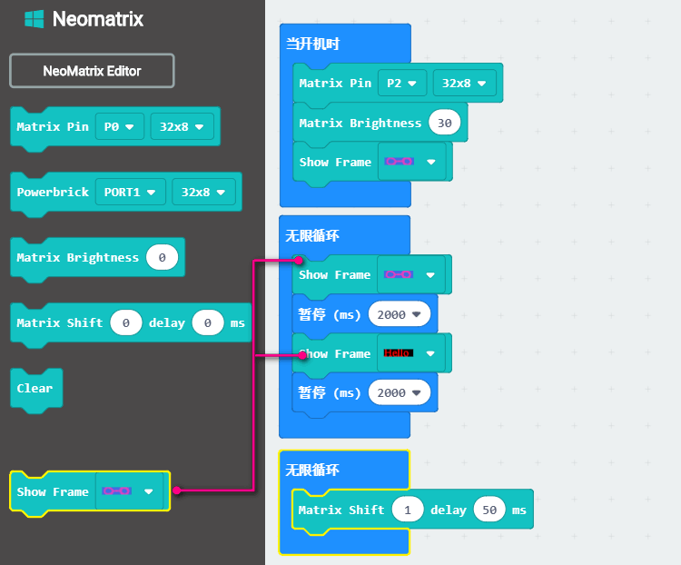 

最后附上使用编辑器在柔性屏上显示的效果，用在节日庆祝、生日派对、DIY作品中都是别有风趣的~  
 
 
  
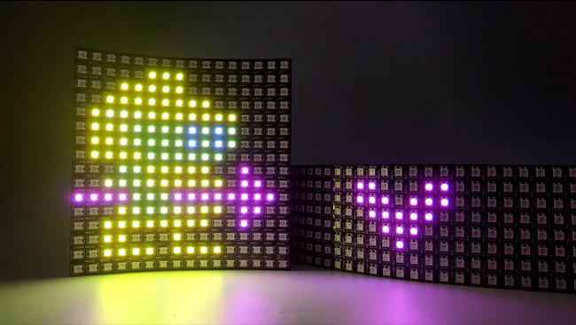 

## 注意事项 
    
- 检查接线是否正确  
- 务必杜绝接高于5V的电源 
- Robotbit板子电源开关一定要打开   
- 灯条若需要长时间使用需要注意如下图所示   

 
  
如果以上都不能解决问题，请联系小喵科技，热诚为你服务  

- 本产品只适用于14岁以上的儿童进行独立使用，8~14岁儿童请在家长或者老师的陪同下进行使用
- 如使用前请按照小喵官方资料指导下进行使用，不要随便接插电路，切勿外接大电流舵机，大电流电机，以免烧毁电路板。
- 注意不要在金属表面，或者导电的物体上使用，以免短路
- 请避免在潮湿和有水的地方使用，以免短路
- 电路板或者机械上含有细小物件请不要吞食，请放在儿童接触不到的地方妥善保管
- 长时间使用请外接电源，具体操作见小喵的产品详细资料地址