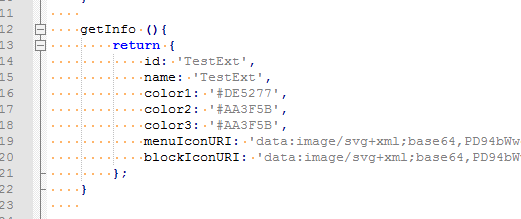
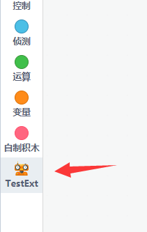
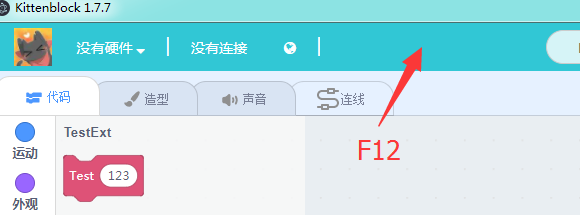
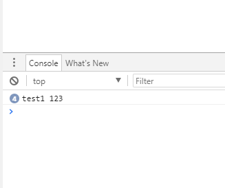
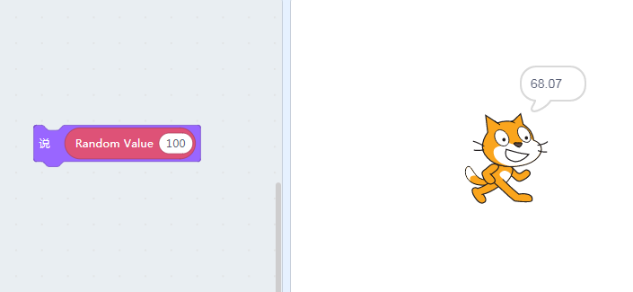

# Kittenblock插件开发指南 -- 01

本节是给有兴趣开发在Kittenblock或者scratch3下开发插件的geek和爱好者阅读，需要一定的js开发能力。 这里介绍的方法不光在Kittenblock内，在标准的scratch3内也是通用的。

具体的插件定义大家可以前往MIT团队的官方github仓库查看：[https://github.com/LLK/scratch-vm/wiki/Scratch-3.0-Extensions-Specification](https://github.com/LLK/scratch-vm/wiki/Scratch-3.0-Extensions-Specification)

目前这份标准并没有完全实现，这里只是以已经实现的部分介绍如何添加一个自己的插件。

## scratch3的插件形式

跟scratch2类似，scratch3的插件也是一大块JavaScript的代码，不同的是更加开放、更加灵活、允许用户定义的功能也更加多，但是随之的开发难度也提高了不少。

所有的插件都是一个类Class，当然也同时支持es6的各种语法。

对js class或es6不熟悉的同学可以看看这篇blog：[http://es6.ruanyifeng.com/#docs/class](http://es6.ruanyifeng.com/#docs/class)

## 构件我们的第一个插件

首先我们先在电脑上新建一个文件，名字就叫`testext.js`吧，用您喜欢的文本或者代码编辑器打开它并添加以下代码。

	
	const ArgumentType = Scratch.ArgumentType;
	const BlockType = Scratch.BlockType;
	const formatMessage = Scratch.formatMessage;
	const log = Scratch.log;
	
	class TestExt {
	    constructor (runtime){
	        this.runtime = runtime;
	        this.runtime.registerExtensionDevice('TestExt', this);
	    }
	    
	    getInfo (){
	        return {
	            id: 'TestExt',
	            name: 'TestExt'
	        };
	    }
	    
	    
	}
	
	module.exports = TestExt;

其中前四行是scratch3的运行环境。之后我们定义了一个名字叫TestExt的Class，这个类就是插件的主体，scratch的vm（虚拟机）会自动生成一个这个类的实例并挂载到运行环境中。

接着我们打开Kittenblock，在左上角的硬件下拉菜单最后一栏导入外部插件`testext.js`：

加载后可以看到在最左下角有一个新的插件：

但是这个完全是空的，接下来我们来讲解如何定制化插件的各种属性。

**PS: 如果重复加载插件发现插件没有更新，这是因为更新的内容太少，这时候可用切换到造型面板再切换回代码面板让程序强制刷新图形化方块。**

## 更改颜色和图标

更改图标的颜色只需要在genInfo加入对应的颜色定义

	getInfo (){
	    return {
	        id: 'TestExt',
	        name: 'TestExt',
	        color1: '#DE5277',
	        color2: '#AA3F5B',
	        color3: '#AA3F5B',
	    };
	}

如果需要图标则可以加入对应的图标定义，有菜单栏图标menuIconURI和方块前缀图标blockIconURI两种：

图标支持base64格式和你的插件图标路径的require方法，大家可以找一下在线的图片转base64工具，注意控制图片大小。

## 添加图形化方块

这里我们添加我们第一个自定义的图形化方块，先贴完整的代码：

	const ArgumentType = Scratch.ArgumentType;
	const BlockType = Scratch.BlockType;
	const formatMessage = Scratch.formatMessage;
	const log = Scratch.log;
	
	class TestExt {
	    constructor (runtime){
	        this.runtime = runtime;
	        this.runtime.registerExtensionDevice('TestExt', this);
	    }
	    
	    getInfo (){
	        return {
	            id: 'TestExt',
	            name: 'TestExt',
	            color1: '#DE5277',
	            color2: '#AA3F5B',
	            color3: '#AA3F5B',
	            
	            blocks: [
	                {
	                    opcode: 'test1',
	                    blockType: BlockType.COMMAND,
	                    text: 'Test [VALUE]',
	                    arguments: {
	                        VALUE: {
	                            type: ArgumentType.NUMBER,
	                            defaultValue: 123
	                        }
	                    }
	                }
	            ]
	        };
	    }
	    
	    test1 (args){
	        console.log('test1', args.VALUE);
	    }
	    
	    
	}
	
	module.exports = TestExt;
	

注意这里我们在getInfo函数中加入了一个blocks数组定义，数组中每个元素对应一个方块。 

其中opcode对应方块的id，这个在插件中必须唯一，并且还要对应一个对应的实现函数`test1`，也可以使用func指定实现函数。如果缺少实现函数，则方块不会被加载。

blocksType为方块类型，主要常用的有COMMAND和REPORTER两种。

text为方块内容定义，其中类似`[xxx]`为参数，需要在下面arguements定义中按照xxx的名称给出。

arguments中是参数的结构定义，每个text中定义的参数都需要在arguments结构中有对应的key入口。 其中type为参数的类型，常用的有`STRING，NUMBER，BOOLEAN，COLOR等等`。defaultValue就是默认值了。

接下来我们看看实现函数，它的主要功能就是在终端打印出参数的值。

    test1 (args){
        console.log('test1', args.VALUE);
    }

这里我们需要打开kittenblock的终端调试界面，先点击标题栏之后按**f12**。

之后我们在弹出来的devtool界面可以看到我们点击方块的打印信息。

## 构造一个带返回值的模块

在getInfo函数的blocks定义中添加如下：
	
	{
	    opcode: 'test2',
	    blockType: BlockType.REPORTER,
	
	    text: 'Random Value [MAX]',
	    arguments: {
	        MAX: {
	            type: ArgumentType.NUMBER,
	            defaultValue: 100
	        }
	    }
	},

在Class中添加实现函数

    test2 (args){
        return Math.random()*args.MAX
    }

最后的效果

实际上我们可以看到在插件中我们可以运行任何js代码，大家可以参考MIT官方的vm仓库和我们的github的extension_kittenblock仓库查看更多的扩展插件实现。

下一章我们介绍如何使用插件和硬件进行交互, 最后我们贴上这一节的全部代码。
	
	const ArgumentType = Scratch.ArgumentType;
	const BlockType = Scratch.BlockType;
	const formatMessage = Scratch.formatMessage;
	const log = Scratch.log;
	
	class TestExt {
	    constructor (runtime){
	        this.runtime = runtime;
	        this.runtime.registerExtensionDevice('TestExt', this);
	    }
	    
	    getInfo (){
	        return {
	            id: 'TestExt',
	            name: 'TestExt',
	            color1: '#DE5277',
	            color2: '#AA3F5B',
	            color3: '#AA3F5B',
	            
	            blocks: [
	                {
	                    opcode: 'test1',
	                    blockType: BlockType.COMMAND,
	                    text: 'Test [VALUE]',
	                    arguments: {
	                        VALUE: {
	                            type: ArgumentType.NUMBER,
	                            defaultValue: 123
	                        }
	                    }
	                },
	                {
	                    opcode: 'test2',
	                    blockType: BlockType.REPORTER,
	
	                    text: 'Random Value [MAX]',
	                    arguments: {
	                        MAX: {
	                            type: ArgumentType.NUMBER,
	                            defaultValue: 100
	                        }
	                    }
	                },
	            ]
	        };
	    }
	    
	    test1 (args){
	        console.log('test1', args.VALUE);
	    }
	    
	    test2 (args){
	        return Math.random()*args.MAX
	    }
	    
	    
	}
	
	module.exports = TestExt;
	
