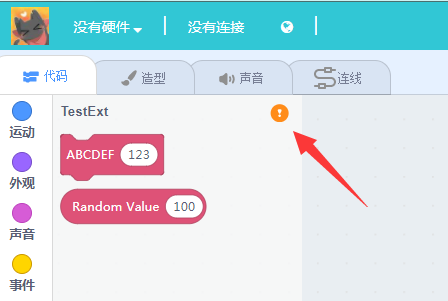

# Kittenblock插件开发指南 -- 02

这一节我们主要讲述如何在kittenblock下开发一个跟硬件设备通信的插件

## 准备工作

为了和硬件通信我们首先需要准备一个硬件主板，目前kittenblock支持串口，tcp和udp的硬件通信方式。只要您的硬件设备符合这三种其一就可以了。

其实要保证你的主板上已经烧录了通信用的固件，具体通信用的固件需要您执行开发，如果实在摸不着头脑可以参考一下kittenbot和minilfr的通信固件，源代码在kittenblock安装目录下的arduino\libraries\中kittenbot和minilfr中可以找到。我们推荐使用基于字符串的通信方式，这样可以节省大量的调试时间并且大部分CNC设备都是基于这种通信方式的。

## 插件改造

我们继续以上一节做的样板插件为基础，为了让插件可以选择硬件通信接口，我们首先需要在getInfo函数中使能插件状态按钮：

	showStatusButton: true,

并且在类的构造函数中加上：

	this.comm = runtime.ioDevices.comm;
	this.session = null;

其中comm是kittenblock的通信io实体，session是通信上下文，具体在打开端口后进行实例化。

另外我们需要在类中添加以下函数，这些函数是scratch3的虚拟机引擎所要求的的回调函数，如果没有这些函数实现会导致通信流程失败。

    // method required by vm runtime
    startDeviceScan (){
        this.comm.getDeviceList().then(result => {
            this.runtime.emit(this.runtime.constructor.PERIPHERAL_LIST_UPDATE, result);
        });
    }

    connectDevice (id){
        this.comm.connect(id).then(sess => {
            this.session = sess;
            this.session.onmessage = this.onmessage;
            this.session.onclose = this.onclose;
            // notify gui connected
            this.runtime.emit(this.runtime.constructor.PERIPHERAL_CONNECTED);
        }).catch(err => {
            log.warn('connect peripheral fail', err);
        });
    }

    disconnectSession (){
        this.session.close();
    }

    getPeripheralIsConnected (){
        return Boolean(this.session);
    }

我们来看看这时候的完整代码如下，重新加载插件后可以看到插件列表上方有个小的状态图标

	const ArgumentType = Scratch.ArgumentType;
	const BlockType = Scratch.BlockType;
	const formatMessage = Scratch.formatMessage;
	const log = Scratch.log;
	
	class TestExt {
	    constructor (runtime){
	        this.runtime = runtime;
	        this.comm = runtime.ioDevices.comm;
	        this.session = null;
	        
	        this.runtime.registerExtensionDevice('TestExt', this);
	    }
	    
	    // method required by vm runtime
	    startDeviceScan (){
	        this.comm.getDeviceList().then(result => {
	            this.runtime.emit(this.runtime.constructor.PERIPHERAL_LIST_UPDATE, result);
	        });
	    }
	
	    connectDevice (id){
	        this.comm.connect(id).then(sess => {
	            this.session = sess;
	            this.session.onmessage = this.onmessage;
	            this.session.onclose = this.onclose;
	            // notify gui connected
	            this.runtime.emit(this.runtime.constructor.PERIPHERAL_CONNECTED);
	        }).catch(err => {
	            log.warn('connect peripheral fail', err);
	        });
	    }
	
	    disconnectSession (){
	        this.session.close();
	    }
	
	    getPeripheralIsConnected (){
	        return Boolean(this.session);
	    }
	
	    
	    getInfo (){
	        return {
	            id: 'TestExt',
	            name: 'TestExt',
	            color1: '#DE5277',
	            color2: '#AA3F5B',
	            color3: '#AA3F5B',
	            showStatusButton: true,
	
	            blocks: [
	                {
	                    opcode: 'test1',
	                    blockType: BlockType.COMMAND,
	                    text: 'ABCDEF [VALUE]',
	                    arguments: {
	                        VALUE: {
	                            type: ArgumentType.NUMBER,
	                            defaultValue: 123
	                        }
	                    }
	                },
	                {
	                    opcode: 'test2',
	                    blockType: BlockType.REPORTER,
	
	                    text: 'Random Value [MAX]',
	                    arguments: {
	                        MAX: {
	                            type: ArgumentType.NUMBER,
	                            defaultValue: 100
	                        }
	                    }
	                },
	            ]
	        };
	    }
	    
	    test1 (args){
	        console.log('test1', args.VALUE);
	    }
	    
	    test2 (args){
	        return Math.random()
	    }
	    
	    
	}
	
	module.exports = TestExt;
	

