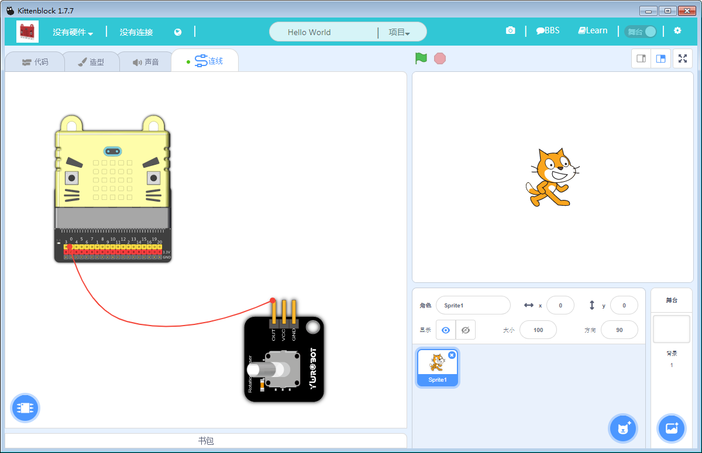
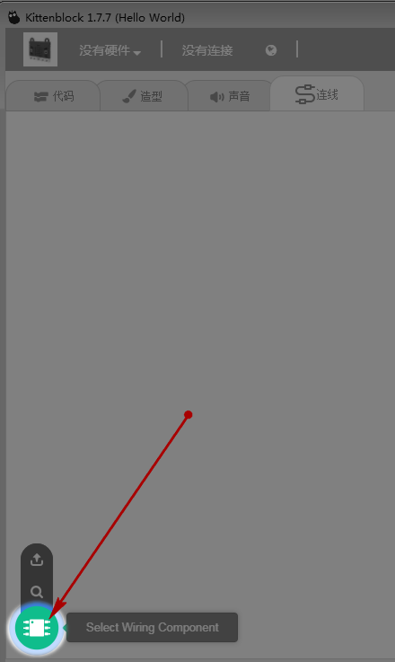
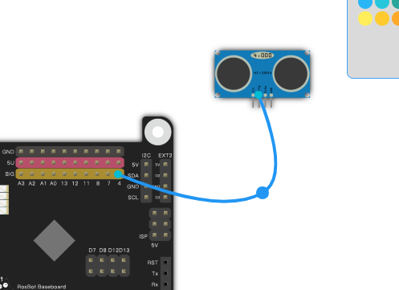

# 连线引擎简介和使用

小喵家早期的天使用户可能知道在kittenblock 1.4x版本有一个连线引擎的功能，但是因为后面1.5x开始框架大改导致前后不兼容所以删掉了。但是随着现在软件慢慢稳定下来，我们在1.73迭代花了3天将连线引擎完完全全重写了一遍。

## 连线引擎基本使用介绍

Kittenblock是一个专注于硬件编程的平台，但是硬件编程少不了连线的步骤，Kittenblock内的连线引擎设计的初衷就是多少简化这个步骤，给用户更加直观的电路连接的概念。

更新了1.73版本的Kittenblock后大家应该可以看到Tab栏多了一个连线的部分：

点击打开后可以看到一张空的画布，在最左下角有一个"+"图标。这个是用于导入电路板或电子模块图片的，目前只支持png格式，导入的图片将以1：1的形式绘制在画布上。在Kittenblock安装目录下的wiring目录有一些我们已经画好的主板和电子模块图片，大家可以自由使用。

使用上述方法我们导入一个rosbot主板和一个sr04超声波模块：

之后我们来模拟一下连线过程，步骤基本如下：

1. 在电子模块针脚处双击鼠标，可以生成一个线路引脚。
2. 按着引脚点可以拖动一条导线出来。
3. 在另一个引脚释放鼠标可以将两个点用导线连接起来。

### 改变颜色

当两个引脚连接上后即使我们拖动电子模块也会自动跟随更新新的位置。目前引脚和导线可以更换颜色，具体操作是先点击导线或者引脚，在右上角弹出来了一个颜色选择框点击对应颜色就可以了~

### 曲线设置
我们也可以给导线添加拐点，将连接从直线变成曲线：

- 双击某一条导线，大家应该可以看到会新增一个控制点
- 拖动控制点就可以弯曲导线了

## 连线结果保存和打开

目前保存项目为sb3的时候自动将连线引擎的内容打包到sb3内，所有电子模块的图片也会自动打包进去。当打开这个sb3的时候，连线内容会自动重新加载进来。

由于电子模块图片是打包在sb3文件内的，即使你把文件给其他小伙伴，他们电脑中没有这个电子模块的图片也能正常打开。

目前连线引擎还处于比较雏形的阶段，有什么新的功能和需求请尽管提出来吧，就看大家脑洞有多大了 ~

   