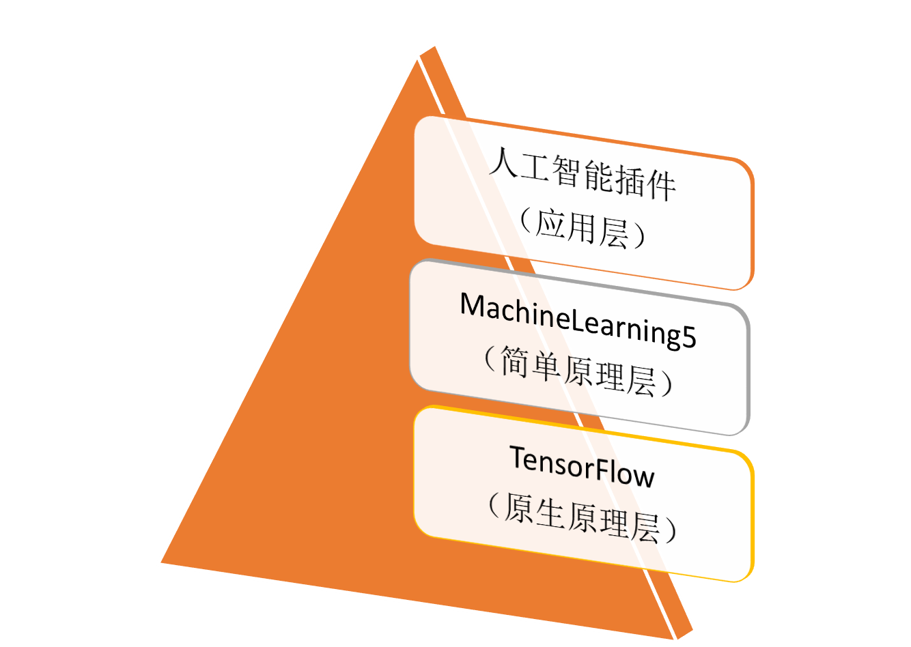
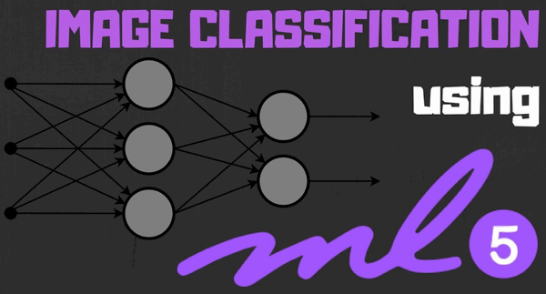
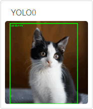
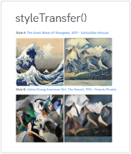

# MachineLearning5 简介

针对web的友好机器学习模型包（第三方）

Kittenblock中的人工智能插件、Machinelearning5（机器学习）和TensorFlow这三者可以用一个图表来进行表示。

用户可以根据自己的学习阶段进行选择对应的插件进行学习。（见图1）

图1 人工智能相关插件关系表

推荐插件对应的用户群体（见图2）

人工智能插件面向群体：一到四年级学生

MachineLearning5：五到九年级学生

TensorFlow：高中及以上学生

图2 推荐插件对应的用户群体

## 简介

简介来源于ml5官网：

https://ml5js.org/

ml5.js旨在使广大的艺术家，创意编码员和学生能够使机器学习变得平易近人，可从网页上直接学习机器学习。该库提供了对浏览器中机器学习算法和模型的访问，构建在TensorFlow.js之上，不再需要其他外部的依赖。

ml5官网还有一个好处，您无需在自己本机电脑搭建复杂繁琐的编程环境。可以直接在网页上进行应用体验。

ml5服务器在国外，国内访问速度一般会很慢。

## 功能

### 图像分类器（视频图像分类）

MobileNet是一种机器学习模型，经过培训可识别某些图像的内容

### 特征提取器的KNN分类器

允许人们使用KNN分类器在网络摄像头图像上训练“Rock Paper Scissor”分类器。

### 涂鸦RNN

SketchRNN是一个反复出现的神经网络模型，它训练集来自于谷歌的猜图小歌。

### 骨架网络

PoseNet是一种允许实时人体姿势估计的机器学习模型。

PoseNet可用于估计单个姿势或多个姿势，这意味着有一种算法只能检测一个人在图像/视频和一个版本中，可以检测图像/视频中的多个人。

### YOLO （待续）

YOLO：实时快速目标检测

### LSTM写诗 （待续）

导入大量样本后，机器进行学习，进行自主创作

### 风格类型迁移（待续）

Style Transfer是一种机器学习技术，可以将一个图像的样式转换为另一个图像。这是一个两步过程，首先您需要在一个特定样式上训练模型，然后您可以将此样式应用于另一个图像

