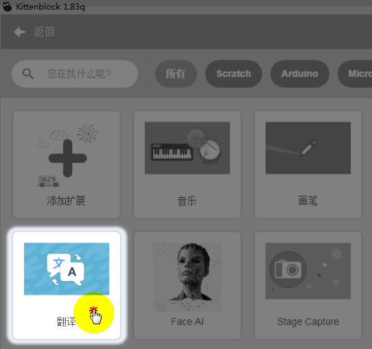
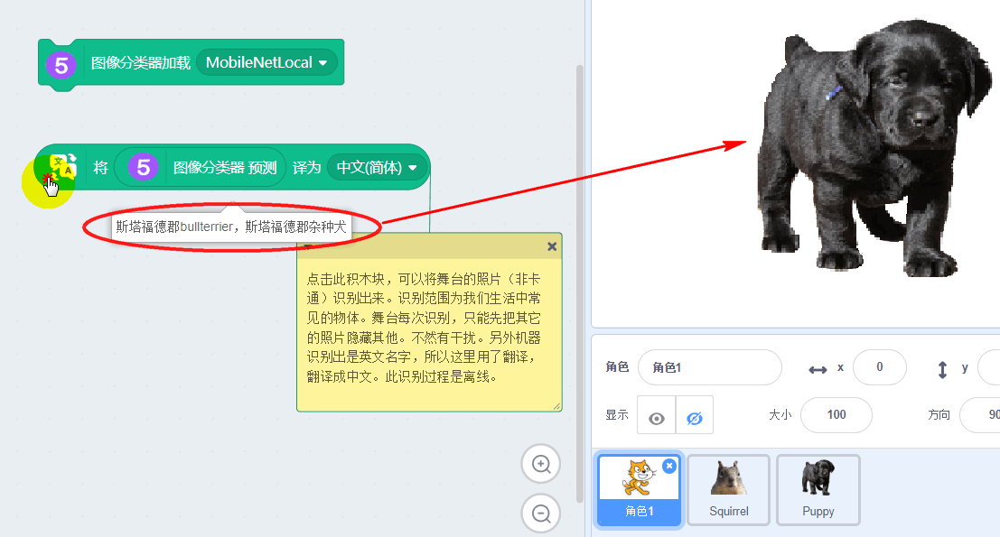
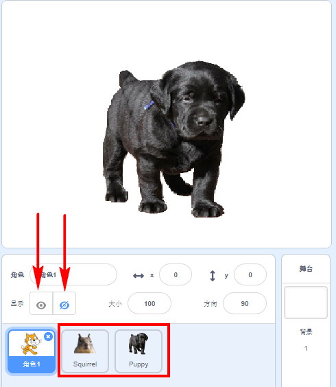
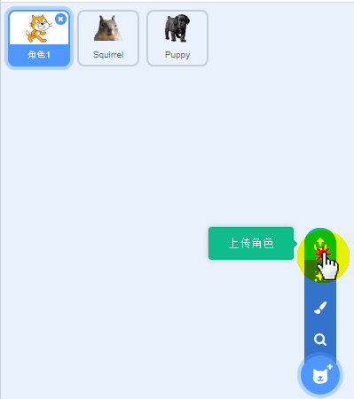
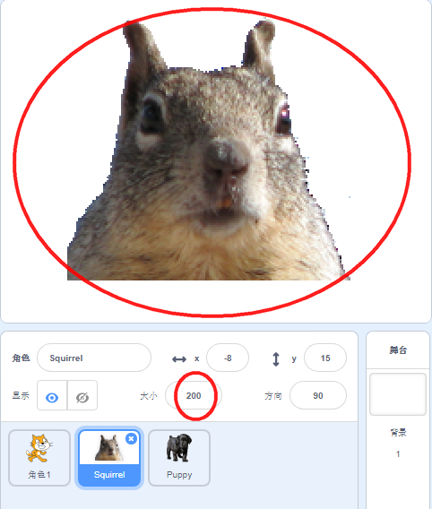

# 图像分类器——识别给定的图片

底层技术依靠TensorFlow实现，此图像分类器利用了Mobilenet分类模型

上节通过例子已经学习了用图像分类器对图形进行分类，本节我们学习识别指定图片的详细操作过程。

## 用途

识别常见的物体/动物

## Mobilenet简介

说到机器学习，不得不提卷积神经网络（CNN），它普遍用在计算机视觉领域中，可以简单理解，神经网络层数越多，模型越复杂，对分类越准确。

但在实际的生活场景中，这种复杂的模型很难被应用，第一它对运算配置要求高，第二实时响应速度不够快。MobileNet模型的产生就是为了解决这个问题，可以在保持响应速度比较快和模型比较小的前提下，依然能保证识别效果，常用用于移动端的应用场景。

## 实验要求

畅顺的网络

Kittenblock 1.8.3q以上版本

## 加载插件

ml5插件成功加载

## 同时也把文字翻译加载进来

全部成功加载

## 使用方法

### 网上收集图片

图片有以下要求：

- 生活中常见，真实的，非卡通
- 图片背景尽量保证干净，纯白色背景最好
- 图片不能太小太模糊

推荐使用bing图片搜索，质量比较好

点击第一个方块，加载MobileNet，这个模型需要从网上下载。模型是在国外服务器的，所以下载会比较慢。

**当积木块的边框亮起来，就说明模型已经在下载中。**

**当边框从亮到灭，就说明模型已经成功下载完毕。这时候我们就可以继续往下操作。**

我这边即使网络比较好，都需要大概10~30秒才下载完成。针对这个程序，这个模型本次加载过一次后就可以了。(如果你关闭了程序，重新打开，还是需要重新再下载一次模型)

如果积木块一直是亮着的，可以再点击一下，取消下载。

然后再重试一遍，网速不快的需要给点耐心。如果超过2分钟都没下载完成，可以看文末的解决办法——更换DNS。

点击第二个积木块，进行预测当前舞台的照片，舞台对应要把识别的照片显示，而其他的隐藏起来。

点击积木块，就立马返回一串英文（拉布拉多犬）

因此这里配合翻译积木块，把英文翻译成中文，这样我们就知道这只小狗叫拉布拉多犬

## 为何需要翻译插件？

其实直接点 图像分类器预测 就会返回结果了。但是返回的结果是英文，为了方便大家看，所以加入翻译插件这样看上去就比较舒服。

## 如何识别另外的

如果你要识别另外一张图片，你需要手动选中角色后，对齐进行显示（对其他精灵进行隐藏）。然后再点击第二个方块进行预测。（第一个方块已经下载过模型了，所以不用再点击了）

如果你还想识别其他物体，可以直接点击增加精灵
识别物体的照片最好是无背景，或者白背景，照片尽量清晰，需要是现实生活的真实照片（卡通画，漫画不能正确识别）

另外需要注意，角色的大小对识别结果也有影响，所以尽量让识别的图片占据舞台的大部分面积，这样可以提升识别的准确率。

