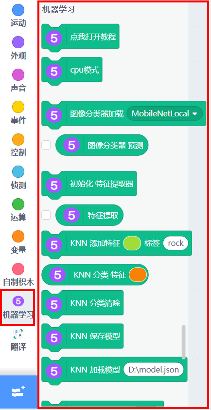
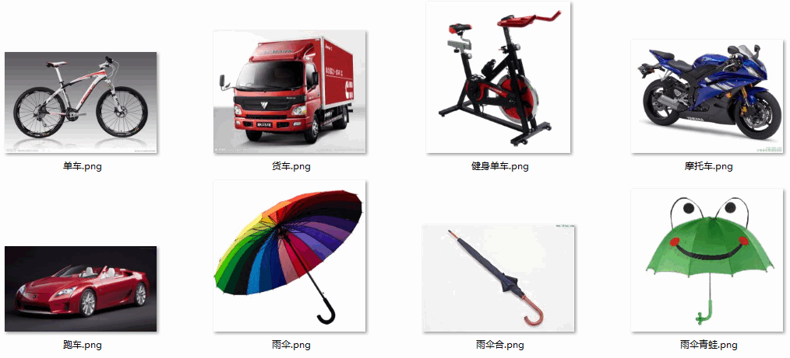
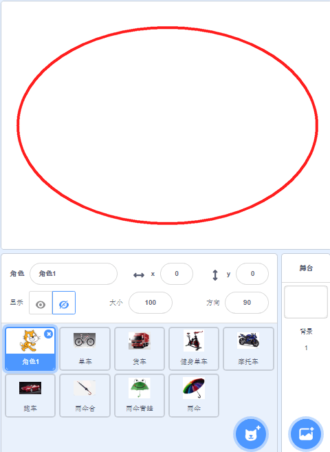
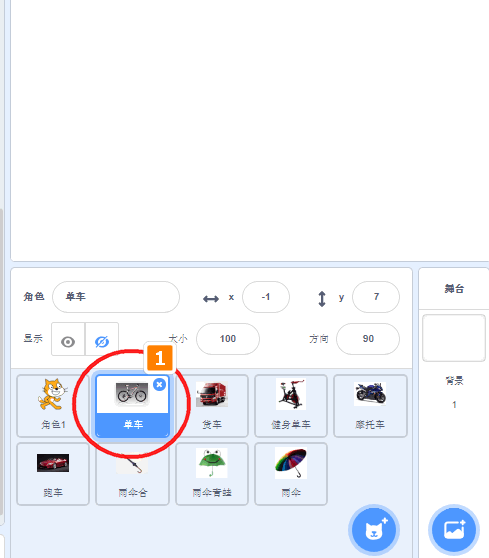
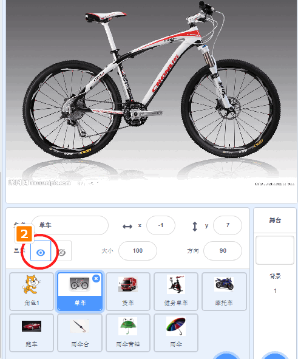
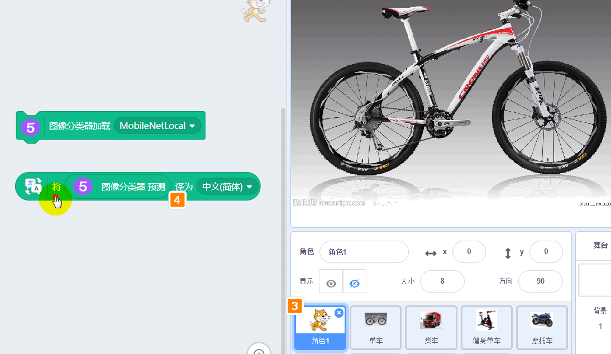
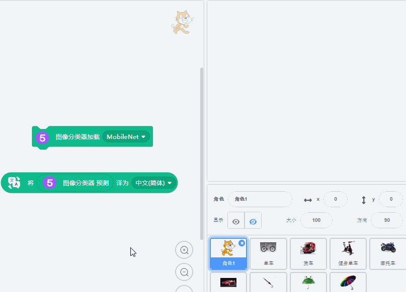
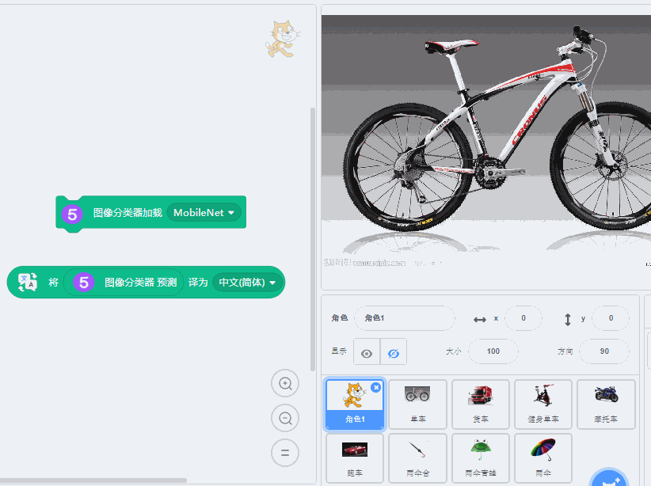
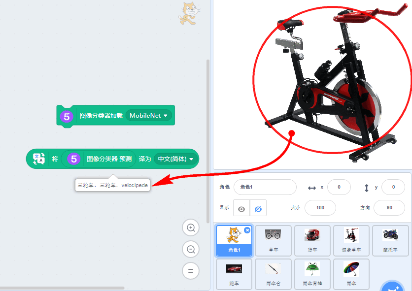
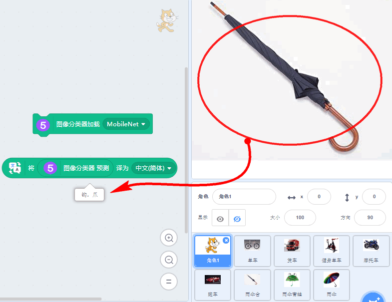

# 图像分类器——识别给定的图片

底层技术依靠TensorFlow实现，此图像分类器利用了Mobilenet分类模型

上节通过例子已经学习了用图像分类器对图形进行分类，本节我们学习识别指定图片的详细操作过程。

## 用途

识别常见的物体/动物

## Mobilenet简介

说到机器学习，不得不提卷积神经网络（CNN），它普遍用在计算机视觉领域中，可以简单理解，神经网络层数越多，模型越复杂，对分类越准确。

但在实际的生活场景中，这种复杂的模型很难被应用，第一它对运算配置要求高，第二实时响应速度不够快。MobileNet模型的产生就是为了解决这个问题，可以在保持响应速度比较快和模型比较小的前提下，依然能保证识别效果，常用用于移动端的应用场景。

## 实验要求

畅顺的网络

Kittenblock 1.8.3q以上版本

## 加载插件

ml5插件成功加载

## 同时也把文字翻译加载进来

全部成功加载

## 使用方法

### 网上收集图片

图片有以下要求：

- 生活中常见，真实的，非卡通
- 图片背景尽量保证干净，纯白色背景最好
- 图片不能太小太模糊

推荐使用bing图片搜索，图片质量比较好。我这里找了雨伞，几种车的图片，保存在某一个文件夹，如图所示：

### 把图片加入舞台中

**指向**图中的图标后，就会弹出上传角色的图标，这时候点击下。

### 全选批量加入

弹出文件选择对话框后，全选，打开

### 图片成功加载

成功加载后，我们逐个点击图片，将所有图片以及小猫隐藏，点击**隐藏图标**（如图操作）

已经全部隐藏起来

## 加载MobileNet

需要耐心等待，等待其加载完毕（黄色亮边框消失即加载完毕，需要网络）

## 编写完成程序

翻译插件，前篇已经说过如何加载，这里不在重复说明

程序的编写是在小猫的角色下进行编写的

## 正式进行指定图片辨认

按图依次操作

识别结果如下：

这个我做了一个Gif图，方便大家理解操作的过程：

## 其它图片预测

操作方式相同，这里就不再展开说，记得每次舞台预测时，只出现一副图片即可。其它图片隐藏起来即可。

## 误差分析

在图片预测过程中，我们发现了有两张图片预测不是很准.

不过机器猜得八九不离十。健身单车误认为三轮车。合起来的雨伞误认为是勾字。错误的原因：可能是样本集里面没有含有这两类的图片，健身单车和合起来的雨伞。

所以看似如此智能的机器学习，背后实质也要依靠人类帮助提供大量标定好的样本数据，这样它才会越来越智能。

