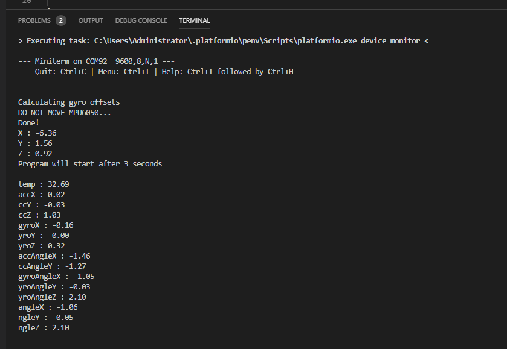

# 板载MPU6050测试

Bridge板载了一个MPU6050陀螺仪，这是大部分机器人项目必备的反馈传感器。

## 操作流程 

我们完成将一个读取板载陀螺仪各个数据的程序

- Step 1： 

新建一个项目，步骤和和上一篇一样 

- Step 2： 

建立好项目后我们可以在PIO主页的Library中搜索MPU6050库，本节项目我们选用 `MPU6050_tockn`这个库


点击进入库页面并选择安装库


我们可以在库的项目主要找到更加详细的资料：https://github.com/tockn/MPU6050_tockn

- Step 3：使用MPU6050库

当库安装好后我们就可以在我们的代码中使用6050了，由于6050基于I2C通信，所有我们也需要Arduino的I2C通信库 `Wire.h`

- Step 4：代码实操 

  - 导入库的头文件：

```c++
#include <MPU6050_tockn.h>
#include <Wire.h>
```

  - 之后我们还要实例化一个陀螺仪实例：

```c++
MPU6050 mpu6050(Wire);
```

  - 在Setup函数中我们初始化陀螺仪设备

```c++
  Wire.begin();
  mpu6050.begin();
  mpu6050.calcGyroOffsets(true);
```

  - 在Loop函数中不停读取6050数据就行了：

```c++
mpu6050.update();
```

## 完整代码如下

```c++
#include <Arduino.h>
#include <MPU6050_tockn.h>
#include <Wire.h>

MPU6050 mpu6050(Wire);
long timer = 0;

void setup()
{
  // initialize LED digital pin as an output.
  pinMode(LED_BUILTIN, OUTPUT);
  Serial.begin(115200);
  while(!Serial)
    delay(10);


  Wire.begin();
  mpu6050.begin();
  mpu6050.calcGyroOffsets(true);
  
}

void loop()
{
  mpu6050.update();

  if(millis() - timer > 1000){
    
    Serial.println("=======================================================");
    Serial.print("temp : ");Serial.println(mpu6050.getTemp());
    Serial.print("accX : ");Serial.print(mpu6050.getAccX());
    Serial.print("\taccY : ");Serial.print(mpu6050.getAccY());
    Serial.print("\taccZ : ");Serial.println(mpu6050.getAccZ());
  
    Serial.print("gyroX : ");Serial.print(mpu6050.getGyroX());
    Serial.print("\tgyroY : ");Serial.print(mpu6050.getGyroY());
    Serial.print("\tgyroZ : ");Serial.println(mpu6050.getGyroZ());
  
    Serial.print("accAngleX : ");Serial.print(mpu6050.getAccAngleX());
    Serial.print("\taccAngleY : ");Serial.println(mpu6050.getAccAngleY());
  
    Serial.print("gyroAngleX : ");Serial.print(mpu6050.getGyroAngleX());
    Serial.print("\tgyroAngleY : ");Serial.print(mpu6050.getGyroAngleY());
    Serial.print("\tgyroAngleZ : ");Serial.println(mpu6050.getGyroAngleZ());
    
    Serial.print("angleX : ");Serial.print(mpu6050.getAngleX());
    Serial.print("\tangleY : ");Serial.print(mpu6050.getAngleY());
    Serial.print("\tangleZ : ");Serial.println(mpu6050.getAngleZ());
    Serial.println("=======================================================\n");
    timer = millis();
    
  }
}
```

## 下载与观察结果

编码完成后我们跟前面的教程一样下载程序到主板上，并且打开`串口终端`就可以看到陀螺仪的输出了



