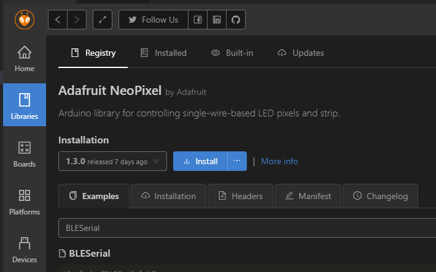

# 板载ws2812 Neopixel测试

在Bridge主板上我们有一颗ws2812灯珠，平时用于指示bootloader启动流程。当然我们也可以通过程序控制它。

## 操作流程

我们将完成一个使用板载RGB灯进行blink的程序

- Step 1： 

新建项目后在PIO库管理页面搜索Neopixel，RGB库在创客圈没人能比`灯厂Adafruit`更加专业，因此我们选择`Adafruit Neopixel`作为我们本节的RGB驱动。



- Step 2： 

  -  引入 `Neopixel头文件`，之后使用宏定义灯珠数目和引脚位置。

```c++
#include <Adafruit_NeoPixel.h>
#define PIN        40
#define NUMPIXELS 1
```

``` attention:: 注意板载的RGB灯定义在40号引脚上，大家可以在PIO安装目录找到对应的定义   
C:\Users\你的用户名称\.platformio\packages\framework-arduinosam\variants\metro_m4\variant.cpp
```


  - 实例化一个灯珠设备

```c++
Adafruit_NeoPixel pixels(NUMPIXELS, PIN, NEO_GRB + NEO_KHZ800);
```

  - 我们还需要在Setup函数中初始化灯珠：

```c++
pixels.begin();
```

  - 接下来在Loop函数中让它显示随机颜色

```c++
pixels.clear(); // Set all pixel colors to 'off'
pixels.setPixelColor(0, pixels.Color(random(0,150), random(0,150), random(0,150)));
pixels.show();
delay(2000);
```

## 完整代码

```c++
#include <Arduino.h>
#include <Adafruit_NeoPixel.h>

#define PIN        40
#define NUMPIXELS 1

Adafruit_NeoPixel pixels(NUMPIXELS, PIN, NEO_GRB + NEO_KHZ800);

void setup()
{
  // initialize LED digital pin as an output.
  pinMode(LED_BUILTIN, OUTPUT);
  Serial.begin(115200);
  //while(!Serial)
  //  delay(10);
  pixels.begin();
  
}

void loop()
{
  pixels.clear(); // Set all pixel colors to 'off'
  pixels.setPixelColor(0, pixels.Color(random(0,150), random(0,150), random(0,150)));
  pixels.show();
  delay(2000);
}
```


## 下载与观察结果


将上面的程序下载到板子上后我们就可以看到灯珠闪烁随机颜色了。

``` hint::
其实大家可以通过定义灯珠引脚和数目将这个程序扩展到RGB灯条或者矩阵屏幕，由于Bridge强大的运算速度和内存可以支持的RGB灯珠数目将远远大于Arduino，大家可以尽情尝试下
```

