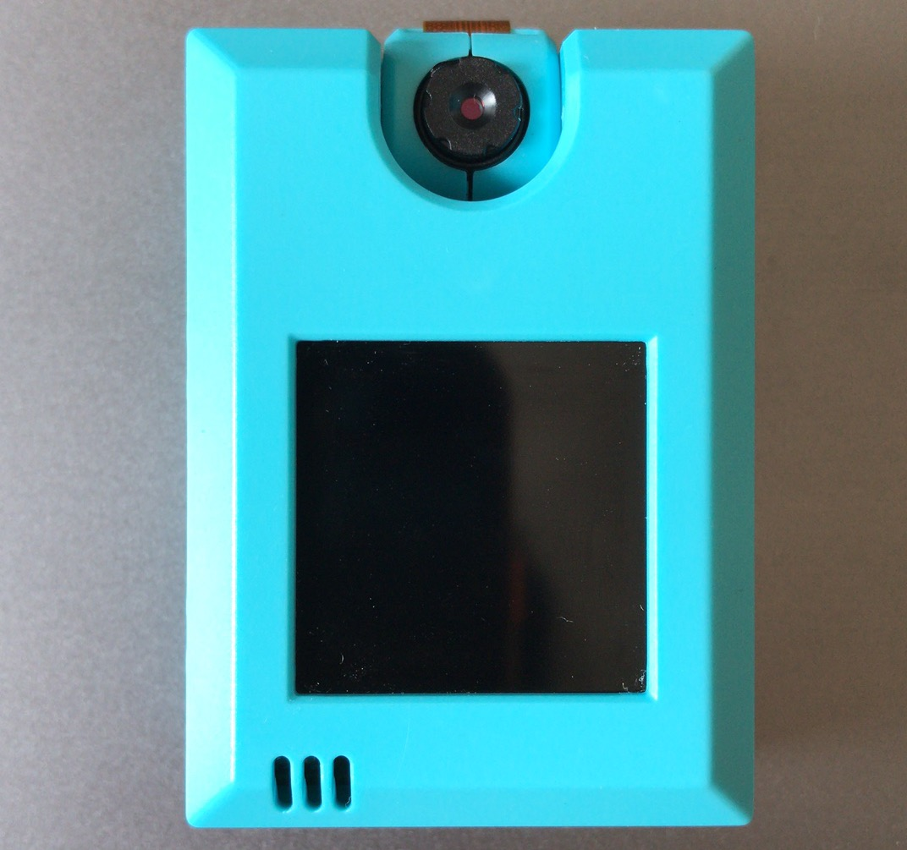
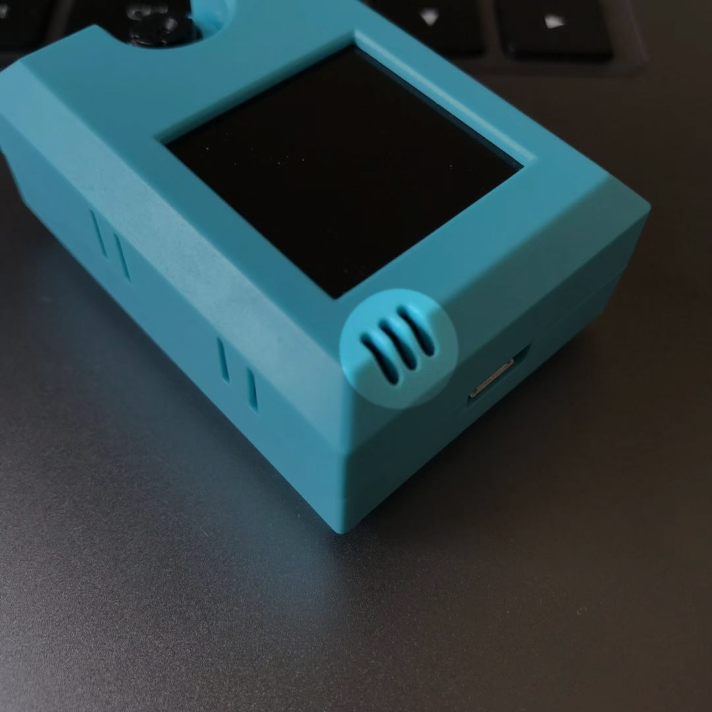
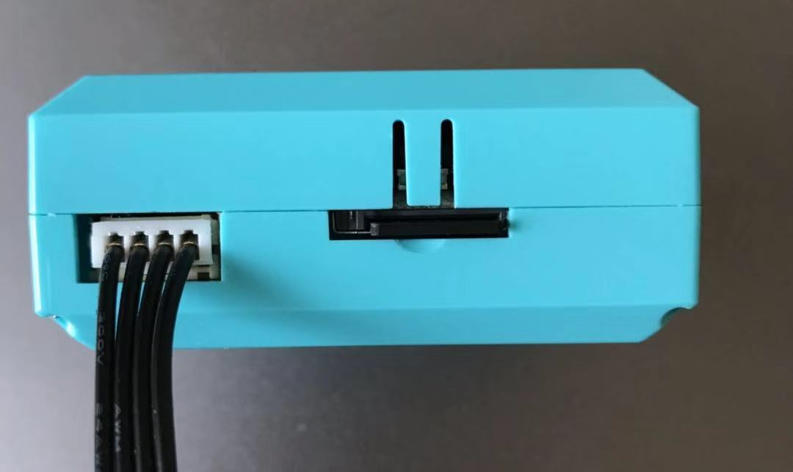
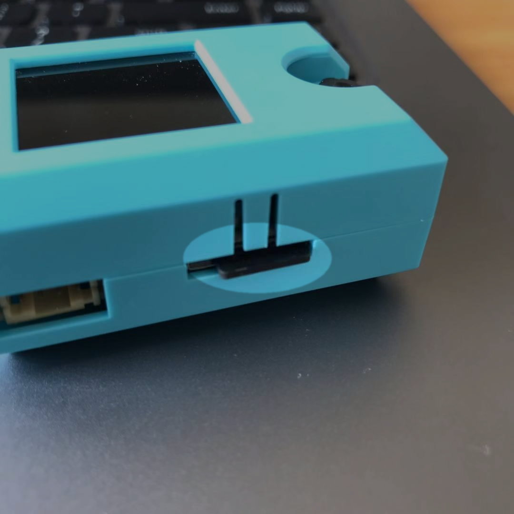
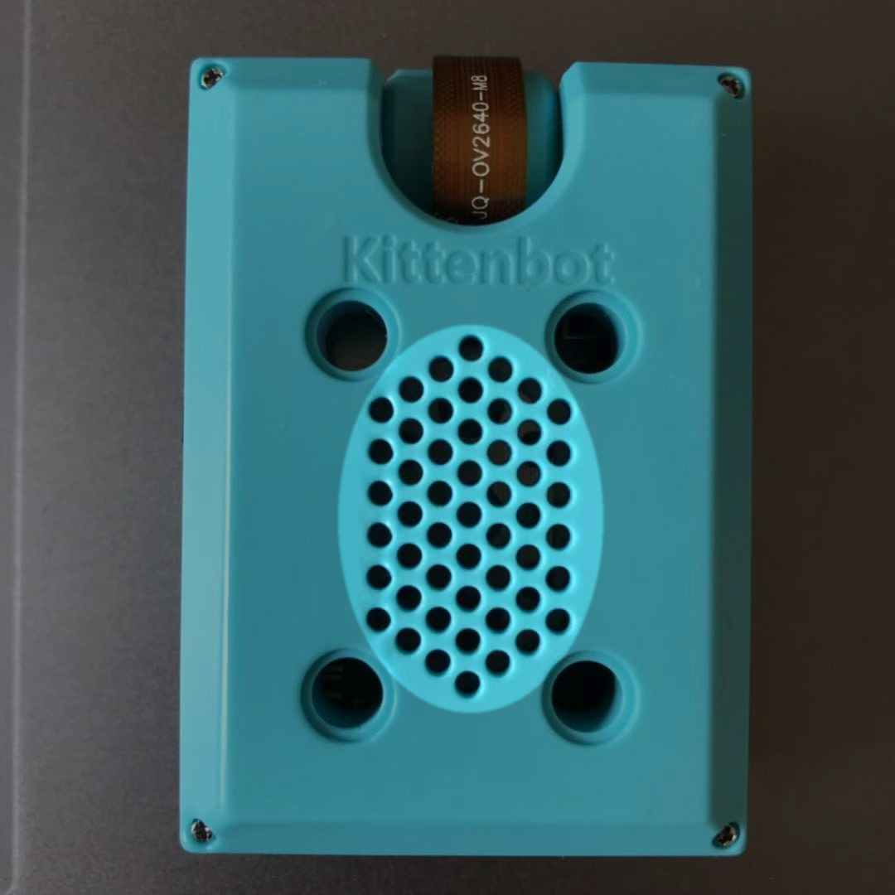

# KOI锦鲤魔块的基本认识

在使用KOI锦鲤魔块前，首先我们要认识它的一些基本说明与概念。方便后续快速上手此模块。

### 模块的正方向

此为KOI锦鲤模块的正方向

### 旋转镜头

镜头旋转为0~180。若从前往后旋转，注意摄像头排线的收纳，动图GIF

### 摄像头前置

不难理解，摄像头与屏幕同一方向为摄像头前置，如图

前置一般应用在：人脸追踪交互、物体追踪交互，可从屏幕直观看到摄像头的数据

### 摄像头后置

摄像头与屏幕反方向为摄像头后置，如图

后置一般应用在：条码、二维码扫描、线条追踪等

### 屏幕与屏幕坐标系

屏幕为高清IPS屏，像素为240x240

坐标系原点起始为屏幕的左上角

屏幕用于显示摄像头的实时数据流，与一些操作的交互信息

### 按键AB与复位按键Reset

模块左右两侧各有一个可编程按键，类似Microbit的A和B按键

### 麦克风

屏幕左下方有收音的麦克风，收音距离约为50cm

### USB数据口

此数据口用于给模块更新固件或者给模块供电

### PH2.0 4PIN串口

此接口用于与能量魔块主控盒、Microbit、Arduino或者其他带串口的板子进行串口通讯

4PIN引脚定义：

新手强烈推荐使用能量魔块主控盒，这样不会有插错的风险

### TF卡槽

TF卡槽为弹卡式卡槽，最大内存支持为16G，可以存放音频，图片、机器学习模型等。

### 喇叭

喇叭用于播放内存卡内的音频文件

### 乐高插销孔

模块的乐高插销孔为全孔（普通）插销孔，尺寸符合乐高尺寸。

插销孔间距：

长为4个插销孔间距

宽为3个插销孔间距

