# Robotbit V2.0详解   

## 购买链接

__转到淘宝购买__----------→[Robotbit v2.0](https://item.taobao.com/item.htm?spm=a1z10.3-c-s.w4002-17001215033.23.1df7762exi5M0c&id=559862615142)

## 产品名称：

RobotbitV2.0   
适用人群：小学生/培训机构/家长/爱好者 配套Microbit进行使用   

## 配送清单

RobotbitV2.0 X1   
其他配套Microbit或者硅胶保护套、电池根据实际购买套餐配送   

Product Purpose## 产品简介   
KittenBot团队专为Microbit量身定做的优秀机器人扩展板。现还有配套3D打印保护壳   

## 产品特色
它具有强大直流电机、步进电机、舵机的驱动能力，板载RGB灯与蜂鸣器，并把Microbit空闲引脚全部引出，支持arduino以及市面上的常见电子模块。   
自带18650电池座，集成锂电池升压、充电、保护芯片。支持外部电源输入。   
支持扩展至KittenBot机器人底盘以及乐高标准孔。强大的驱动能力与自带电池可使DIY更加方便自由。   
受到学校老师培训机构和个人爱好者的一致好评，microbit DIY作品选择Robotbit不会有错！
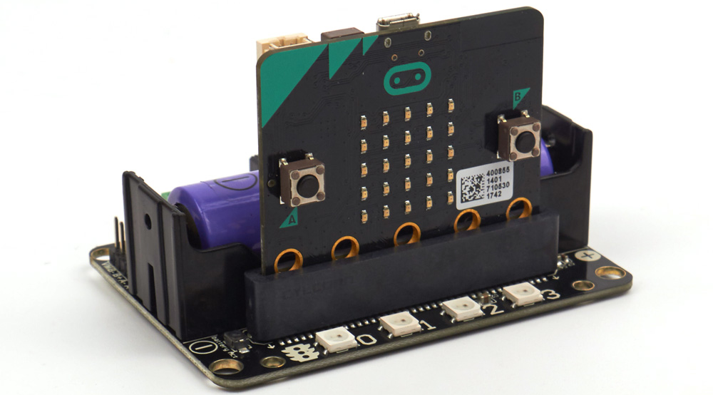

## 产品参数
- 产品尺寸：78mm x 57mm x 23mm   
- PCB板厚 ： 1.5mm   
- 小孔直径 ： 3.0mm   
- 大孔直径 ： 4.8mm   
- 净重（不含包装）:37.5g   
   

### 功能性参数：   
- 18650电池电压：3.7V   
- USB输入电压：5V   
- VM引脚最大：1A（在板载电池的支持下）   
- 绿色端子电压(外部电源输入)：5V（只支持5V输入，切勿接超5V的电压，最大电流支持3A）   

## 软件支持：   
编程方式：Kittenblock(基于Scratch3.0) / Makecode /python（Mu editor）
配套硬件：Microbit  

### MakeCode微软官方   
   
### KittenBlock（小喵家图形化编程软件 基于Scratch 3.0）   
   
### python支持   
如果你已经习惯代码编程，想通过microbit上手python   
你有两个选择，直接使用Mu Editor   
   
或者kittenblock的python代码编程模式   
   

以上详细教程可查看Learn中相关教程，进行自主学习，学习过程中遇到问题随时欢迎在爱上小喵科技官方Q群讨论。   

## Makecode插件支持   
在makecode添加包中直接搜索Robotbit（小喵科技的扩展板插件已经通过微软官方认证，是实力的象征）   
在小喵makecode离线版本中，添加包列表可以显示Robotbit以及其他集成扩展包（Robotbit可以离线加载不依靠网络，其他的扩展包不可以）   
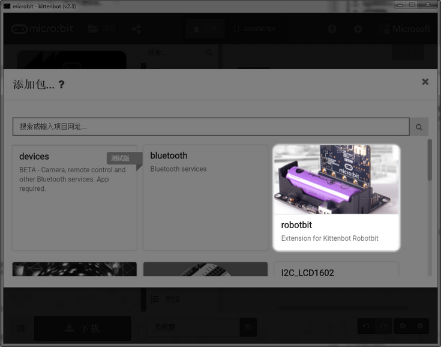   

## 硬件接口： 

1. 5V外部电源端子（防反接）   
2. 电源开关   
3. 电源指示灯   
4. 电量指示灯   
5. Micro充电口   
6. 4路直流电机/2路28BYJ步进电机   
7. 蜂鸣器跳线帽   
8. 8路IO（对应Micro：bit P0-P2、P8、P12-P15）   
9. 5V与GND排针   
10. 无源蜂鸣器   
11. 8路舵机3PIN接口   
12. I2C接口（可拓展I2C模块）   
13. 18650锂电池座   
14. 电池保护激活按钮   
15. Microbit插槽   
16. 4路全彩RGB   
   
17. 舵机驱动芯片   
18. 电机驱动芯片   
19. 标准KittenBot机器人底盘固定孔   
20. 标准乐高孔   
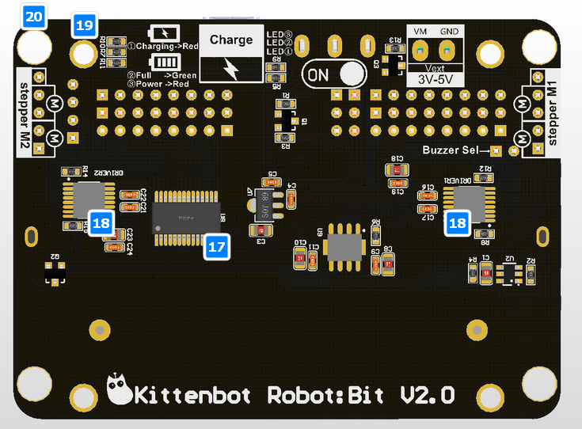

## 版本迭代更新说明   
Robotbit作为一款有活力的Microbit扩展板，已经经历过两次的大迭代更新，每次的更新都是比前面一代更加智能更加好用。   
Robotbit版本起于2017年11月初的V1.2，中间经历了V1.3，2018年6月中发布V2.0（由于改动提升比较大，版本直接跳到V2.0）   
   
## V2.0版本比前面版本更新的内容：   

### 1. 增加IO接口  

V1.3只引出3个可编程IO   
V2.0在原P0-P2基础上增加P8、P12-P15，一共8个可编程IO足以应对平常的DIY项目（巡线+避障so easy！）   
### 2. 改进电池放电方案 

充电不易发烫，但依然保持快速大电流充电的特性

### 3. 改进电源开关电路设计 

船型开关完全控制电路中所有电源的通断，解决关闭电源待机情况下会有耗电的问题。 

### 4. 增加外接电源接口   

5V防反接，再外部电源的供电下，支持接大直流电机（如金属减速电机）和大舵机（如MG995）时使用。   
支持的电流决定于外部电源5V的电流，小喵在5V3A的外部电源支持下尝试过驱动4个MG995没问题  

### 5. 外接电源 VM接口的电流上限3A   

### 6. 增加独立的电池保护芯片   

摒弃前面版本的一体方案，采取高成本的独立芯片方案，更好的应对过放过充的情况。

### 7. 增加电池保护激活按钮   

在过流，或者短路，或者打开开关插拔电池这些瞬间异常大电流情况下，电池保护芯片会启动工作，保护电路的安全性。在确保更正错误后，点击电池激活按钮，即可恢复正常工作模式 

### 8. 蜂鸣器改进   

上移至板顶部,增加蜂鸣器音量，让做音乐实验效果更加好   

### 9. 采用全新40P立式microbit插槽，拔插更方便，不伤Microbit金手指。   

### 10. 增加5V和GND各一列排针   

为了更好兼容市面上的模块，特意增5V和GND各一列。注意Microbit的电压是3.3V，所以当你使用5V模块时，Microbit只能作为输出，不能作为输入，否则IO口会承受5V的电压，导致IO口损坏。新手应该在小喵官方的指导下谨慎使用。   

### 11. 电源指示灯与充电指示灯改善   

### 12. 板子上的丝印优化

## Robotbit各个部分详解： 

### 18650电池座

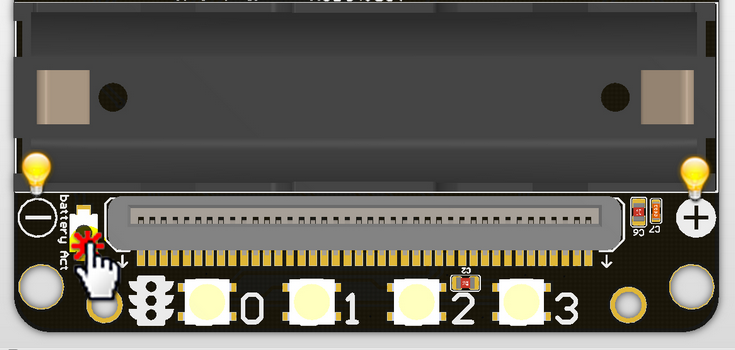  

收到扩展板首先安装18650锂电池，注意电池正负极，切勿装反（虽然防反接功能）   
当第一次安装电池时，拓展板处于待激活状态（电源灯不亮），此时需要短按一下电池保护激活按钮或连接usb供电.
使拓展板进入正常工作模式（如果你重新安装电池，就需要操作这个步骤）   

### 18650电源开关   

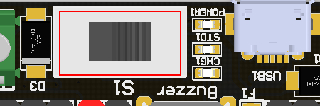   
开关打开后（拨向绿色端子那边为打开开关），为Micro:bit和扩展板的接口供电（扩展板需要装上18650电池）  

### Micro usb充电口   

   
只能用于充电，不是用于程序下载！   
只能用于充电，不是用于程序下载！   
只能用于充电，不是用于程序下载！   
电脑供电或任意5V 1A或者1A以上的手机充电器均可为KittenBot原厂18650锂电池充电   
5V1A的充电器约2.5小时充满，充满会自动截止，不会过冲   

### 电源与电量指示灯   

   
Led（3）为电源指示灯，打开开关后常亮   
Led（1）为充电指示灯，充电过程中常亮，电量充满后Led（2）常亮   

### Micro:bit立式插槽

   
用于安装Microbit主板，安装方向：Micro:bit带按键那面（正面）朝4颗LED方向   
即使插反也不会烧，只会控制无反应   

### 4路全彩RGB灯   
   
小喵科技出品的Makecode插件已内置好RGB灯控制积木块   
4路RGB灯实际与Micro:bit的P16相连控制   

### 8路舵机标准3Pin接口   
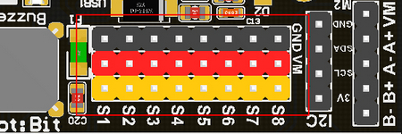   
小喵科技出品的Makecode插件Robotbit已内置好舵机控制积木块   
8路舵机实际通过专门的舵机扩展驱动芯片与Micro:bit的I2C口控制   
舵机接口不能作为普通IO口使用，只能驱动舵机   
扩展板在KittenBot原装电池状态下，最多能支持8个9g舵机（总电流＜2A），禁止使用MG995等大电流舵机，以免烧毁扩展板   
扩展板在外部电源接口（绿色端子）供电状态下（5V 3A或者3A以上），最多能支持总电流不超过3A的舵机。   
   
### 支持4路直流电机/2路28BYJ步进电机   
   

小喵科技出品的Makecode插件已内置好直流电机与步进电机控制积木块   
在KittenBot原装电池状态下工作，一共可以同时控制4路（左右两侧合计）TT马达，或者2路步进电机（与舵机合计总电流＜2A），禁止接大电流电机和大电流步进电机，以免烧毁扩展板   
支持直流电机与步进电机混搭使用（2个直流电机与1个步进电机）（与舵机合计总电流＜2A）   
   
### 蜂鸣器与跳帽

   蜂鸣器跳帽出厂默认已插上，对应蜂鸣器与Micro:bit的P0口连接   
如果想使用P0口的IO口读写功能，需要把蜂鸣器跳帽拔下来   
蜂鸣器硬件上的电气连接与Microbit的Music积木块是对应的，可直接使用Music控制蜂鸣器   
   
### Micro:bit的IO口引出

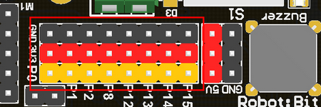   
已经将Micro:bit上P0-P2、P8、P12-P15转出到扩展板上（P0使用时需要拔掉跳帽）
标准的arduino 3PIN接口，支持市面上的Arduino模块与常用模块
P0-P2支持数字读写和模拟读写，P8、P12-P15只支持数字读写
如果需要使用5V输出模块，可以接3PIN接口左侧的5V电源（3PIN接口的电源默认是3.3V）   
   
### I2C接口

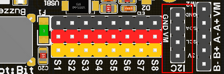   
可拓展I2C模块，只能用于插接I2C模块，不能用于普通IO口读写

### 2PIN外接电源端子

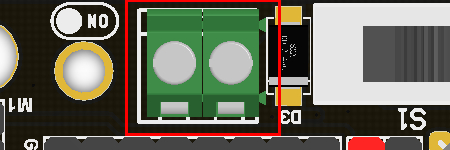   
虽然有防反接功能，但是还是接线需要注意正负   
接线端子支持DC5V的外部电源供电，推荐5V 2A以上适配器电源供电以满足拓展板驱动高扭矩舵机的电流需求。   
内部电源供电时，舵机VM接口电源为18650电池电压3.7V   
当使用外部电源供电时，舵机VM接口的电压为5V 负载电流最大3A   

## Robotbit新手必看快速入门教程：
### 把18650电池装到Robotbit上，注意正负
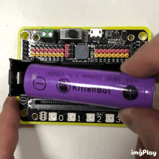   
### 把Microbit插到Robotbit上，注意插接方向
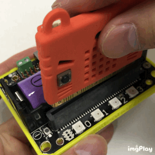
### 点击电池激活按钮
   
### 打开18650电池开关
   
### 打开makecode的网址
   
### 搜索robotbit
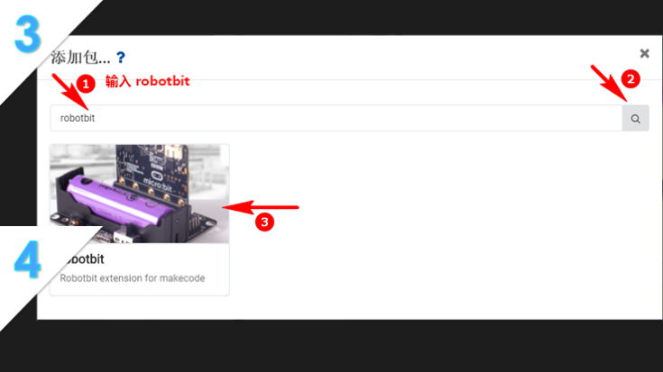   
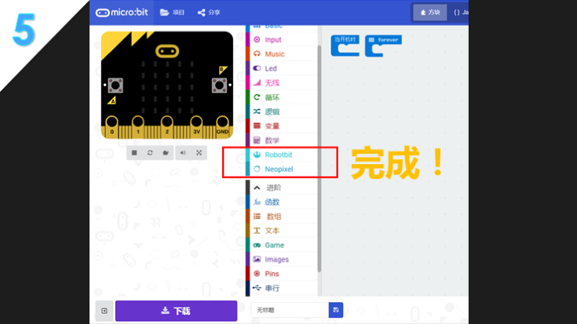   
### 把robotbit的一些积木块拖拽出来进行编程，编程记得对应连接相应的电机舵机等等..
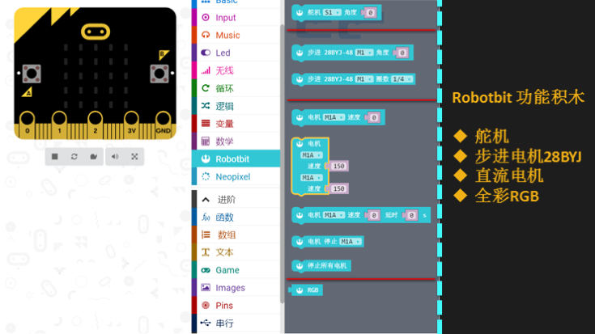   
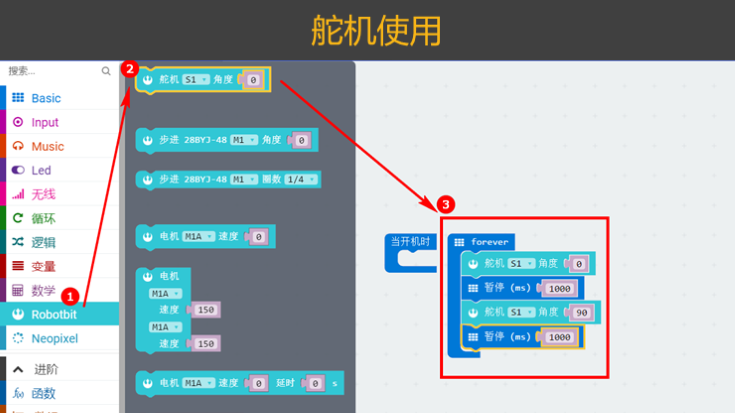   
   
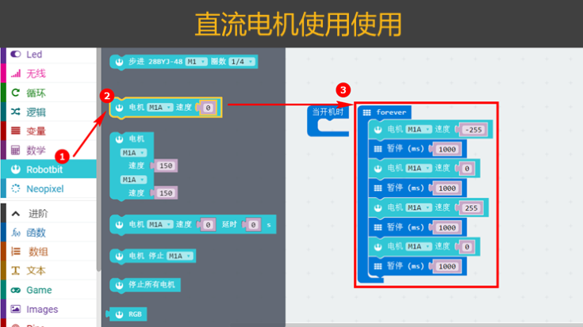   
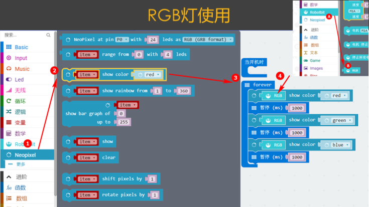   
   
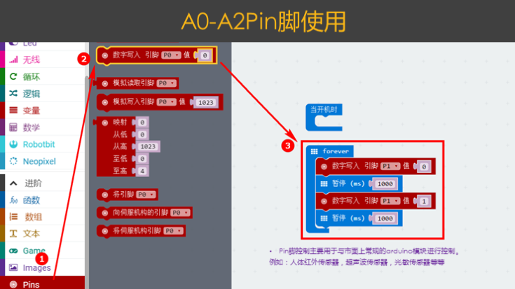   
### 下载前记得用usb先连接Microbit的USB口，点击下载按钮

下载后，会弹框提示，请自行选择保存在Microbit的U盘上
   
   

### 控制点阵屏的实验现象   

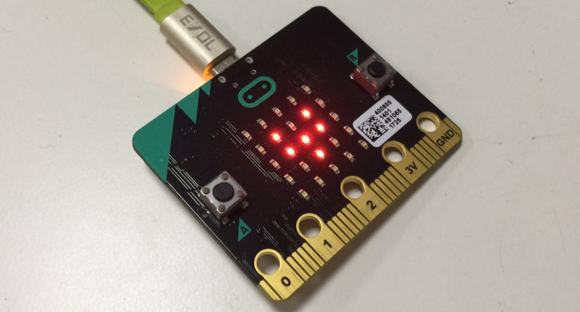   

## 有没有视频教程？

请直接跳转网易云课堂，视频是之前录制robotbit的V1.3，编程使用方法上没有区别，使用上也是大同小异，注意引脚接线即可(另外说明1.3版本的A0-A2对应2.0版本的P0-P2) 
http://study.163.com/course/courseMain.htm?courseId=1005485001&share=2&shareId=400000000501010   

## F&Q常见问题与解答

### 电池插上去没有，打开开关没有反应？

检查是否已经按了电池激活按钮？   
检查电池正负是否接反？   
检查电池是否有电？   

----------

### 电池激活按钮用什么用？

在过流，或者短路，或者打开开关插拔电池这些瞬间异常大电流情况下，电池保护芯片会启动工作，保护电路的安全性。点击电池激活按钮，即可恢复正常工作模式   

----------

### 插上usb电脑找不到Microbit
robotbit上的usb只能用于充电，不能用于下载程序，插到robotbit的usb口上，电脑是不会有反应的   

----------

### 电池插反会不会烧？
不会，robotbit的设计考虑到一般性失误操作而做了防反接处理。插反不会供电

----------

### Microbit插反会不会烧？
不会，另外Microbit插反只会不工作

----------

### P0引脚控制没有反应？是不是坏了？
PO是通过跳帽默认连接到板子的蜂鸣器上，可以直接用makecode中的music模块进行控制蜂鸣器。如果要使用P0口，需要拔掉跳帽

----------

### Microbit上可编程IO口不止8个剩下的都去哪里了？
Microbit上可编程IO口接近20个，但是很多已经与板子上的点阵按键复用了。考虑到复用带来的不方便性对，新手容易带来误解，小喵引出了8个（跟板子资源没有复用的IO口）已经完全足够应对日常的DIY。如果你对IO数量有狂热的追求，可以选择喵家另外一款扩展板IObit

----------

### 舵机排针可以当编程IO口使用吗？
不能，舵机s1-s8使用专门的舵机驱动芯片拓展出来，只能用于舵机驱动

----------

### 电机接口那边的VM有什么用？
平时使用直流电机是用不到VM，直流电机只需要插A+A-或者B+B-。使用4相5线步进电机的时候，刚好VM就用上了，详细请看Robotbit控制步进电机的视频教程

----------

### 板子可以放在金属表面或者潮湿环境下使用吗？
不行，会短路的，要注意绝缘

----------

### 绿色端子外部电源应该接几V电源？插高压电会烧坏吗？
只能接5V，高于5V都会烧毁板子，电流建议2~3A，也就是说板子最大支持的电流是3A

----------

### 我按照教程做得，得不到实验结果
如果实验得不到对应的结果，请首先检查自己的接线和程序，一般就是有些小地方遗漏了，请再三检查下   

### 电路板好像烧坏了，怎么办小喵有保修么？
robotbit在工厂出厂都进行过硬件程序测试，保证了功能的完好性。   
首先先排除下是不是程序使用问题。如果你确定烧坏了，可以寄回来给小喵，小喵只收取元件的成本费，没有多少钱。具体价格咨询淘宝客服，根据实际损坏的严重性进行评判   
请用购买账号联系小喵淘宝店的客服，咨询相关维修的问题。   

需要写清楚   

姓名，电话，地址，方便小喵寄回去板子给你   
还有板子问题描述，方便工程师快速定位问题给你维修。谢谢你们的配合这样会缩短维修的时间   

