# Rosbot简介   

## 产品名称   
Microbit   

## 适合人群   
中小学生学习图形化编程，或者毫无技术基础而想快速学习图形化编程控制的用户    

## 配送清单   
英国BBC出品正版Microbit X1   

## 产品简介   
Microbit是由英国广播电视公司（BBC）为青少年编程教育设计，联合微软，三星，ARM，英国兰卡斯特大学等共同完成开发的一款微型电脑   
用途主要针对中小学生编程教育。一块微小板子集合了数种传感器，可以让学生无门槛的入手编程和控制硬件。16年3月-6月，micro:bit在英国全线铺开，BBC在线上线下配套了大量的项目教程资源和活动，每一位7年级的在校学生（11-12岁）都能免费获取一块micro:bit开发板用于编程学习，Microbit已经在英国中大力推广，现已呈现出全球化的趋势。因此Microbit是适合中小学生学习编程的利器。   

## 产品特色   
- 当下中小学编程教育界流行的硬件，全球流行，BBC、微软、三星多个巨头为其背书，支持力度大。   
- 集成多种传感器（蓝牙，陀螺仪，2.4G无线，电子罗盘，点阵屏等等），性价比高。   
- 软件使用简单，无门槛，只需要登录网页即可，随时随地可进行编程。   
- 软件makecode除了支持积木块拖拽编程，还支持多种流行语言。如JavaScript、python等等   
- 下载方式特别，通过拷贝程序到Microbit的U盘方式，进一步降低下载程序的学习成本。   
- 一块板子集成多种传感器，而且体积只有信用卡大小，老师教学收纳方便，无需收纳其它电子模块了，适合大班上课   

## 产品参数   
长x宽x高：5CMx4CM   
净重：8.8g   
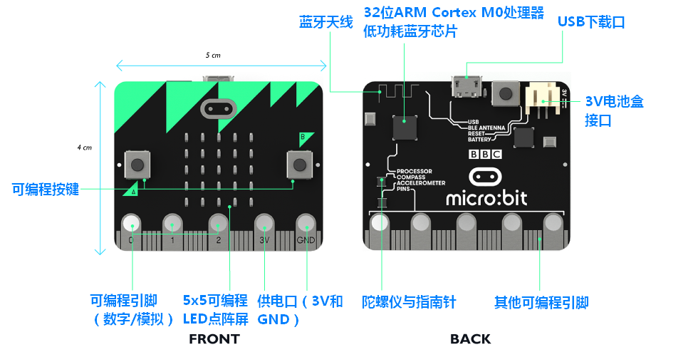   

## 技术参数   

- 供电方式：   供电从Microbit的usb口供入，或者Microbit的3V电池座供入2节7号电池（不能插3.7锂电池包会烧毁Microbit）   
- 工作电压：3V   
- 输出电流：40ma（不要用IO口驱动大电流器件，容易烧坏Microbit，如果要驱动大电流器件请使用RobotbitV2.0）   
- 串口引出：串口可进行IO口映射   
- I2C口引出：19、20引脚只能作为I2C功能引脚使用，不能作为普通IO口读写，因为microbit底层写死了   
- spi口引出；14、15（IO口可读写）   

## 可编程资源   
25颗独立可编程LED（5x5点阵屏）   
2颗可编程按键AB   
金手指引出的可编程IO口   
光线传感器和温度传感器
运动传感器（加速度计和指南针）   
无线通讯，蓝牙方式和2.4G无线通讯   

### 可编程LED   
Micro:bit有25颗可独立编程的LED灯，你可以用它来显示文本，数字以及简单的图标（像素点太少，暂时不能显示中文字符串）   
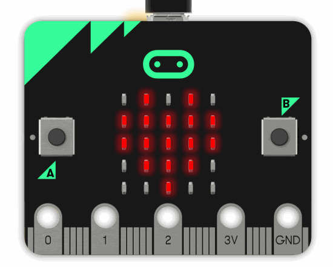   
### 可编程按键   
Microbit正面有两个可编程按键，通过组合可以有三种组合，作为输入元件   
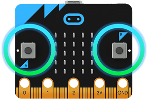   
### 金手指触片引脚   
25个引脚，这些金手指引脚一般可以配合鳄鱼夹使用，或者插接到扩展板上进行转接使用，使Microbit功能更强大，控制电机、舵机，或者其他电子模块。
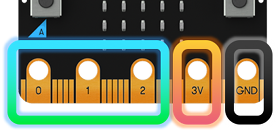   

### 光线传感器   
通过反向二极管电流的作用，把点阵屏转换成一个光敏传感器来进行使用，用来检测周围的光线。   
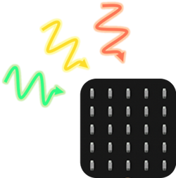   

### 温度传感器   
利用蓝牙芯片的温度传感器，大概时间检测当前环境温度的概念   
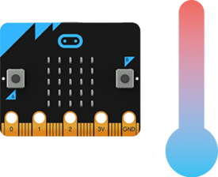   

### 陀螺仪传感器   
可以测量microbit的三轴转动角度，可以检测加速度的大小，也可以检测Microbit常见的状态，摇晃倾斜自由落体等等。   
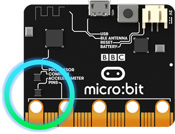   

### 指南针   
指南针可以用来指示方位，并且可以检测磁场的强度   
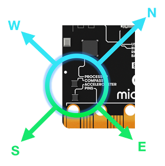   

### 2.4G无线   
2.4G无线通讯可以在2块板子或者以上进行无线通讯，通过简单的编程积木块，可以在板子与板子之间发送字符串，使用非常简单。   
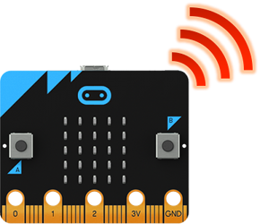   

### 蓝牙   
可以通过蓝牙方式与Microbit通讯，可以用蓝牙控制Microbit，或者Microbit通过蓝牙把信号传会手机或者电脑   
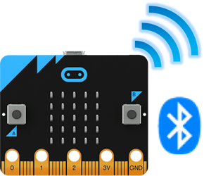   

### USB下载口   
只需要通过USB即可下载，插到电脑上，会显示一个Microbit名称的U盘   
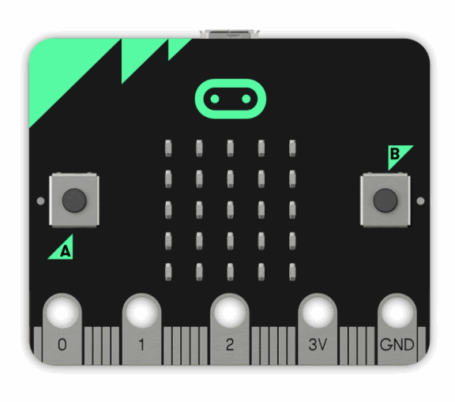   

## 使用方式
编程方式：Makecode/Kittenblock(基于Scratch3.0)   

产品详细的学习资料地址：

## 具体使用   
请参考Learn中的Microbit使用教程，新手建议从网易云课堂的Microbit视频教程学起

## Microbit使用注意事项   

 - Microbit板上有很多精密的电子元件，建议戴上硅胶保护套进行使用，防止短路。
 - Microbit的IO口驱动能力很弱，IO口电流不足200ma，请勿接大电流器件（例如大舵机MG995、直流电机），    
**否则会烧坏Microbit**，使用前必须完全了解清楚你所使用的器件电流情况，一般建议配搭扩展板进行使用   
 - 如果使用引脚的高低电平读的功能，必须设置引脚上下拉   
   

 - 供电建议从Microbit的usb口进行供电，或者Microbit上的3V电机座接口。Microbit本身IO口是3V电平，所以是不支持5V传感器的，如需支持5V传感器需要使用扩展板   
 - 使用与Microbit点阵的共用引脚（如3、4、5、6、7、8、9、10、11），记得在软件上把点阵屏禁用掉，否则会有点阵屏乱亮的现象
 - 不要使用IO19、20，19和20是不能当做IO口来使用的，虽然makecode软件上显示可以使用，实际是用不了的！只能用于I2C通讯
 - 3V电池座接口上不能使用3.7V锂电池包，**插上去一定会把Microbit烧坏**
 - **禁止放在金属制品上使用，以免短路**