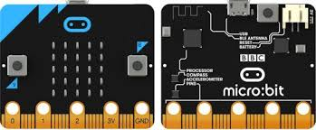
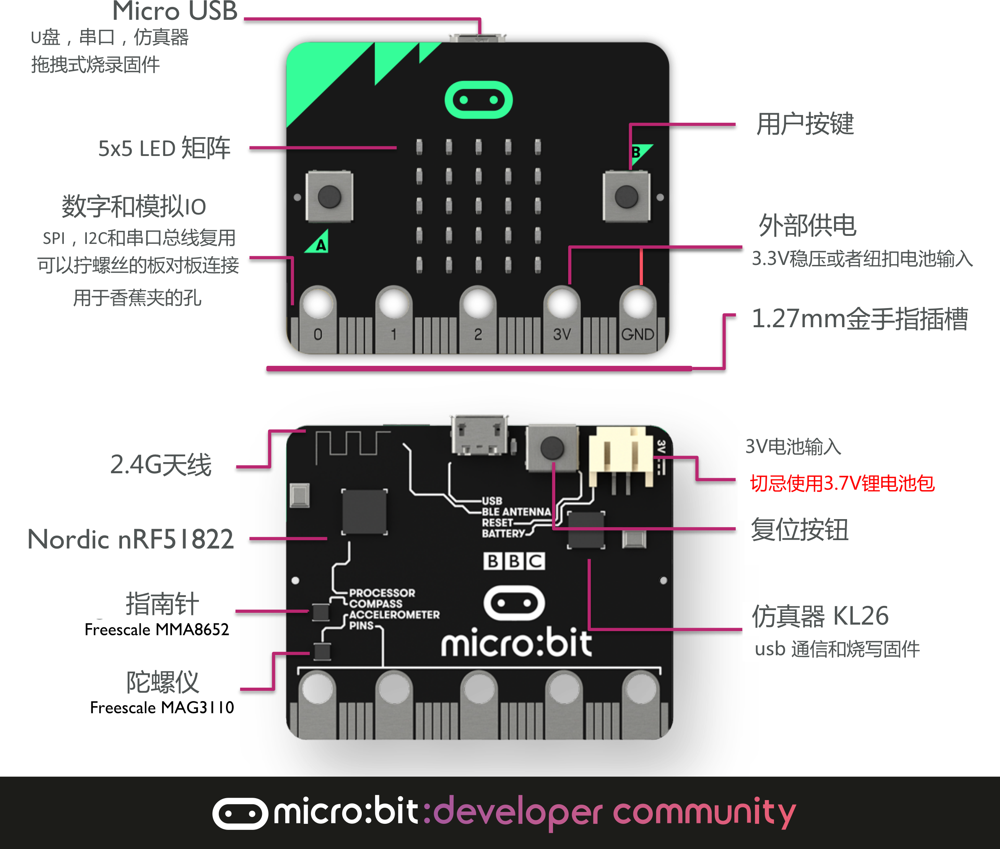
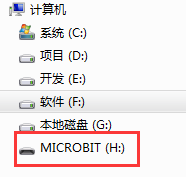
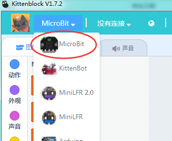
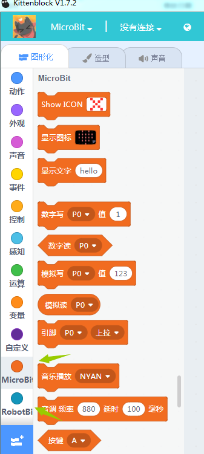
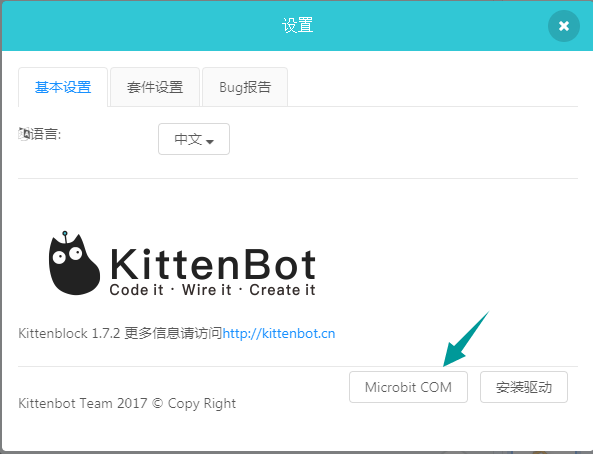
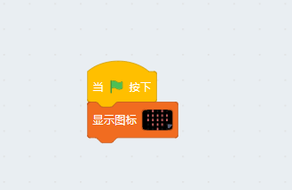
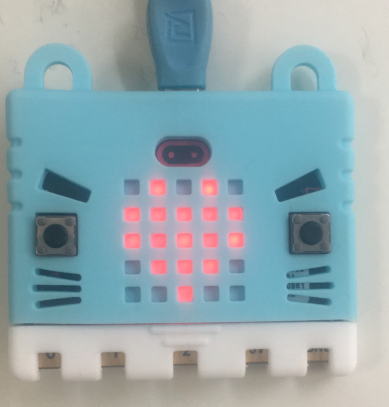

# Microbit快速开始

## Microbit主板基本介绍

这里假设大家手上都有这样一块Microbit主板了

如果大家使用Makecode学习Microbit或者想了解相关历史的可以看看我们社区相关的帖子

[小喵家社区：Micro:bit教程汇总目录](http://kittenbot.cn/bbs/forum.php?mod=viewthread&tid=104&extra=page%3D1)

### 主板功能模块

## 打开软件和连接Microbit

### 首先用microusb数据线连接microbit和你的电脑

连接上后系统会自动安装一些通用驱动，完成后可以看到你的microbit成为一个类似u盘的存在。

如果插上后找不到microbit的U盘，请换一个数据线，如果还不行加我们的qq群（568084773）求助。

请记住这个u盘只用于烧写固件，千万不要拷贝一些microbit固件以外的文件到上面，有变砖的风险。

### 打开Kittenblock

打开Kittenblock后在菜单栏硬件部分选择microbit

选择硬件会伴随着插件的加载，我们可以看到kittenblock侧边栏自动加入了Microbit和Robotbit两个插件

**接下来我们要做的是给microbit安装串口驱动，请在安装串口驱动前确保你的microbit连着电脑**

点击右上角的小齿轮，之后在弹出对话框下侧点击**Microbit COM** 安装驱动

安装过程点确认并让它自动完成就好了。

驱动安装成功可以在连接下拉框看到Microbit多出来一个串口连接选项，这个是用来跟Microbit实时通讯用的。

**请记住烧写固件还是使用microbit的虚拟u盘，如果不使用串口通讯功能则并不影响使用。**

## 显示第一个图形

接下来我们让Microbit的5x5矩阵面板显示我们第一个图形

在左侧“事件”菜单找到绿旗帜模块，将它拖到工作区。这是所有程序开始的入口。

之后在Microbit菜单找到显示图形，将它也拖到工作区，并接在绿旗帜模块下面，他们会自动吸附并组合成一个程序流程。

在舞台中应该可以看到这样的代码块

之后点击右上角的“舞台”和“代码”切换开关让kittenblock进入代码模式，我们可以看到左边的图形块已经翻译成python的程序了。

之后点击代码串口的“下载”，kittenblock会自动寻找microbit的u盘盘符并下载，静静等待下载完成就好了。

部分程序可能需要按一下Microbit背后的复位按钮才能正常启动，如果发现有不对劲的时候按一下复位按钮可以解决大部分问题。

第一个程序结果如下图

下载出错会有提示，可以到我们qq群（568084773）求助。

如果大家喜欢上图那个萌萌的硅胶保护套可以光顾我们网店
[小喵家@Taobao](https://kittenbot.taobao.com/)

它可以防止各种物理碰撞导致的零件损坏，也能防止人体静电造成的芯片击穿，还让led矩阵屏的灯变得更加柔和和平均方便观看~

