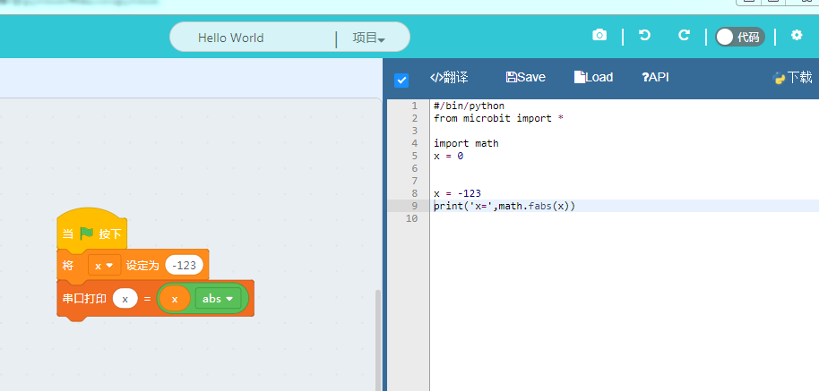

# Python基础篇2

## python的import方法

microbit的每一个程序我们总能看到类似的`from microbit import *`或者`import microbit`,两者的区别是什么呢？那么如何正确使用呢？import进来的东西都到哪里去了呢？

这里我需要用到python另外一个內建函数`locals`，它的作用是输出当前代码作用域下所有的符号列表。看不懂这句话的意思？没关系我们来做一个实验就懂了，编程上的很多概念只可意会不可言传。

之前我们用`dir`查看过micorbit的内容，首先还是从这种import方法开始。

	import microbit
	print(dir(microbit))
	print(locals())

输出为：

	 ['__name__', 'Image', 'display', 'button_a', 'button_b', 'accelerometer', 'compass', 'i2c', 'uart', 'spi', 'reset', 'sleep', 'running_time', 'panic', 'temperature', 'pin0', 'pin1', 'pin2', 'pin3', 'pin4', 'pin5', 'pin6', 'pin7', 'pin8', 'pin9', 'pin10', 'pin11', 'pin12', 'pin13', 'pin14', 'pin15', 'pin16', 'pin19', 'pin20']
	
	{'__name__': '__main__', 'microbit': <module 'microbit'>}

没有对比就没有伤害，我们再看看另外一种import方法：

	from microbit import *
	
	print(locals())

输出结果：

	 {'pin15': <MicroBitDigitalPin>, 'pin2': <MicroBitTouchPin>, 'pin0': <MicroBitTouchPin>, 'pin1': <MicroBitTouchPin>, 'pin3': <MicroBitAnalogDigitalPin>, 'pin6': <MicroBitDigitalPin>, 'pin4': <MicroBitAnalogDigitalPin>, 'i2c': <MicroBitI2C>, 'pin5': <MicroBitDigitalPin>, 'pin7': <MicroBitDigitalPin>, 'pin8': <MicroBitDigitalPin>, '__name__': '__main__', 'Image': <class 'MicroBitImage'>, 'pin9': <MicroBitDigitalPin>, 'pin14': <MicroBitDigitalPin>, 'pin16': <MicroBitDigitalPin>, 'reset': <function>, 'pin19': <MicroBitDigitalPin>, 'temperature': <function>, 'sleep': <function>, 'pin20': <MicroBitDigitalPin>, 'button_a': <MicroBitButton>, 'button_b': <MicroBitButton>, 'running_time': <function>, 'accelerometer': <MicroBitAccelerometer>, 'display': <MicroBitDisplay>, 'uart': <MicroBitUART>, 'spi': <MicroBitSPI>, 'panic': <function>, 'pin13': <MicroBitDigitalPin>, 'pin12': <MicroBitDigitalPin>, 'pin11': <MicroBitDigitalPin>, 'pin10': <MicroBitAnalogDigitalPin>, 'compass': <MicroBitCompass>}

第一种的locals只输出了一个名字叫microbit的对象，而第二种则有一大串密密麻麻的输出，他们每个都是microbit中的一个子对象。其实local就是告诉你，当前代码位置你能用的哪些东西。如果我们用两种不同的import方法，都实现在microbit上显示一个心形该怎样做呢？

	import microbit
	microbit.display.show(microbit.Image.HEART)

和

	from microbit import *
	display.show(Image.HEART)

明显第一种要多敲好多字啊，大部分程序员都很懒，所以大家看别人的代码的时候肯定第二种会更常见一点。`from xxx import *`的格式实际上将目标对象解开来，并将里面每个东西都拿出来。

打个比方就是，我们有一个叫microbit的工具箱，里面有各式各样的工具。现在我们将里面所有的工具都拿出来放到我们的工作桌桌面，也就是我们的当前的代码工作空间或者作用域。而第一种import方法就相当于，每次我们要用什么东西都跑去工具箱里面翻呀翻。那么第二种import方法的缺点也很显而易见，你有可能会同时用到几个工具箱，如果把所有工具都拿出来那么你的工作桌桌面肯定凌乱不堪。而且很有可能两个工具箱里面都有一个叫“扳手”的工具，但是两者的规格尺寸完全不同。

那么怎么办呢？其实我们可以指定import对象中具体哪个子对象。如下，我们用到什么import什么。

	from microbit import display,Image
	display.show(Image.HEART)

其实import还有很多花式玩法，例如：`import microbit as mb` 这种，现在知道就行了，后面内功深了自然就会理解了。

## python的数组(列表)类型

前面我介绍了python的数组，或者有些书称之为列表。我们先用手上几个新工具解剖一下数组：

	a = [1, 2, 3, 4, 5]
	print(a)
	print(type(a))
	print(dir(a))

输出为：
	[1, 2, 3, 4, 5]
	
	<class 'list'>
	
	['append', 'clear', 'copy', 'count', 'extend', 'index', 'insert', 'pop', 'remove', 'reverse', 'sort']

实际上数组是一个名字叫list的对象，但是`dir`输出了一连串动词是几个意思。

正如前面所说，dir是剖析一个对象内部信息。因为a是一个数组对象，所以他拥有一个数组对象所有的方法函数。

我们挑几个数组函数来做实验，大家自己把程序下载到microbit上看看输出跟想的是不是一样：

	a = [1, 2, 3, 4, 5]
	print(a)
	a.append(6)
	print(a)
	a.remove(3)
	print(a)
	a.pop(0)
	print(a)

说到数组我们不得不提另外一个函数`len`，他的作用是返回一个对象内部元素的长度。例如：

	a = [1, 2, 3, 4, 5]
	print(a)
	print(len(a))

数组本质上将所有的元素按照顺序排列在内存中，如果是按照顺序那么我们肯定能按照序号读出某个元素。还记得我们之前那个小船的例子吗？我们构造了一个动画列表：
	
	from microbit import *
	
	boat1 = Image("05050:"
	              "05050:"
	              "05050:"
	              "99999:"
	              "09990")
	
	boat2 = Image("00000:"
	              "05050:"
	              "05050:"
	              "05050:"
	              "99999")
	
	boat3 = Image("00000:"
	              "00000:"
	              "05050:"
	              "05050:"
	              "05050")
	
	boat4 = Image("00000:"
	              "00000:"
	              "00000:"
	              "05050:"
	              "05050")
	
	boat5 = Image("00000:"
	              "00000:"
	              "00000:"
	              "00000:"
	              "05050")
	
	boat6 = Image("00000:"
	              "00000:"
	              "00000:"
	              "00000:"
	              "00000")
	
	all_boats = [boat1, boat2, boat3, boat4, boat5, boat6]

我们现在要显示动画中第三帧，也就是boat3，那么该怎么写呢？我们在数组后面用方括号指示，并在里面填上序号就行了。

	display.show(all_boats[2])

什么？为啥是2不是3？

因为计算机是从零开始数数的，程序员跟计算机相处久了也从零开始数数了。如果后面在马路上看到某个人是从零开始数数的，那么他一定是程序员。

还记得我们之前输出的microbit对象内容吗？当我们手上有了榔头所有东西都是钉子，我们知道Image对象中有很多内置的图形，其中有一个是钟表盘

	from microbit import *
	clock = list(Image.ALL_CLOCKS)
	print(clock)
	display.show(clock[0])

我们用数组的构造函数list构造了一个新的数组clock，并显示第一个图形。可以看到Image中的预制图片实际上每个都是一个新的Image对象，其中包含了LED矩阵的字符串图案。

	[Image('00900:00900:00900:00000:00000:'), 
	Image('00090:00090:00900:00000:00000:'), 
	Image('00000:00099:00900:00000:00000:'), 
	Image('00000:00000:00999:00000:00000:'), 
	Image('00000:00000:00900:00099:00000:'), 
	Image('00000:00000:00900:00090:00090:'), 
	Image('00000:00000:00900:00900:00900:'), 
	Image('00000:00000:00900:09000:09000:'), 
	Image('00000:00000:00900:99000:00000:'), 
	Image('00000:00000:99900:00000:00000:'), 
	Image('00000:99000:00900:00000:00000:'), 
	Image('09000:09000:00900:00000:00000:')]

很明显用方括号括起来的是一个数组，那么我们要显示倒数第二个图形怎么办呢？

勤奋的同学估计已经开始数了，0、1、2、3 ... 之后`	display.show(clock[10])`

但是记住，python是一个极其简洁和灵活的语言，而程序员大部分都是很懒的。
我们可以`display.show(clock[len(clock)-2])`。
但是这样多敲了好多字，不符合python简洁的特性。是不是可以直接`display.show(clock[-2])`呢？大家自己试试把程序下载到microbit看看结果吧~

## python的字典类型

介绍数组后，我们来看看python另一大数据类型，**字典**。

顾名思义字典跟一般书不同的最大的特点就是有一个强大的不能再强大的目录了。我们把把目录称为字典的key，而对应的单词或者内容称为value，这样字典类型就是一个key-value对。

太抽象了？直接上代码：

	simpledict = {'a': 'apple', 'b': 'banana', 'c': 'cat', 'd': 'dog'};
	print(simpledict)
	print(type(simpledict))
	print(dir(simpledict))

输出如下，最后的dir函数把字典类型的所有可能方法都打印出来了

	{'a': 'apple', 'd': 'dog', 'c': 'cat', 'b': 'banana'}
	
	<class 'dict'>
	
	['clear', 'copy', 'fromkeys', 'get', 'items', 'keys', 'pop', 'popitem', 'setdefault', 'update', 'values', '__getitem__', '__setitem__', '__delitem__']

大部分方法看名字都能猜到用法，我们拿其中一个做下实验：

	simpledict = {'a': 'apple', 'b': 'banana', 'c': 'cat', 'd': 'dog'};
	
	simpledict.update({'x': 123})
	simpledict.update({'y': 0.123})
	
	print(simpledict)

大家运行程序后会发现最后字典中多了两个key：x和y,但是这样给字典添加元素是不是不太符合python的简洁特性呢？
我们参考之前数组的方法，凭证直觉写下下面代码：

	simpledict = {'a': 'apple', 'b': 'banana', 'c': 'cat', 'd': 'dog'};
	
	simpledict['x'] = 123
	simpledict['y'] = 0.123
	
	print(simpledict)

我们知道添加元素的方法了，那么删除呢？英文的删除某个东西叫'delete'，那么python中內建的删除函数就是`del`（果然符合程序员的特性，连多三个字母都懒得敲了）

	simpledict = {'a': 'apple', 'b': 'banana', 'c': 'cat', 'd': 'dog'};
	del simpledict['a']
	print(simpledict)

大家可能可以发现，del直接跟着空格再加被删除的对象。类似`del(simpledict['a'])`这样写也是成立的，但是这又不太符合python的简洁特性了。如果要删除多个东西可以：`del simpledict['a'],simpledict['b']`。实际上del删除的是对象的引用，而对象本身还保留在内存中，目前只要知道就行了，后面玩的溜了自然会懂的了。

## python的其他数学函数

就像第一章开头所说，python最广泛的应用是科学计算，包括人工智能等等相关的计算实现。我们来看看python的其他数学相关的函数，大家可以用图形化方块拖一个例子出来，并看看micropython支持哪些数学模块。

注意数学库math是需要另外导入的，用arduino的同学可能平时就是直接用了，因为arduino内部的头文件已经`include <math.h>`了。

