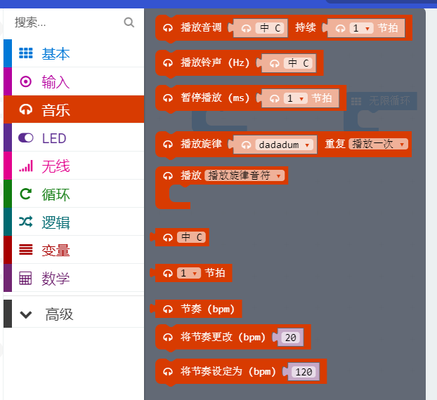
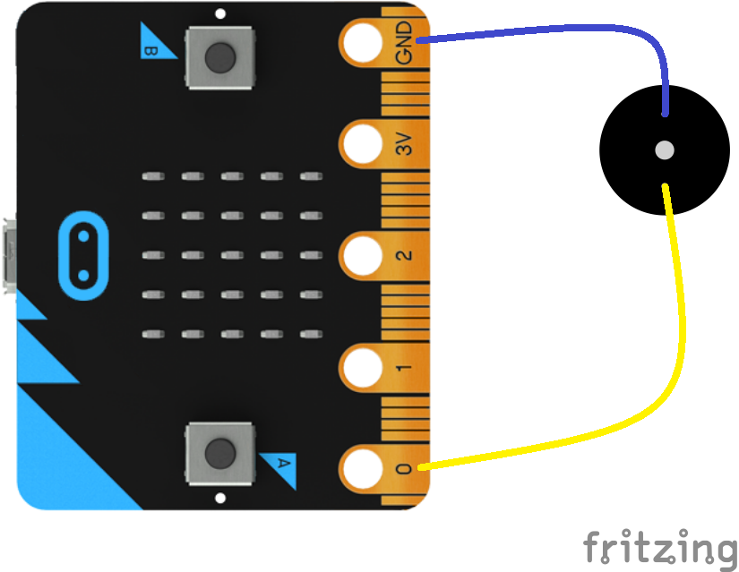
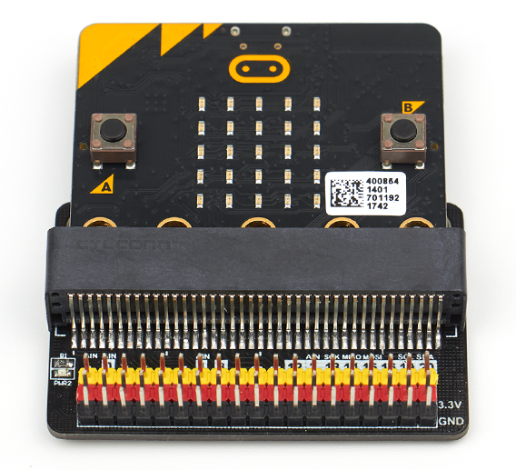
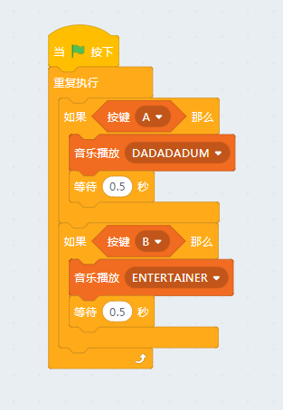
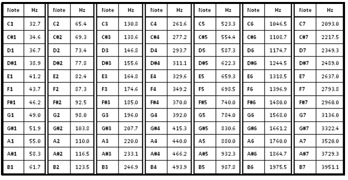

# 蜂鸣器与音乐

如果接触过makecode的同学可能知道makecode下有整整一个专栏是做互动音乐的。那么在micropython下有没有吗，答案是有的而且功能基本和makecode一样甚至更加强大。

这里顺便推广下小喵家的makecode离线版本：

[http://kittenbot.cn/bbs/forum.php?mod=viewthread&tid=156&extra=page%3D1](http://kittenbot.cn/bbs/forum.php?mod=viewthread&tid=156&extra=page%3D1)

- 不受网络限制
- 可以直接下载hex到microbit上面，不用每次弹出下载窗口并选择microbit
- 内置串口调试工具，总是靠在5x5面板上调试代码是不是很不爽呐，现在有串口打印了

## 电路接线

要使用Microbit的音乐功能，我们需要一个蜂鸣器，而主板上本身不带，这就需要我们外接了。动手能力好的同学可以照着下面的图外接一个蜂鸣器：

接线只需要用鳄鱼夹连接到Microbit的金手指上就行了，不需要焊接。

另外也可以用小喵家的IoBit扩展板，上面自带一个蜂鸣器并且有放大电路让声音更大。而且还把所有io引出来了，方便大家做项目。

## 图形化编程

我们先在Kittenblock中找到音乐播放的方块，在右侧下拉列表有micropython所有内置的音乐列表。

之后切换到代码模式并下载到microbit上，如果接线正确可以听到一段悦耳的电子节奏配乐。

## music模块编程

我们接下来看看Kittenblock自动生成的micropython代码：

	#/bin/python
	from microbit import *
	import music
	
	music.play(music.NYAN)

发现这里import了一个新的库“music”，因为音乐功能不在microbit主板设备上所以需要另外导入。

之后music对象调用play函数播放内置音乐"NYAN"，是不是感觉跟之前矩阵屏的对象display用法很像呢？我们用瑞士军刀"dir"来看看music对象里面到底有什么：

	<class 'module'>
	
	['__init__', 'reset', 'set_tempo', 'get_tempo', 'play', 'pitch', 'stop', 'DADADADUM', 'ENTERTAINER', 'PRELUDE', 'ODE', 'NYAN', 'RINGTONE', 'FUNK', 'BLUES', 'BIRTHDAY', 'WEDDING', 'FUNERAL', 'PUNCHLINE', 'PYTHON', 'BADDY', 'CHASE', 'BA_DING', 'WAWAWAWAA', 'JUMP_UP', 'JUMP_DOWN', 'POWER_UP', 'POWER_DOWN']
可以看到我们刚刚用到的play函数就在其中，之后还有几个其他函数例如：reset、pitch、stop...

在micropython中小写的一般是函数，而大写的一般是常量。我们可以看到music对象内还有一连串`'DADADADUM', 'ENTERTAINER'`,这些是内置音乐的名字，我们刚刚的`NYAN`也在其中。

还记得我们之前用的按键吗？这里我们把microbit变成一个可以用按键控制的音乐播放器，按键B播放下一首，按键A播放前一首。我们先用之前的按键图形化代码改造一下：

但是这样只能实现两首音乐切换，这里我们需要将内置的音乐转成一个list，并且通过按键切换数组位置实现音乐切换。下面进入敲代码模式，我们先看看初始的机器生成的样板代码：

	#/bin/python
	from microbit import *
	import music
	
	while True:
		if button_a.is_pressed():
			music.play(music.DADADADUM)
			sleep(0.5*1000)
		if button_b.is_pressed():
			music.play(music.ENTERTAINER)
			sleep(0.5*1000)

我们首先要构造一个音乐数组：
	
	mlist = [music.DADADADUM, music.ENTERTAINER, music.PRELUDE, 
	        music.ODE, music.NYAN, music.RINGTONE, 
	        music.FUNK, music.BLUES, music.BIRTHDAY, 
	        music.WEDDING, music.FUNERAL, music.PUNCHLINE, 
	        music.PYTHON, music.BADDY, music.CHASE, 
	        music.BA_DING, music.WAWAWAWAA, music.JUMP_UP, 
	        music.JUMP_DOWN, music.POWER_UP, music.POWER_DOWN]

之后还需要一个指示当前音乐位置的序号变量`pos`，之后当按键按下的时候直接播放mlist的音乐。

第一阶段改造后的代码如下：
	
	#/bin/python
	from microbit import *
	import music
	
	pos = 0
	mlist = [music.DADADADUM, music.ENTERTAINER, music.PRELUDE, 
	        music.ODE, music.NYAN, music.RINGTONE, 
	        music.FUNK, music.BLUES, music.BIRTHDAY, 
	        music.WEDDING, music.FUNERAL, music.PUNCHLINE, 
	        music.PYTHON, music.BADDY, music.CHASE, 
	        music.BA_DING, music.WAWAWAWAA, music.JUMP_UP, 
	        music.JUMP_DOWN, music.POWER_UP, music.POWER_DOWN]
	        
	while True:
	    if button_a.is_pressed():
	        pos -= 1
	        music.play(mlist[pos])
	        sleep(0.5*1000)
	    if button_b.is_pressed():
	        pos += 1
	        music.play(mlist[pos])
	        sleep(0.5*1000)

我们把代码下载进去，看看效果。可以发现，当我们按下A、B按键已经能够切换不同的音乐了。但是有几个问题：

- 我想让屏幕显示当前播放的曲目序号
- 一定要等到音乐播放完成按键才有用，能不能中断播放直接切换下一首呢？

遇到不确定函数是不是有某个想要的功能的时候，我们需要查看一下micropython的api文档。大家可以点击Kittenblock内的API按钮前往micropython的官方文档页面(注意目前只有英文版本，所以说编程一定要英文好)

我们找到music相关模块的api说明部分：
[http://microbit-micropython.readthedocs.io/en/latest/music.html](http://microbit-micropython.readthedocs.io/en/latest/music.html)

其实api文档列举出来的函数我们之前用dir函数都能查看到，但是文档有更加详细的介绍和使用说明。

我们发现`music.play(music, pin=microbit.pin0, wait=True, loop=False)`其中有一个参数是wait，默认值是true，它表示一直等待音乐播放结束，这就是我们要找的东西。再改造一下核心的播放代码，并且加上显示功能。

	while True:
	    if button_a.is_pressed():
	        pos -= 1
	        music.play(mlist[pos], wait=False)
			display.scroll(str(pos))
	        sleep(0.5*1000)
	    if button_b.is_pressed():
	        pos += 1
	        music.play(mlist[pos], wait=False)
	        display.scroll(str(pos))
	        sleep(0.5*1000)

## 自定义音乐

我们知道micropython中内置了好多默认的音乐，那么我们想要自己添加音乐该怎么办呢？我们知道矩阵屏的默认图片是一个用冒号隔开来的5列字符串，那么默认音乐是不是也类似呢。下面来做一个实验：

	#/bin/python
	from microbit import *
	import music
	
	print(music.NYAN)

打印结果如下：

	('f#5:2', 'g#', 'c#:1', 'd#:2', 'b4:1', 'd5:1', 'c#', 'b4:2', 'b', 'c#5', 'd', 'd:1', 'c#', 'b4:1', 'c#5:1', 'd#', 'f#', 'g#', 'd#', 'f#', 'c#', 'd', 'b4', 'c#5', 'b4', 'd#5:2', 'f#', 'g#:1', 'd#', 'f#', 'c#', 'd#', 'b4', 'd5', 'd#', 'd', 'c#', 'b4', 'c#5', 'd:2', 'b4:1', 'c#5', 'd#', 'f#', 'c#', 'd', 'c#', 'b4', 'c#5:2', 'b4', 'c#5', 'b4', 'f#:1', 'g#', 'b:2', 'f#:1', 'g#', 'b', 'c#5', 'd#', 'b4', 'e5', 'd#', 'e', 'f#', 'b4:2', 'b', 'f#:1', 'g#', 'b', 'f#', 'e5', 'd#', 'c#', 'b4', 'f#', 'd#', 'e', 'f#', 'b:2', 'f#:1', 'g#', 'b:2', 'f#:1', 'g#', 'b', 'b', 'c#5', 'd#', 'b4', 'f#', 'g#', 'f#', 'b:2', 'b:1', 'a#', 'b', 'f#', 'g#', 'b', 'e5', 'd#', 'e', 'f#', 'b4:2', 'c#5')

跟我们的数组很像是吧，区别只是包裹它的是圆括号。这就是组元（tuple）的定义，它是除了list和dict外python另一大数据结构。它和list的区别只是，组元内的内容一旦定义后就不能更改了。除此之外，其他用法基本跟list一样。

那么上面的那些符号的意思到底是什么呢？熟悉五线谱的同学可能可以一眼就看出来了，其实这是数字化的简谱写法。上面数组中每一个元素都是一个音符，其中包括了音调和节拍。这里我们要用数学的角度解释音乐，我们都知道`do re mi fa so ra si`7个音符，在简谱中对应`c d e f g a b`这几个字母。

但是完整的音阶还有一些中间频率，可以参考钢琴的黑色按键位置，因此完整的音阶如下`c c# d d# e f f# g g# a a# b`。具体可以参考下面的图：

以我们上面音乐为例子，第一个音符是`f#5:2`，我们从上面的表可以查到`f#5`的频率。其中5代表基调，对应表中某一列.例如第二个音符`g#`在表中实际上是`g#5`。只要基调不重新声明，后面将会一直使用这个基调。

后面还有一个冒号跟了一个数字表示的是节拍，这里2表示1/8拍，1/4拍则是4，以此类推。和基调频率一样，只要不重新声明后面的音符都是用该节拍。

我们下面看看这一小段音乐，大家把它烧录到microbit上看看能听出来是什么吗？

	import music
	
	tune = ["C4:4", "D4:4", "E4:4", "C4:4", "C4:4", "D4:4", "E4:4", "C4:4",
	        "E4:4", "F4:4", "G4:8", "E4:4", "F4:4", "G4:8"]
	music.play(tune)

## 播放音调

其实music除了音符外，还可以播放指定频率的声音。例如我们看看上表C大调，频率是261hz：

	music.pitch(261, 250)

我们也可以模仿一个警车的报警声音：

	import music
	
	while True:
	    for freq in range(880, 1760, 16):
	        music.pitch(freq, 6)
	    for freq in range(1760, 880, -16):
	        music.pitch(freq, 6)

ps：其实music.NYAN是网红彩虹猫的主题曲，它还有自己的专属主页，大家感兴趣的可以去看看：[http://www.nyan.cat/](http://www.nyan.cat/)