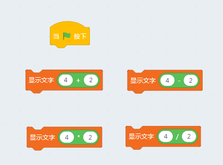
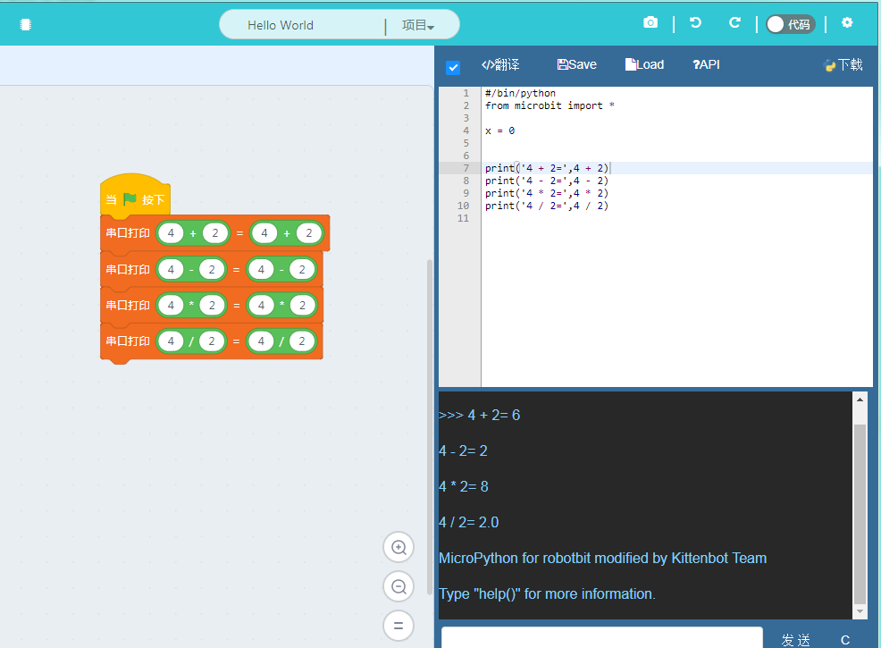

# Python基本概念

相信通过前面几章的学习，大家都能够把手上的硬件玩起来了。对python语言也应该有一个大致的影响，是不是感觉挺有意思的？但是真正的编程学习和修炼并不是这么有意思的过程，相反还伴随着各种痛苦和让人抓狂的情况。通常浪费一两天时间调试，最后发现只是某个地方符号或者大小写弄错了。编程是一个极其注重细节的工作，需要比外科手术更高的细致，任何一点点细微的细节差错都可能导致运行结果大相庭径。不过好在python已经是一门对细节容忍比较宽松的语言了，而其他语言就没这么友好了。

这一章我们就要学习python的一些比较细碎的，但是非常有用的东西，真是这些构成了任何一门编程语言的基础功。

## Python基本计算和基本函数

### 基本四则运算

python的基本四则运算和我们正常使用的没有什么不同，不过需要注意的是在编程语言中乘法一般是星号`*`,而不是`x`。除法符号是左斜杠`/`，而不是`÷`。还有就是计算优先级的问题，括号内的计算优先级最高，同一括号内乘法除法的优先级比加减高。这跟我们小学学到的四则运算基本一样。

大家可以试试将下面的方块拖到绿旗帜下面看看生成的代码和下载进去的运行效果。多试试就可掌握其中窍门，小喵家的创始人就说过运营就是要多试，其实编程也是一样。

### 串口打印结果

大家是不是发现像上面这样一个个方块拖到绿旗帜下面，并生成代码，之后再下载很不方便呢？

这里我解释另外一个python内置函数`print`，顾名思义print就是将对象打印到串口输出上。在编程语言中我们有一个更专业的称呼是终端，或者console。一般高级语言的程序都带至少有一个输出流和一个输入流，大家可以把这些流理解为管道，实际上操作系统也是把这些当做数据管道来处理。大家在未来接触到操作系统开发，或者学习微机原理的时候会详细了解。

Micropython的默认输出流就是串口，而默认的输入流还是串口。

我们将上面的四则运算程序改造成如下形式，并且下载到microbit上面。

看看是不是一下子就在终端将结果显示出来了。

我们来详细看看由方块生成的代码：

	#/bin/python
	from microbit import *
	
	print('4 + 2=',4 + 2)
	print('4 - 2=',4 - 2)
	print('4 * 2=',4 * 2)
	print('4 / 2=',4 / 2)

可以看到每个print函数内由两部分组成，前半部分是一个单引号括住的字符串，后半部分基本一样只是没用引号括住。还记得我们之前说过，python下不管拿单引号、双引号还是三引号括住的部分都当做字符串处理。字符串扔给print函数，解释器会原封不动地将字符串输出到终端。而没有用括号括住的部分，解释器则认为它是一个表达式，会尝试对其进行计算并输出结果。

### 查看python的对象

