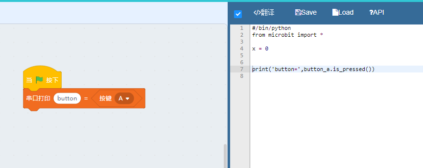
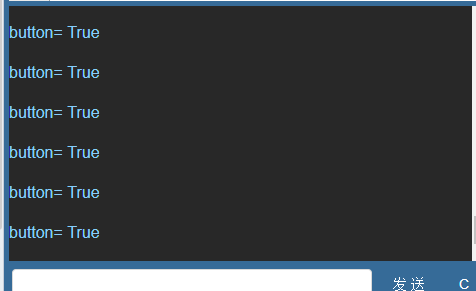
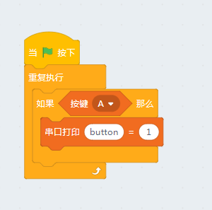
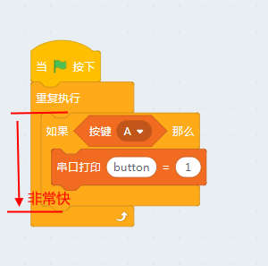
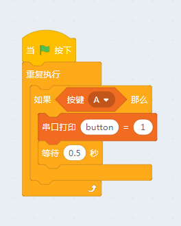
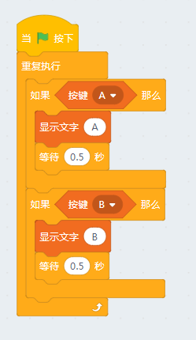
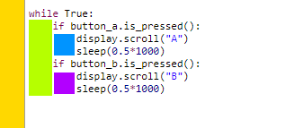

# Microbit按键和程序流程

前面两个章节我们讲了python的基本语法，是不是觉得略显枯燥呢，而且很多地方还是蒙圈的状态。不过没关系，后面我们再慢慢实践中会对这些概念慢慢深入理解并最终掌握。

## Microbit按键函数

microbit正面看过去除了正中间的矩阵屏外就是左右对称的两个按键了。如果矩阵屏是电脑的显示屏，那么按键就是键盘了，microbit官方宣传的时候也将它比作世界最小的电脑。

就两个按键也能算电脑？其实微型计算机的原理大致相通，编程也一样。很多同学可能整天纠结到底该学那种语言，不停地比较来比较去，其实这完全没意义。编程学习的是一种编程思维或者是一种逻辑思维，并且培养的是极致的细心和碰到问题解决问题的能力素养。一旦精通了某一种语言，切换到另外一种语言也就是大半天的功夫而已，无非就是搭建开发环境，阅读一下语法定义和相关文档。

前面我们尝试使用`dir`函数输出microbit内容，细心的同学肯定记得microbit里面有两个对象`button_a`和`button_b`，这一看就是控制按键的吧。Kittenblock也内置了这个函数的图形化方块，我们拖一个程序出来如下，并翻译成代码。这里要注意那种圆形和尖括号形状的方块表示带有返回值的方块，可以作为其他程序执行方块的输入参数。

程序下载下去会发现，终端输出了如下信息，然后就没有然后了。

之后再怎么按按钮也没有反应，那么应该怎么办呢？

这里我教大家一个诀窍，按住按键A不要松手，之后按microbit背后的复位按钮让程序重启，看看是不是输出了`button= True`。

你明显在逗我吧。。我家的电脑按键盘都不用重启的。。

这是因为操作系统不停的在监听键盘有没有按下，那么用microbit该怎么实现呢？

这里我们需要用上python的循环函数。

## python的循环与条件控制

我们在kittenblock里面的控制指令菜单找到“重复执行”方块，并拖出如下代码：

下载下去，当我们按下按钮的时候终端不停的打印`button= True`。

重复执行可以不停的执行它包裹着的代码。

但是这样好像还不是我想要的效果，满屏幕的打印信息其他东西都看不了了。这里我们要用上另外一个控制指令，条件判断。

将程序下载下去看看效果，发现啥都不干的时候终端没有任何输入，但是一旦按下按键A就会刷出来一连串的`button=1`。
我家的电脑按下键盘只会输出一个字母，这明显还是哪里不对啊。

这是因为计算机的程序执行流程速度非常快，快到你还没松手就又进入下一个流程了，当然如果你手指速度够快可以让程序只输出一次按键值。

*小提示：想拼手速的同学可以试试发送右边的'C'按钮，可以清除当前终端的显示。*

那么该怎么办呢？一般大家家里的电器或者遥控器都有一个消抖动的过程，或者用软件或者用硬件电路实现。这里我们就用软件实现消抖动。

主要思路就是降低程序执行的速度，例如让它在哪里等一下。我们加上一个等待函数，里面填0.5秒。

将程序下载进去是不是发现只有当按下按钮的时候才输出一行打印信息，如果一直按着不放就会连续输出若干相同的打印字符串。

这里我们想继续玩花式，我不想把按键输出在丑陋的终端，我想显示在屏幕上，就跟我家的电脑一样。

我们继续改造代码，并且加上按键B

下载并看看实际效果，是不是发现当按下按键A有一个字母A飘过，而按下B有一个字母B飘过呢？

## python逻辑表达式和作用域介绍

我们前面一直在用图形化方块在写代码，让我们看看现在的python程序到底是怎么样的？

	#/bin/python
	from microbit import *

	while True:
		if button_a.is_pressed():
			display.scroll("A")
			sleep(0.5*1000)
		if button_b.is_pressed():
			display.scroll("B")
			sleep(0.5*1000)

`sleep`函数在我们的microbit工具箱中，大家往前翻一下microbit的dir打印就会发现它了。

这里多了几个新的关键字`while`、`if`，还有一些新的奇怪的代码格式

`while`字面意思就是`当....就`，`if`是`如果...就`。`True`的意思是`真的`或者`是的`,当他和`while`一起用则组合成死循环。

### 逻辑表达式
python的逻辑表达式都有如下结构

- 关键字：例如`while`或者`if`还有`for`等等，根据关键字的不同程序的执行流程也不同
- 条件表达式：可以是一个函数，或者一个逻辑值，也可能是一个数组等等。根据关键字有不同的类型
- 冒号：这个相当关键，如果没有这个冒号python解释器就不知道你在写一个条件表达式，而是当成一般的代码语句在处理
- 换行缩进：这个也相当重要，条件表达式的目标代码必须跟表达式本身具有不同的换行缩进。英文叫indent，如果大家后面看到报错中有indent这个单词多半是因为换行缩进没对齐。

为什么有换行缩进，因为这是python语言的设计方法，用于标定不同的作用域。玩Arduino的同学可能都碰到代码里面有各种花括号`{xxx}`包裹着代码，每个花括号之间是一个作用域。而python则用缩进符来表达作用域，拥有同一样缩进的代码拥有同样的作用域。

回到我们前面的代码，这里用不同的颜色将作用域标注出来了

其中黄色就是我们之前用`lcoals()`打印出来的作用域，绿色是`while True:`这个条件表达式控制的作用域。

注意蓝色和紫色是不同的作用域，虽然他们有相同的缩进但是作用域只在当前表达式下才起作用。

那么作用域的作用是啥？直观的理解就是它表述了当前代码可以使用的对象，就像你把你的工作桌面划成不同的区域，区块A拿来焊接东西，区块B拿来组装3D打印模型，区块C拿来调试代码一样。每个区域有不同的工具，区域间尽量保持不要窜用工具，这样才能保持桌面整齐。子作用域可以使用父作用域的对象，但是反过来则不行。

换行缩进的形式并不固定，程序员常见的有使用2个空格，4个空格或者直接用tab键的，大家调自己喜欢的方式就好了。当然因为缩进符的不同导致程序员间分成不同的派别，甚至有引发种族战争的也不在少数。

