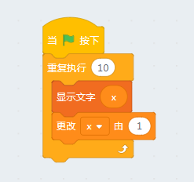
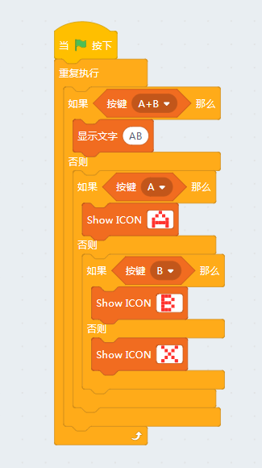
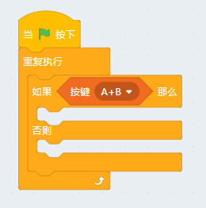
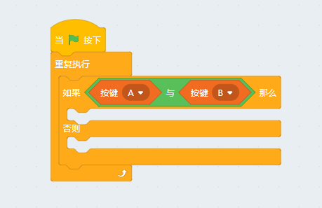
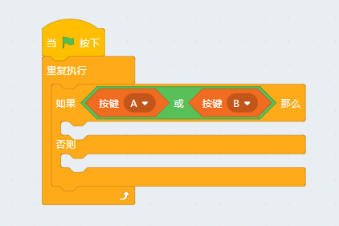

## Python程序流程-高级篇

实际上python的流程控制语句和各种变形远不止我们上一章说的那几种，这一章我们将常见的流程控制语句都介绍一下。

如果对生涩理论不感兴趣的同学可以跳过这一章，继续玩硬件~

## for循环

我们前面接触了while的循环，但是平时编写程序有一种更常用的循环--FOR循环，我们先用图形化积木生成一个样板代码：

生成的代码如下：

	#/bin/python
	from microbit import *
	
	x = 0
	
	for count in range(10):
		display.scroll(x)
		x += 1

但是这时候不要直接下载，因为display的scroll函数不支持数字类型，我们要把它变成字符串。还记得我们之前的`str`函数吗？

将`display.scroll(x)`改造成`display.scroll(str(x))`下载就行了，我们可以看到矩阵屏不停飘过数字，最终到9停止。

我们来看看条件表达式`for count in range(10):`，他的关键字形式是`for A in B:`。它的作用是对数组B内所有的元素进行循环操作，而A表示就是当前循环的数组元素，一旦循环完成则退出循环。

### Range函数

那么`range(10)`的作用呢？我们来做一个实验，关掉kittenblock的自动代码转换，在代码框写入如下测试代码：

	a = range(10)
	print(a)
	print(type(a))

下载后看看输出：

	range(0, 10)
	
	<class 'range'>

我们之前说`for A in B:`中的B应该是一个数组是不，但是这里打印的range的类型是一个range对象。实际上range函数并不是直接返回一个数组，而是一个叫做迭代器的东西。迭代器允许你对一个对象进行循环操作，数组对象list也隐含了类似的迭代器。实际上迭代器在python解释器中是一个预分配内存的过程，他只在使用的时候才真正的被调用到。如果觉得太抽象，前期可以把它们视作等同的东西，基本上在数组上的操作在range对象上也成立。

我们可以使用list将range变成一个我们真正摸得着看得到的数组：

	a = range(10)
	b = list(a)
	print(b)
	print(type(b))

输出如下：

	[0, 1, 2, 3, 4, 5, 6, 7, 8, 9]
	
	<class 'list'>

注意这里的对象b是真真切切的占用了我们microbit中10个数字的内存。同理我们使用list作为for循环的操作也是成立的，我们将前面的程序改造成如下：

	from microbit import *
	
	a = range(10)
	b = list(a)
	
	for x in b:
		display.scroll(str(x))

这里我们去掉了外部变量x，而动态地从数组b中抽取元素，他的名字还是x。

range函数还支持各种花式初始化的方法，大家可以自己试试下面这几种初始化后的range函数返回的数组是怎么样的：
	
	range(10)
	range(10, 20)
	range(1, 20, 2)
	range(1, -20, -1)

## if ... else ...

我们前面用了if来判断按键是否按下，实际上if的变形是python条件控制语句中最灵活的。我们可以打开kittenblock内置的示例程序“AB按键测试
”

看看自动生成的代码中核心循环控制部分：

	while True:
		if button_a.is_pressed() and button_b.is_pressed():
			display.scroll("AB")
		else:
			if button_a.is_pressed():
				display.show(Image("00900:09090:90009:99999:90009"))
			else:
				if button_b.is_pressed():
					display.show(Image("99900:90090:99900:90090:99900"))
				else:
					display.show(Image("90009:09090:00900:09090:90009"))

else的作用域指的就是当if条件不成立所执行的代码块。上面的代码感觉很臃肿，貌似不符合python简洁的特性。毕竟机器生成的代码肯定不如人写的简洁有没，那么我们是否能优化一下。

	while True:
		if button_a.is_pressed() and button_b.is_pressed():
			display.scroll("AB")
		elif button_a.is_pressed():
			display.show(Image("00900:09090:90009:99999:90009"))
		elif button_b.is_pressed():
			display.show(Image("99900:90090:99900:90090:99900"))
		else:
			display.show(Image("90009:09090:00900:09090:90009"))

将上面的代码替换掉自动生成的部分，下载到microbit上看看是否效果一样？

我们这里接触到新的关键字elif，实际上跟之前的代码对比一下很容易就明白了其意思。它在前一级if判断不成的情况下，重新进行新的if判断。如果前面所有的if条件判断都不成立，则执行else的部分。

实际上上这种写法在实际研发中相当常见，假设有一个用户要登录你写的服务器。你的服务器代码要检查：

- 他是不是已经登录过了
- 他提供的密码是不是正确
- 他的账号是不是已经被管理员封停了

等等类似的条件判断，每一种判断都有不同的程序执行流程。

## 条件判断的混合用法

大家可能看到上面`if button_a.is_pressed() and button_b.is_pressed():`中条件判断，实际上不管if后面的条件判断语句有多复杂最终只返回一个真假值(True或者False)，如果返回True则执行if下面的代码块，否则则进入下一个elif或者else判断。

我们可以看到这个条件判断的原型是：

当然我们完全可以自己写一个类似的判断：

你会发现生成的代码是一模一样的，这是因为代码生成器做了整合。

如果我想让A或B按键其中一个按下就执行一段程序呢？

请注意`if button_a.is_pressed() or button_b.is_pressed():`和`if button_a.is_pressed() and button_b.is_pressed():`中间仅仅只是一个单词的差别却具有完全不一样的意义，大家写程序的时候要特别小心，即使很有经验的工程师也常常在条件判断地方栽跟头。

大家可以多试试在kittenblock拖不同的方块出来组合，看看生成额条件判断代码有什么不同。

## 课后作业

还记得我们之前用过的Image的时钟数组吗，现在请试试把它做一个循环的动画（使用循环）
